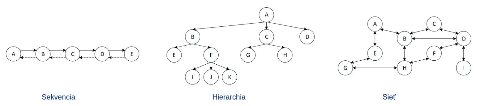

# AUS

Radsej pouzivat referenciu (`&`) ako pointer (`*`) ak sa da

- Jednoduchsia syntax (netreba dereferencovat)
- Zabera menej pamate
- Je to v podstate nieco ako alias?

```c++
int x = 20;
int* ptr = &x;  // pointer
int& ref = x;  // referencia
```

Pri ASCII stringu: pocet pismenok = pocet bitov  
Pri Unicode stringu: pocet pismenok sa nemusi = pocet bitov (UTF-16 pismenko = dvojbajt, UTF-32 pimenko = stvorbajt)

Najlepsie pouzivat UTF-8

Primitivne typy (int, short, long,...) vs. Odvodene typy (class, struct)

```c++
enum WeekDay: short {
    Monday,
    Tuesday,
    // ...
    Sunday
};
```

---

## Pamat

### Zasobnik - Call stack

Malicky  
Stack pointer - vrchol zachobnika - tam kde zasobnik konci  
Deli sa na ramce (frames)

- Novy ramec sa vytvori vzdy ked sa zavola nejaka funkcia?
- Znici sa ked sa skonci funkcia (`}`)

My default na windowse `1MB`, stack overflow - "minul" sa zasobnik

Odovzdavanie parametrov funkcii

- Hodnotou - pass by value
  - `void print(int val) {...}`
  - Implicitne alokuje novu pamat pre dany typ (int `4B`, class `vela`), pozor na velke typy (class, pole)
- Adresou - pass by address
  - `void print(int* val) {...}`
  - Implicitne alokuje novu pamat pre pointer (`8B`)
  - Trebe dereferencovat `{ (*val) += 5; }`
- Odkazom - pass by refrence
  - `void print(int& val) {...}`
  - Netreba dereferencovat `{ val += 5; }`
  - Implicitne alokuje novy pamat pre pointer (`8B`)
  - Da sa zabranit modifikaciam `void print (const int& val) {...}`
  - Kedze referencia je synonimum, tak

Prudko nepouzivat `mutable` a `const cast`

### Halda - Heap

Velka kapacita, (skoro) vsetka ostatna pamat

```c++
Osoba o = new Osoba();
delete o;
```

Dangling pointer

- Visiaci ukazovatel
- 2 pointre ukazuju na ten isty objekt, jeden spravi delete objektu, druhy ukazuje na neexistujuci objekt = je dangling pointer
- Riesi sa pomocou `nullptr`

Memory leak

- Aby sa dalo pristupit k pamati v halde, musi v zasobniku existovat premenna, pomocou ktorej sa da dohladat
- Ked prideme o alokovanu adresu v pamati (nahradime ju novou), nemozeme k povodnej pamati pristupovat a iba zabera miesto = memory leak

Smart pointers - unique pointers,

### Spravca pamate

- Zodpovedny za pridelovanie a vratenie pamate
- Udrziava informaciu o
- First-fit (rychlejsie) vs. Best-fit (menej fragmentacie) vs. Worst-fit (mam zoznam volneho miesta, pouzijem prve = najvacsie -> najrychlejsie)
- Objektove typy
  - Alokuje pamat + vola konstruktor
  - Pri destrukcii najprv zavola destruktor a potom uvolni pamat

#### Expanzna strategia

- konstantna - $m + 10$
- linearna - $m * 2$
- geometricka - $m ^2$

##

### Logicke usporiadanie udajovych struktur



- Sekvencia (asi pole) - 1 predchodca, 1 nasledovnik - `1:1`
- Hierarchia (vyzera ako strom) - 1 predchodca, n nasledovnickov `1:n`
- Siet (total mess) - m predchodcov, n nasledovnikov - `m:n`

### Abstraktny pamatovy typ (APT)

Rozhranie, ktore urci ako su organizovane bloky v pamati (sekvencne, hierarchicky, siet)

### Abstraktna pamatova struktura (APS)

Kombinuje APT a spravcu pamate

- Sekvencia
  - Implicitna sekvencia + Spravca suvislej pamate
  - Obojstranne zretazena sekvencia + Spravca suvislej pamate
  - Obojstranne zretazena sekvencia + Spravca nesuvislej pamate
  - `...`
- Hierarchia
  - `...`

Problem - strasne vela kombinacii  
Riesenie - kompozicia (no idea what that is, informatika 1 flashbacks) namiesto dedicnosti

Mozu byt implicitne (v pamati za sebou - compact memory manager) a explicitne (rozhadzane v pamati)

### Iteratory

_"Iterator je prst"_  
Ukazuje na nejaku poziciu v strukture a moze sa pohybovat na dalsie miesto  
Zapuzdruje \_  
Musi byt fess rychly - zlozitost `O(1)` (skoro vzdy)

Typy

- Standardny
- Dopredny - viem citat od niekam po niekam
- Obojsmerny - viem posuvat aj dozadu
- S nahodnym pristupom - posun sa o niekolko

Prehliadky

## Sekvencia

Linearny pamatovy abstraktny typ  
Jeden predchodca, jeden nasledovnik

## Hierarchia

Stromova struktura  
Kazdy blok pamate sa oznacuje ako vrchol

### Terminologia

Otec, syn  
Predok, potomok  
Koren, list

Stupen = pocet synov  
Uroven = ako daleko od korena som (koren = 0, jeho synovia = 1)  
Hlbka = najvacsia uroven  
Mohutnost = pocet vrcholov

### Klasifikacia

Viaccestne hierarchie

- Pocet synov vrcholu nie je obmedzeny
- Napr. suborovy system

K-cestne

- Binarne - K=2 - vrchol moze mat max 2 synov
- Trojcestne
- Stvorcestne
- Dalej sa delia na usporiadane a neusporiadane
  - Usporiadane - synov je mozne pomenovat nejakou vlastnostou - najstarsi, najmladsi, lavy, pravy, ...
  - Neusporiadane

### Vlastnosti

Vyvazena hierarchia - vsetky listy v hierarchii lezia takmer v rovnakej hlbke

Pre K-cestne

- Kompletnost - zaplname hierarchiu postupne - nevytvarame novu uroven, ak este momentalna uroven nie je uplne zaplnena
- Plnost - kazby vrchol ma prave `0` alebo `n` synov
- Perfektnost - je kompletne zaplnena, vsetky listy su na jednej urovni, taky pekny trojuholnik

### Prehliadky

Je mozne prehliadat do hlbky a do sirky

- Prehliadka do hlbky
  - Prehliadka v priamom poradi (preorder) - najprv spracujem seba, potom synov - basically prehladavame od korena smerom dole k listom
  - Prehliadka v spatnom poradi (postorder) - najprv spracujem synov, potom seba - bsically prehladavame od listov smerom hore ku korenu
  - Specialny pripad - Prehladka vo vnutornom poradi (inorder)
    - Iba v Binarnej hierarchii
    - Ak mam laveho syna tak ho spracujem, potom spracujem seba, potom praveho syna
    - V konecnom dosleku spracujem celu mapu zlava doprava
  - Max. pocet ramcov (rekurzia) = hlbka
- Prehliadka do sirky (level order) - po jednotlivych urovniach - nie je rekurzivna (max. 1 ramec)

### Dotazy

JeKoren (SpristupniOtca, ak je null)  
JeSyn ()
