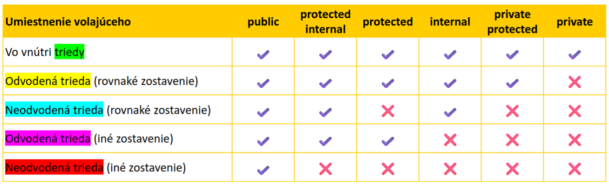
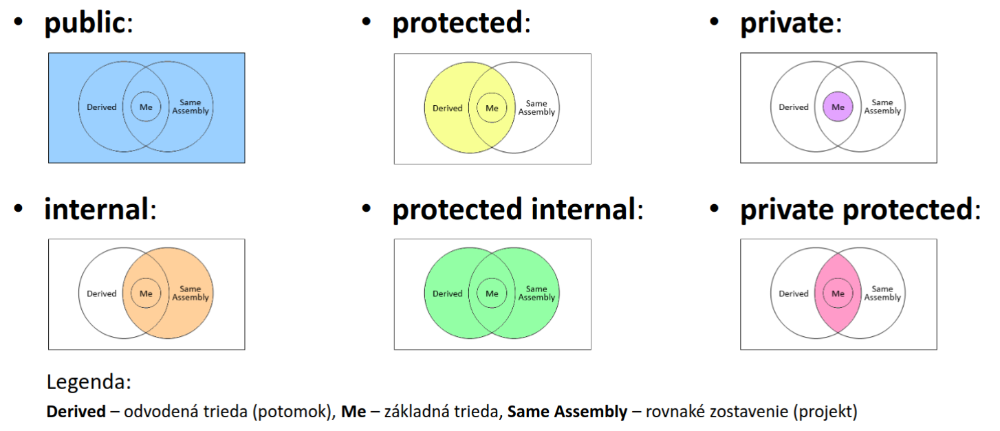

# C# a .NET

```cs
Console.WriteLine("Hello World");
```

`C#` je programovaci jazyk, `.NET` je framework ktory umoznuje beh `C#` kodu

Samotny programovaci jazyk je fess podobny Jave

`.NET` sa sklada z

- `.NET Runtime` - iba spusta uz predkompilovany kod (`.dll`)
- `.NET SDK` - Software Development Kit - obsahuje vsetko potrebne na vyvoj - kompilator aj nastroj na spustenie
- `.NET Libraries`

## Installation

Na buildovanie a spustenie programu treba nainstalovat _.NET SDK_

```shell
yay -S dotnet-sdk
```

_SDK_ uz obsahuje _Runtime_, ktory je zodpovedny za spustanie predkompilovanych `.dll` suborov  
_Runtime_ sa da nainstalovat aj samostatne, ale nie je to potrebne kedze je sucastou _SDK_

```shell
yay -S dotnet-runtime
```

Pri nejakych webovych srandickach sa pouziva _ASP.NET Runtime_

```shell
yay -S aspnet-runtime
```

### Useful commands

General

```shell
dotnet --help
dotnet --version
dotnet --list-sdks
dotnet --list-runtimes
```

Creating new app

```shell
dotnet new console  # vytvori novu konzolovu aplikaciu
dotnet new console --output HelloWorldApp  # vytvori novu konzolovu aplikaciu do noveho priecinku
dotnet new console --use-program-main  # vytvori okrem hello world aj triedu
dotnet new list # pre zobrazenie vsetkych moznosti/typov projektu

dotnet new --help
```

Running and/or Building

```shell
dotnet run
dotnet build
```

## Data Types

- Hodnotove
  - int, float, double, struct, DateTime, Enum, tuples, record struct
  - nullable - int?, DateTime? - moze 'nadobudat null' (aj ked actually nie) lebo by default napr int nemoze byt null
  - Vytvaraju sa na zasobniku
- Referencne
  - class, record, delegate, interface
  - Maju referenciu v pamati

`int` je alias na `System.Int32`, `long` na `System.Int64` atd atd (slajd v prezentacii)

Ak mam vacsie cislo ako `ulong` ($2^{64}$) mozem pouzit `BigInteger` - teoreticka velkost bez obmedzenia

```cs
BigInteger n = BigInteger.Pow(long.MaxValue, 3);
BigInteger n2 = BigInteger.Parse("99999999999999999999999999999999999999999");
// System.Numerics.BigInteger
```

### Premenne

```cs
int a = 5;
var b = 6;  // typ sa automaticky odvodi

Student abc = new('meno', 'priezvisko');  // automaticky zavola konstruktor triedy Student

string s1 = new String("Hello world");
string s2 = "Hello world";
var s3 = new string("Hello world");
string s4 = new("Hello world");

StringBuilder sb1 = new StringBuilder("sisarp");
StringBuilder sb2 = new("sisarp");
```

Pouzitie vyhradeneho slova ako nazov premennej

```cs
int new = 123;  // nemozeme spravit lebo new je vyhradene slovo
int @new = 123;
```

#### Rozsah platnosti premennej (scope)

```cs

```

Kompilator premiestnuje deklaracie premennej niekam na zaciatok!!! Nemozeme 2x deklarovat premennu

#### `const`

```cs
const doulbe pi = 3.141592654
```

#### Literaly

Predpony

```cs
var deci = 42;
var hexa = 0x2A;
var bina = 0b11001010;

var prehladnejsie = 123_456_789;
var abc = 0x234_34A_FFF;
```

Pripony (radsej pouziat velke pismeno)

- F/f float
- D/d double
- L/l long?
- ...
- M/m ako money

Explicitne konverzie

```cs
int x = 123.456;
int y = (int)x;  // explicitna konverzia, ale stracame presnost

var signedbyte = (sbyte)43;
```

## Class

```cs
public class MyClass
{
    // telo triedy
}
```

### Pristupove modifikatory

- public
- private - fields by default (konvencia hovori `private string _name;`)
- protected
- internal - triedy by default
  - podobne ako private, ale v ramci projektu
  - da sa pouzit iba v ramci jedneho projektu
  - ak mame nejaku kniznicu, tak vsetko co je internal sa nemoze pouzit mimo kniznice
- ak je vnorena trieda moze mat aj dalsie
  - private protected
  - protected internal

Staticke a instancne cleny

- static - zdielane pre vsetky instancie (konvencia hovori `private static int s_count;`)
- instancne - kazda instancia ma svoje vlastne

```cs
var myInstance = new MyClass();
MyClass myInstance2 = new();
var list = new List<MyClass>();
var list2 = new List<MyClass>() = { new MyClass(), new MyClass() };
```

Konstanta - nikdy sa nemoze zmenit  
`readonly` - v podstate ako konstanta, moze sa pouzit pri stringu - moze sa menit iba pri inicializacii, deklaracii a v konstruktore

### Co vsetko moze trieda obsahovat

- Datove cleny (fields) - na INF1 oznacovane ako atribut, ale v C# je atribut uplne nieco ine
- Finalizery (finalizers) - na INF3 oznacovane ako destruktor (takmer vobec sa nepouziva lebo garbage collector)
- Dekonstruktor - z jedneho objektu vytvorime viac objektov - rozbalime objekt do tuplu
- Indexery - v C++ je to `operator[]`
- Udalosti (events) - su na nich zalozene GUIs
- Operatory - podobne ako v C++
- Vnorene typy (nested types) - trieda v triede, enum v enum, ...
- Vlastnosti (properties)
- ... take bezne veci

### Properties

```cs
public class Person
// stara syntax
{
    private int _age;

    public int Age
    {
        get {return _age;}
        set {_age = value;}  // value je akoze implicitny parameter
    }
}

// nova syntax
public class Person2
{
    private int _age;

    public int Age
    {
        get => _age;
        set => _age = value;
    }
}
```

## Polia (arrays)

- "Stvorcove"
  - Jednorozmerne `type[]`
  - Dvojrozmerne `type[,]`
  - Trojrozmerne `type[,,]`
  - Stvorrozmerne `type[,,,]`
  - Max. 32-rozmerne
- Pole poli / zubate / jagged
  - `type[][]`
  - `type[][,]`
  - `type[][][]`

Velkost je nemenna  
Alokuju sa na halde (heap)

```cs
int[] numbers;
int[] numbers2 = new int[4];
int[] numbers3 = new int[] { 1, 2, 4, 5, 9 };
int[] numbers4 = { 1, 2, 4, 5, 9 };
int[] numbers5 = [ 1, 2, 4, 5, 9 ];

Console.WriteLine(numbers[0])  // prvy
Console.WriteLine(numbers[numbers.Lenght - 1])  // posledny
Console.WriteLine(numbers.LongLength)

// [] sa vola indexer
numbers[0] = 9;

Person[] people = new Person[2];
people[0] = new("Jozko", "Mrkvicka");
people[1] = new("Ferko", "Mrkvicka");
```

Viacrozmerne polia

```cs
int[,] twodim = new int[3, 4];
twodim[0, 0] = 1;
twodim[0, 1] = 2;
twodim[2, 3] = 9;
twodim[3, 4] = 9;

int[,] another =
{
    {1, 2},
    {3, 4}
};

Console.WriteLine(twodim.Rank);  // pocet rozmerov
Console.WriteLine(twodim.Length);  // pocet prvkov
Console.WriteLine(twodim.GetLength(0));

for (...twodim.GetLength(0)...)
{
    for (...twodim.GetLength(0)...)
    {
        // ...
    }
};

foreach (var i in twodim)
{
    // ...
};

int[][] jagged =
{
    {1, 2},
    {3, 4, 5, 6},
    {7}
};  // toto mi pride ako normalny array z inych jazykov
```

`myArray.Rank` pocet dimenzii  
`myArray.Length` pocet prvkov

Zakladom vsetkeho je abstraktna trieda `System.Array`

```cs
Array.Sort();
Array.Clone();  // shallow copy
// pre deep copy idealne serializovat a deserializovat
Array.CreateInstance();
Array.IndexOf();
Array.LastIndexOf();
Array.Exists();
Array.CopyTo();
Array.Reverse();
Array.Clear();
Array.FindAll();
Array.ForEach();
```

Priklad

```cs
var intArray = Array.CreateInstance(typeof(int), 5);
int[] numbers = (int[])intArray;  // aby sa mohol pouzit indexer

// ak chceme indexy nie od 0
int[] lengths = {2, 3};
int[] lowerBounds = {1, 10};
Array array = Array.CreateInstance(typeof(string), lengths, lowerBounds);
array.SetValue("A", 1, 10);

string[,] matrix = (string[,])array;
matrix[1, 11] = "B";
matrix[2, 11] = "C";
```

## Ranges and Indices

```cs
int[] data = {1, 2, 3, 4, 5, 6};

Console.WriteLine(data[0]);  // first
Console.WriteLine(data[^1]);  // last
// "^1" je akoze "data.Length - 1"
// to iste ako v pythone [-1]

ShowRange(data[..])  // all elements
ShowRange(data[0..4])  // first to 4th
ShowRange(data[..4])  // also first to 4th
ShowRange(data[^3..^0])  // last 3 elements
ShowRange(data[^3..])  // also last 3 elements
```

## Struktury

Ako keby odlahcena trieda  
Hodnotove typy vytvarane na zasobniku (ak nie je v triede ako field)  
Boxing - z hodnotoveho typu spravime referencny  
Daju sa oznacit ako `ref struct` - nenastava boxing, nemoze byt ako field, je rychlejsia  
Neda sa dedit, maju vzdy bezparametricky konstruktor, moze implementovat viac interfaces, nemoze byt null  
Je rychlejsia ako class, pouziva sa na male objekty  
Vytvara sa deep copy? (aj ked asi nie?)  
Moze byt nemenna - immutable - modifikator `readonly`

```cs
public readonly struct Coords { ... }
```

## Records

Poskytuje vstavane funkcionality pre classes alebo structs  
`record class`, `record struct`  
[sharplab](https://sharplab.io)

```cs
public record Person(string FirstName, string LastName);

public record class Person(string FirstName, string LastName);

public record Person(string FirstName, string LastName)
{
    // vlastne srandicky ak treba
}
```

Vytvoria sa

- konstruktory
- dekonstruktor
- gettery, settery
- metody `Equals()`, `GetHash()`, `ToString()`,
- interfaces `IEquatable`,
- vsetky mozne operatory

```cs
Person p = new("Jozko", "Mrkvicka");
Person p2 = p with { LastName="Kalerab" }
```

```cs
public readonly record struct Point(int x, int y);
```

## Anonymous types

Trieda bez mena  
Da sa iba citat

```cs
var doctor = new
{
    FirstName = "Jozko";
    LastName = "Mrkvicka";
}

Console.WriteLine(doctor.FirstName);
```

## Enums

Hodnotove typy, v podstate `int`

```cs
enum Season
{
    Spring,
    Summer,
    Autumn,
    Winter
}  // implicitne 0, 1, 2, 3

enum ErrorCode: ushort  // vlastny typ
{
    None = 0;
    Unknown = 1;
    ConnectionLost = 100;  // vlastne hodnoty
    OutlierReading = 200;
}

Color c = Color.Red;

Console.WriteLine(c);
Console.WriteLine((short)c);
Console.WriteLine((Color)2);
```

### Atribut `[Flags]`

Hodnoty by sa mali zadavat v bitoch

```cs
[Flags]
public enum Days
{
    None    = 0b_0000_0000,
    Monday  = 0b_0000_0001,
    Tuesday = 0b_0000_0010,
    ...
    Synday  = 0b_0100_0000,
    Weekend = Saturday | Sunday
}

Days meetingDays = Days.Monday | Days.Wednesday;
```

## OOP

Abstrakcia, Zapuzdrenie, Dedicnost, Polymorfizmus

```c#
public class Point3D : Point  // trieda Point3D dedi od Point
{ ... }
```

Predok je oznacovany ako `base` namiesto `super`  
`virtual` alebo `abstract` pri metode ak ju chceme polymorfne prekryvat v potomkoch  
`override` pri metode potomka, ak chceme metody prekryt  
`sealed` - zapecateda trieda, neda sa prekryvat/dedit? (v Jave `final`)

```c#
public class BaseClass
{
    protected virtual void MyMethod { ... }
}

public class DerivedClass : BaseClass
{
    protected override void MyMethod { ... }
}
```

`new` pri metodach, neviem co to robi, nieco skryva (implementaciu povodnej?), ma to zvlastne spravanie a neoporuca sa pouzivat

```c#
public class BaseClass
{
    protected void MyMethod { ... }
}

public class DerivedClass : BaseClass
{
    protected new void MyMethod { ... }
}
```

Mozeme dedit aj `record` - funguje to tak isto ako pri triedach

### Pristupove modifikatory

\*Vo vnutri triedy

`private` - dostupne uplne vsade  
`public` - dostupne iba v danom type  
`protected` - dostupne vo vnutri typu a potomkoch  
`internal` - v ramci daneho projektu (zostavenia (assembly))  
`protected internal` alebo `internal protected` - moze byt v ramci projektu, alebo v potomkoch, alebo v potomkoch ineho projektu  
`private protected` alebo `protected private` - iba v potomkoch v ramci daneho projektu (skor by to mohlo byt ze `private internal`)





Ak neuvediem, akeho typu je trieda, tak by default je `internal` (`class MyClass { ... }` je to iste ako `internal class MyClass { ... }`)  
Okrem `internal` mozem pouzit iba `public`  
Ak je trieda vnorena (trieda v triede) tak na vnorenu triedu mozem pouzit vsetkych 6 modifikatorov

## Nullable

Velky rozdiel medzi hodnotovymi a referencnymi typmi

### Nullable hodnotove typy

Napr. `int` nemoze byt `null`, lebo nie je referencny typ  
Da sa oklamat obalenim do `Nullable<int>`, alebo rovno `int?`

```c#
Nullable<int> a = null;
int? b = null;  // s tymto spravi kompilator vlastne to iste co riadok predtym

if (a.HasValue) { ... }
if (a != null) { ... }
if (a is not null) { ... }
```

### Nullable referencne typy

Ked pouzijeme referencny typ s otaznikom, nepreraba sa do `Nullable`  
Treba pouzivat, ked vieme, ze hodnota moze nadobudat hodnotu `null`

```c#
string s1 = GetString();
string? s2 = GetStringOrNull();  // ked viem, ze metoda moze vratit aj null

if (s2 is not null)
{
    s1 = s2;
}

void Method(string? s)
{
    // Console.WriteLine(s.Length);  // warning
    if (s is not null)
    {
        Console.WriteLine(s.Length);
    }
}
```

#### Povolenie/Zakazanie Nullable

Teraz by default povolene  
Da sa v `.csproj` subore zapnut (`<Nullable>Enable</Nullable>`) alebo vypnut (`<Nullable>Enable</Nullable>`)

Da sa pouzit ✨direktiva preprocesora✨

```c#
#nullable enable
    string? message = "Hello";
#nullable disable
    string message2 = null;  // nebude kontrolovat null, neoporuca sa
```

#### Atributy

`[MemberNotNull]`  
`[NotNullWhen(true)]`

## Kolekcie

- `System.Collections` - `ArrayList`, `Hashtable`, `Queue`, `Stack` - uz stare, nepouzivat, negenericke, pomale, iba kvoli spatnej kompatibilite
- `System.Collections.Generic` - `List<T>`, `Dictionary<TKey, TValue>`, ... - toto pouzivat
- `System.Collections.Concurrent` - `BlockingCollection<T>`, `ConcurrentDictionary<T>`, `Concurrent` vsetko mozne - pri praci s vlaknami
- `System.Collections.Immutable` - `ImmutableList<T>`, `ImmutableArray` - nemenne

`ObservableCollection<T>` - upozornuje pri pridavani a odstranovani prvkov (pouzivane pri GUI)  
`SortedList<TKey, TValue>` vs. `SortedDictionary<TKey, TValue>` - na vonok ziadny rozdiel, vnutri inplementovane ako list vs. binarny strom  
Genericke a negenericke su 2 samostatne objekty, subory, nie ako v Jave

## Interfaces

Rozhrania

- `IEnumberable`
- `ICollection` - zakladne - vsetky kolekcie (okrem immutable) - Add(), Remove(), Contains(), CopyTo()
- `IList` (dedi od `ICollection`) - indexovanie, Insert(), RemoveAt()
- `IDictionary` () - TryGetValue()
- `ISet` - mnozina bez duplikacii - UnionWith(), IntersectWith(), SetEquals()
- `ILookup` - vyhladavanie podla klucu

Genericke interfaces (`IEnumberable<T>`, `ICollection<T>`) implementuju ich prislusne negenericke interfaces  
Vsetko co implementuje `IEnumerable` moze byt pouzite vo `foreach`

```c#
public interface IEnumberable
{
    IEnumberator GetEnumerator();
}

public interface IEnumerable<out T> : IEnumerable
{
    IEnumerator<T> GetEnumerator();
}
```

```c#
public interface IEnumberable
{
    bool MoveNext();
    object Current { get; }
    void Reset();  // nemusi sa implementovat, ked tak vyhodit vynimku
}

public interface IEnumerable<out T> : IDisposable, IEnumerable
{
    T Current { get; }
}
```

## Yield

Klucove slovo, ktore viacia prvky

```c#
yield return vyraz;  // vrati vyraz, ale neukonci metodu?
yield break; // = return - ukonci metodu
```

```c#
public IEnumberable<int> GetNumbers()
{
    yield return 0;
    yield return 1;
    yield return 2;
    yield return 3;
    yield return 4;
    yield return 5;
}

foreach (var number in GetNumbers())
{
    Console.WriteLine(number);  // dostaneme cisla od 0 do 5
}
```

> Priklad s power

Da sa spravit aj manualne, cez triedu ktora implementuje `IEnumerable<T>` a `IEnumerator<T>`, je to nadlho

## Delegat

Odkaz (reference) na metodu alebo na metody - smerniky na metody?

```c#
public delegate in OperationDelegate(int x, inty);

public int Add(int a, int b)
{
    return a + b;
}

OperationDelegate operation = Add;  // musia mat zhodne navratovy typ a parametre
Console.WriteLine(operation(7, 3));  // = 10

operation = (x, y) => x = y;
Console.WriteLine(operation(7, 3));  // = 4

// mozem pouzit aj += namiesto len priradenia
// ked to zavolam, vyvolaju sa vsetky priradene metody, nie je zarucene poradie
```

## GUI

Myslienka - udalostne programovanie  
Aplikacia caka na udalost, ked nastane tak nieco spravi

Udalosti

- Z mysi - pohyb, klik, dvojklik
- Z klavesnice - stlacenie, uvolenenie klavesy
- Z okna - tlacidlo v okne, menu, focus, ...

### WinForms

Raster grafika

GUI je zalozene na 2 triedach - Form a Control

- Form - cele okno s ramikom, stara sa o svoje vnutro, obsahuje >= 0 controls (o samotny ramik sa stara window manager)
- Control

Modifikacia vzhladu a vlastnosti

- AutoScroll
- BackgroundImage
- ControlBox
- Icon
- Location
- Size
- Text (windows's caption)

Zmeny sa prejavuju okamzite

Akcie okna

- Activate
- Close - zatvorenie a vytvorenie zdrojov
- Hide - skryt, ale zdroje existuju
- Refresh
- Show - zobrazenie a aktivacia nemodalne
- ShowDialog - zobrazenie a aktivacia modalne (neda sa s nim nic robit)

```c#
Form1 form;
form = new Form1();
form.WindowsState = FormWindowState.Maximized;
form.Show();
```

Udalosti Form

- Load
- Closing
- Closed
- Resize
- Click
- KeyPress

Controls

- Button, CheckBox, RadioButton
- Label
- TextBox
- ListBox
- GroupBox

#### Docking/Anchoring

Anchoring - zakotvenie na relativnu poziciu v okne - topleft, top, topright, none, ...  
Docking - prilepenie k danemu okraju okna - topdock, leftdock, rightdock, bottomdock, filldock

#### Viacvlaknove aplikacie

GUI bezi v jednom vlakne - UIthread  
WinForms nedovolia modifikovat property z inych vlakien - konci vynimkou  
Riesenie - preposlat udalost do UIthread

Vypocet/metodu po stlaceni tlacidla sputime v novom vlakne

```c#
private void button_Click(object a)
{
    Thread t = new Thread(Pocitanie)
    t.Start();
}

private void Pocitanie() {...}  // skonci vynimkou ak sa pokusime modifikovat tu
// riesenie -InvokeRequired (prida novu udalost na koniec queue)
```

### WPF
