# PANS

Principy a Aplikacie Neuronovych Sieti

Hodnotenie

- Semester 50
  - 10 python kurz
  - 20 male online testy (dokopy 4)
  - 15 challenge solving
  - 5 projekt
- Skuska 50
  - 30 prakticka cast
  - 20 ustna cast

## Uvod

### AI vs. ML vs. DL

Slovník Merriam-Webster - artificial intelligence (noun): the capability of computer systems or algorithms to imitate intelligent human behavior

Artificial Inteligence

- Vseobecny pojem pre vsetko dalsie
- Stroj sa sprava podobne ako keby mal ludske myslenie
- Tu nemame ziadne data
- Priklad
  - Jednoduchy SPAM filter - dame si pravidlo ze chceme filtrovat spravy ktore obsahuju slovo Free

Machine Learning

- Trochu zlozitejsie
- **Natrenovane** na datach
- **Strukturovane data s priznakmi**
- My urcujeme priznaky
- Zlozitejsi spam filter - na zaklade viac parametrov + dame sadu sprav na ktorej si to natrenuje

Deep Learning

- Najzlozitejsie
- Nestrukturovane - text, audio, video
- Dame stroju vela vela dat, povieme mu ktore spravy su spam a ktore nie, on si sam pride na to ako to bude vyhodnocovat

DL je podkategoria ML  
ML je podkategoria AI

Este podkategoria DL - Generativna AI - vstup moze byt vsetko, vystup moze byt vsetko - chatgpt

### Ulohy pre AI

Klasifikacia - predpovedam triedu  
Regresia - predpovedam cislo  
Zhlukovanie (clustering) - nemam stitky/znacky/labels

### Typy ucenia

Supervised

- Mam k dispozicie dvojice `X` a `Y`
  - `X` su data
  - `Y` su stitky

Unsupervised

- Mam k dispozicii len `X`

`X` je to co viem zmerat
`Y` je to co by som chcel zistit

Unsupervised

- Klasifikacia
- Regresia
- Clustrovanie

### Pipeline praca ML

1. Ziskam data
2. Spracujem ich, vyrobim priznaky
3. Natrenujem model
4. Vyhodnotim
5. Opakujem dookola - mozem zmenit data, priznaky, model

### Rozdelenie dat

Trenovacia cast

- Trenujem na nej

Validacna cast

- Not sure co to je, iba si myslim
- Ked uz mam natrenovane tak ako keby overim ci som natrenoval dobre
- Nasledne mozem poupravovat veci

Testovacia cast

- Tieto data nevidim pri treningu
- "Svaty dataset"
- Az tu sa uplne zisti ze ci je nas model dobry alebo je natrenovany len na trenovacie a validacne data

Priklad na testoch

- Trenovacia cast - ucebne materialy, prednasky, skripta, ...
- Validacna cast
  - Testy od spoluziakov z minulych rokov
  - Mozem si otestovat ci som sa dobre naucil
  - Ale to ze budem vediet odpovede na tieto otazky mi este nezarucuje ze budem vediet odpvoedat aj v skole na teste (ucitel moze zmenit test)
- Testovacia cast
  - Actually test/skuska v skole
  - Az tu sa zisti ci som sa naozaj dobre naucil

Mozu byt rozdelene v pomere napr. 60%/20%/20%

### Baseline algoritmy

#### Linearna regresia

$y \approx w \times x + b$

Zvolime "dato" na zaklade linearnej regresie  
Hladam priamku/rovinu, ktora najlepsie sedi na datach

Interpretovatelny - vieme povedat co jednotlive prvky vyjadruju

Mozeme mat napr $\hat{y} = w_1 x_1 + w_2 x_2 + b$

- $\hat{y}$ = odhadovana cena bytu
- $w_1$ = cena za $1 m^2$
- $x_1$ = celkova rozloha v $m^2$
- $w_2$ = cena za jednu izbu
- $x_2$ = celkovy pocet izieb
- $b$ = konstanta (casto nic nevyjadruje, nema zmysel)

Hladame toto: $min \sum_{i} (y_i - \hat{y}_i)^2$ - cize taku priamku kde rozdiel medzi nameranymi datami a touto priamkou bude co najmensi

Z poskytnutych dat sme linearnou regresiou zistili ze $w_1 \approx 1.8$, $w_2 \approx 21.1$ (v tisicoch eur), $b = -4.5$

Priklad s bytom (urcujeme cenu bytu na zaklade rozlohy a poctu izieb), BMI, glukoza, ...

#### k-NN

`k` Nearest Neighbors - `k` Najblizsich Susedov  
Hyperparameter `k` = pocet susedov

Ked nevieme, co je novy bod, pozriem sa na jeho najblizsich susedov v treningovych datach  
Zvolime "dato" na zaklade `k` najblizsich susedoch  
Napriklad si zvolime ze $k = 2$, cize mozeme robit priemer 2 najblizsich susedov
**Hodnota `k` sa voli na validacnych datach**

Problem - pri zvoleni susedov moze byt problem s mierkami (scale)  
Napr. x-ova os moze vyjadrovat pocet izieb (2-5), y-ova os moze vyjadrovat rozlohu (40-150)  
Mozu byt vyrazne odlisne vysledky

Napr. pre byt $62 m^2$ a 3 izby

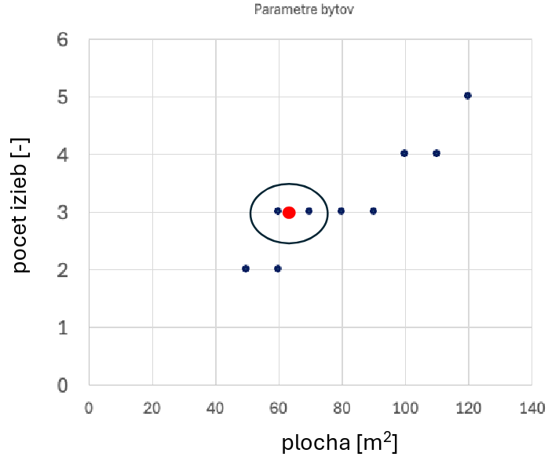  
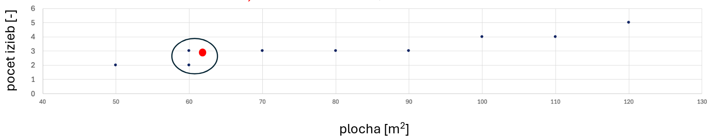

Pri prvom nam vyjde cena 180 tisic, pri druhom 162 tisic, a z linearnej regresie nam vyslo 174 tisic

Riesenie

- Stanardizovat $x_1$ a $x_2$ - odcitanie priemeru a delenie smerodajnou odchylkou
- Normalizacia - scale na interval $<0; 1>$

#### k-means

`k`-priemery

Priradime "dato" k nejakemu centroidu

Zvolime si `k` centroidov, nasledne robime v cykle:

- Kazde "dato" priradim k najblizsiemu centroidu (priamka medzi nimi, v strede kolmica)
- Pre kazdu skupinu dat priradenych k centroidu vypocitam tazisko
- Posuniem centroid na vypocitane tazisko

### Co ak mame vela priznakov

Linearna regresia je super ked mame malo (a kvalitnych) priznakov - rozloha bytu a pocet izieb  
Problem vznika ked mame vela parametrov, napr. [MNIST dataset](https://github.com/cvdfoundation/mnist) - obrazky 28x28 pixelov = 784 priznakov  
Tu sa straca interpretovatelnost - nevieme povedat co konkretne vyjadruje jeden dany pixel  
Linearna regresia je interpretovatelna iba ak mame malo priznakov a kvalitne priznaky

Riesenie

- PCA - neda sa pouzit vzdy
- Embeddingy (?)
- **Deep Learning** (DL) - automaticky zisti priznaky (_features_) - **neuronove siete**

Preco Deep Learning?

- Pri klasickom ML (machine learning)
  - Dobre priznaky
  - Jednoduchy model
  - Vyhoda - interpretovatelnost (ak je priznakov malo)
- Neuronove siete - Deep Learning
  - Vrstvy postupne transformuju vstup na reprezentaciu
  - Z reprezentacie sa robi predikcia/klasifikacia
  - Nevyhoda - casto nie je interpretovatelne - pri MNIST nevieme popisat co robi konkretny pixel

Extrakcia priznakov je casto klucova - a DL je cesta

## Zaklady hlbokeho strojoveho ucenia

### Neuronova siet

Neuronova siet = funkcia

- Zoberie vektor s vela komponentami (28x28 = 784 rozmerny vektor)
- Vrati nam nejaku hodnotu (napr. ci je obrazok cislo 5)

**Proces**: Realita - Kvantifikacia - Model

- Oblacnost, unava - Hotnoty $x, y$ - Funkcia $z = f(x, y)$
- Obrazok 28x28 pixelov - Vektor s 784 komponentami - Funkcia $z = f(\mathbf{x})$, kde $\mathbf{x}$ je vektor, funkcia vracia cislo $\in <0 .. 1>$

Priklad s festivalom

- Uplne jednoducho - dcera chce ist ak su aspon 2 podmienky splnene
  - $x_1 + x_2 + x_3 > 1$
- Pridame vahy - zvazi to viac ak s nou pojde priatel
  - $0.2x_1 + 1.8x_2 + 1x_3 > 1$
- Vo vseobecnosti
  - $w_1x_1 + w_2x_2 + w_3x_3 > T$

Parametre $x_1$, $x_2$, $x_3$ - do vektora $\mathbf{x}$  
Vahy $w_1, w_2, w_3$ - do vektora $\mathbf{w}$  
Bias $b$  
Ci ideme je funkcia $\sum_{i=1}^{n} w_i x_i + b >= 0$, alebo vektorovo $\mathbf{w} \cdot \mathbf{x} + b >= 0$

Ak predchadzajuca funkcia $>=0$ tak rozhodnutie je $1$, inak je rozhodnutie $0$
Pouzijem **Heaviside-ovu funkciu** - pre hodnoty $=< 0$ dava $0$, pre hodnoty $> 0$ dava $0$

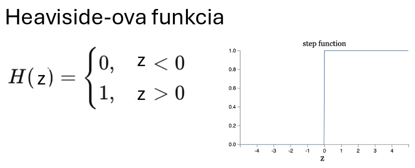

Matematicky zapis $y = f(\mathbf{x}) = H(\mathbf{w} \cdot \mathbf{x} + b)$  
Funkcia $H(z)$ (Heaviside-ova funkcia) sa nazyva aktivacna funkcia

Ucenie vahy ($\mathbf{w}$) a biasu ($\mathbf{b}$) = parametrov (alebo hyperparametrov) = **proces ucenia sa modelu**  
Hladanie parametrov tak, aby model sedel na data

Do neuronu dame vstupy s vahami, neuron da nam vystup

### Perceptron

Typ neuronu  
Je aktivovany Heaviside-ovou funkciou

- `0` ak $\mathbf{w} \cdot \mathbf{x} + b <= 0$
- `1` ak $\mathbf{w} \cdot \mathbf{x} + b > 0$

**Perceptron** - typ neuronu, ktory pouziva aktivacnu funkciu `H` (Heaviside)

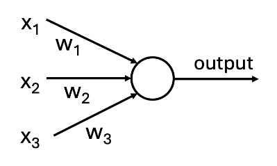

Viac perceptronov

- Napr. priklad s festivalom - nemame iba dceru ale aj dalsich 2 synov
- Neprehladne ked mame specificky vyberat ze ktory vstup do ktoreho perceptronu
- Riesenie - kazdy vstup do kazdeho perceptronu a menime vahy, tam kde nechceme nic dame vahu 0
- Vahy $\mathbf{w}_{ij}$ - z parametru $i$ do percepronu $j$
- Biasy $b_j$, kde $j \in (1, 2, 3)$

Parametre = vahy + biasy

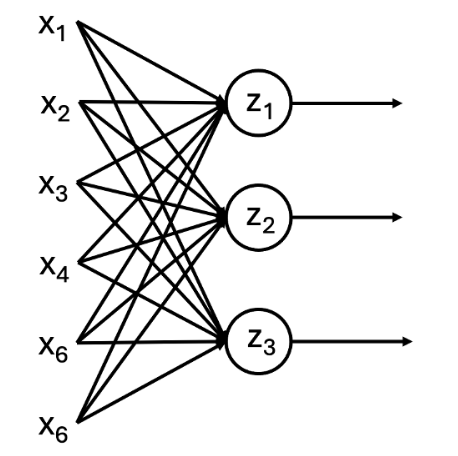

Rozhodneme sa ze na festival pojdeme ak chcu ist aspon dvaja

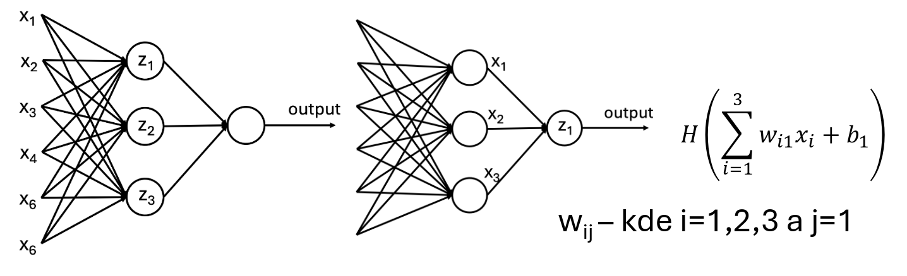

#### Problem nespojitosti

Mala zmena ma velky dopad na vysledok (prekrocenie thresholdu)

> Napr. pocasie za zmeni o 1 stupen tak sa zrazu nejde na festival

Tento problem vyplyva zo skoku vo funkcii $H$

Riesenie - pouzitie inej aktivacnej funkcie

### Aktivacne funkcie

#### Heaviside-ova funkcia

Uz sa spominala predchvilou  
Perceptron

#### Sigmoidova funkcia

Taka vlnka

- Ak je vystup velmi zaporny $\rightarrow$ `0`
- Ak je vystup velmi kladny $\rightarrow$ `1`
- Ak je vystup niekde medzi, tak vystup bude niekde medzi `0` a `1`

Vzorec: $\sigma(z) = \dfrac{1}{1 + e^{-z}}$

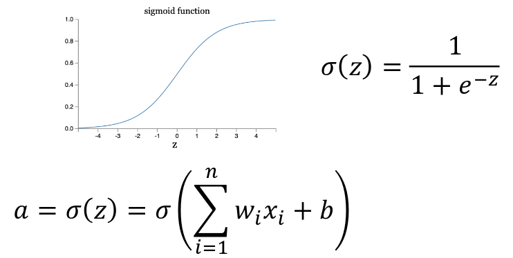

#### ReLU

Rectified Linear Unit

- Ak $vystup < 0 \rightarrow 0$
- Ak $vystup \ge 0 \rightarrow <1 .. \infty >$ (nad $1$ rastie linearne)

$max(0, z)$

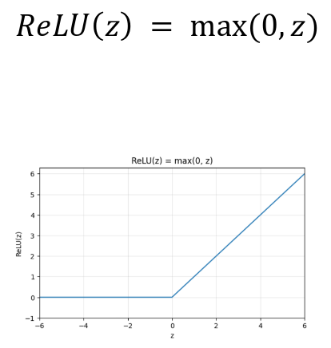

### Terminologia

- Vstupna vrstva
- Skryte vrstvy
- Vystupna vrstva
- Aktivacna vrstva
- Neuron
- Vahy
- Biasy
- Vrstva
- Sirka - pocet neuronov v jednej vrstve
- Hlbka - pocet vrstiev
- Parametre - vahy + biasy

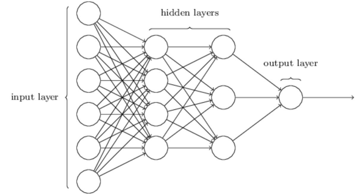

### Formalizacia ucenia sa neuronovej siete

Pome to dat nejak dokopy  
Priklad s festivalom

- 6 vstupov - pocasie, mhd, kamarati, ...
- 3 deti - rozhodnu sa na zaklade vstupov
- 2 rodicia - rozhodnu sa na zaklade deti
- 1 vystup - rozhodne sa podla toho co povedia rodicia

**Siet je funkcia**

- Zoberie vstupy $x_1, ..., x_6$
- Vrati nam vystup - hodnotu, cislo $\in <0..1>$
- Ma vnutri parametre $\mathbf{w}$ a $\mathbf{b}$
- K dispozicii ma mnoho dvojic $\mathbf{x}, y$

Ciel - najst take $\mathbf{w}$ a $\mathbf{b}$ aby predikovane hodnoty $\hat{y}$ boli co najblizsie $y$  
$\hat{y} = F_{w, b}(x)$ sa ma podobat na $y$ = minimalizacia MSE (mean square error) - rozdiely na druhu  
Minimalizujeme $MSE(\mathbf{w}, \mathbf{b}) = \dfrac{1}{n} \sum_{data}(\hat{y} - y)^2 = \dfrac{1}{n} \sum_{data}(F_{w, b}(x) - y)^2$  
Vstupy $x$, data $y$, predikcia $\hat{y} = F_{w, b}(x)$  
V podstate metoda najmensich stvorcov z AP  
$min(MSE(w,b))$

#### Minimalizacia $MSE(\mathbf{w}, \mathbf{b})$

Pri jednom parametri - jediny neuron - hladanie minima funkcie = miesto kde $derivacia = 0$  
Pri viacerych premennych - $parcialne derivacie = 0$  
Pri 784 premennych je to fess problem - sustava 784 rovnic

Riesenie - **iterovanie**

- Som v horach, strasna hmla, nevidim na 2 metre, snazim sa dostat dole
- Iterujem
  - Stojim na mieste, pootacam sa dookola, najdem _smer najvacsieho sklonu_ - kolmo na vrstevnicu
  - Spravim par krokov dopredu
- $(x_{n+1}, y_{n+1}) = (x_n, y_n) - \eta \cdot (Dx, Dy)$
- $n = n+1$
- Moze sa stat ze nepridem dole na parkovisko ku autu, ale niekde do ineho udolia/jazierka/cojaviemco

$(w_{n+1}, b_{n+1}) = (w_n, b_n) - \eta \cdot (dF/dw, dF/db)$  
Klucovy krok su parcialne derivacie $F$

Iterovanie (derivacie) nemusia fungovat pri perceptrone (Heavisideova funkcia)

#### Learning rate

Dlzka kroku ked idem dole z kopca

- Moze sa stat ze je moc maly - moc dlho pojdeme - dlho to trva
- Moze sa stat ze je moc velky - mozeme prepasnut to minimum a nikdy minimum nenajdeme

## Trening neuronovej siete - od chyby k vahe

### Data, parametre, hyperparametre

Supervised learning pracuje s parmi `(X, Y)`

- `X` - priznaky (features) - co vieme zmerat o kazdom priklade - plocha bytu, pocet izieb, ...
- `Y` - label (stitok/anotacia) - co chceme predpovedat - cena bytu

V buducnosti chcem co najpresnejsie predikovat `X`, ktore momentalne nepozna

#### Parametre vs. Hyperparametre

Parametre

- Hodnoty, ktore sa bude siet ucit
- Napr. Vahy, Biasy
- Nastavia sa pocas trenovania - optimalizacna metoda ich aktualizuje automaticky v kazdom krokou (gradient descent)

Hyperparametre

- Nastavenia, ktore volime my - pred treningom, alebo mimo neho
- Napr. Learning rate, pocet vrstiev, aktivacna funkcia
- Nastavia sa mimo treningu, optimalne hodnoty hladame na validacnych datach

Priklad

| Uloha             | Hyperparameter                                                              | Parameter                                      |
| ----------------- | --------------------------------------------------------------------------- | ---------------------------------------------- |
| k-NN              | `k` = pocet susedov, nastavovali sme na validacnych datach                  | Ziadne (k-NN si nic netrenuje)                 |
| Linearna regresia | Ziadne (zadavame iba data)                                                  | Koeficienty $w_1, w_2, b$ (najdene analyticky) |
| Neuronova siet    | Learning rate $\eta$, pocet vrstiev, pocet neuronov, aktivacna funkcia, ... | Vahy a biasy - $w, b$                          |

### Stratova funkcia a minimalizacia (optimalizacia)

Treningovy cyklus (toto iterujeme)

1. Data `(X, Y)`
2. Forward pass - predikcie siete $\hat{y} = f(X, w)$ - vypocty
3. Loss - $L(\hat{y}, y)$ - zmeranie chyby, napr. MSE
4. Gradient - $\partial L / \partial w$ - **backpropagation**
5. Aktualizacia vah - optimalizacia

#### Vystupna vrstva zavisi od ulohy

- Regresia
- Binarna klasifikacia
- Multi-class klasifikacia

|                   | Regresia                                  | Binarna klasifikacia                  | Multi-class                        |
| ----------------- | ----------------------------------------- | ------------------------------------- | ---------------------------------- |
| Pocet vystupov    | 1 vystupny neuron                         | 1 vystupny neuron                     | $N$ vystupnych neuronov (1/trieda) |
| Aktivacna funkcia | Bez aktivacnej funkcie                    | Sigmoid $\sigma (z)$                  | Softmax                            |
| Vystupny rozsah   | Vystup $\in \mathbb{R}$ - lubovolne cislo | Vystup $\in (0, 1)$ - pravdepodobnost | Vektor pravdepodobnosti, sucet = 1 |
| Priklad           | Cena bytu, predikcia teploty              | Spam/nie spam, chory/zdravy           | Pes, macka, vtak, cifry 0-9        |

#### Linearna regresia

$\hat{y} = w \cdot x + b$

Najjednoduchsi priklad

> Aktivacna funkcia prinasa nelinearitu, my chceme _linearnu_ regresiu

Treningovy cyklus

1. Vypocet forward pass - $\hat{y} = w \cdot x + b$
2. Vypocet chyby - Loss $L = (y - \hat{y})^2$
3. Gradient - parcialne derivacie - $\eta L / \partial w$
4. Update parametrov - $w \leftarrow w - \eta \cdot \partial L / \partial w$

#### Stratova funkcia

Stratova funkcia $\dfrac{1}{n} \sum (\hat{y_i} - y_i)^2$ - MSE (mean squared error)  
Potrebujeme zisti ci siet predikuje dobre - potrebujeme jedno cislo - stratu

- Na druhu lebo nech sa to nevykompenzuje (kladne + zaporne), cize vzdy bude kladne
- Vacsia chyba = vacsi dopad, su penalizovane viac
- $\dfrac{1}{n}$ lebo priemer, $n$ je pocet dat alebo coho to idk, proste priemer

#### Minimalizacia straty - 1D

MSE je ako funkcia vahy $w$, teda $L(w)$ je krivka, ktorej minimum hladame  
Kde je minimum? Tam kde je derivacia = 0

Gradient descent ($\partial L / \partial w$) hovori o tom, ktorym smerom strata rastie, ked zvysime $w$

- Ak je gradient kladny - strata rastie smerom doprava - my musime ist dolava
- Ak je gradient zaporny - strata rastie smerom dolava - my musime ist doprava

**Vypocitame sklon krivky v aktualnom bode a ideme opacnym smerom**

$w \leftarrow w - \eta \cdot \partial L / \partial w$

$\partial L / \partial w > 0$ = krivka stupa - $w$ zmensime  
$\partial L / \partial w <= 0$ = krivka klesa - $w$ zvacsime

#### Minimalizacia straty - 2D a mnoho D

Mame 2 vahy - $w_1, w_2$, MSE je plocha

$\nabla L = [\partial L / \partial w_1, \partial L / \partial w_2]$

Zvlast pocitame pre kazdu vahu  
Kazdu vahu potom updatneme zvlast

- $w_1 \leftarrow w_1 - \eta \cdot \partial L / \partial w_1$
- $w_2 \leftarrow w_2 - \eta \cdot \partial L / \partial w_2$

Pri vyssich dimenziach ako 2 je to to iste, len s viac vahami

#### Learning rate $\eta$ - velkost kroku

Ak prilis maly - pomala konvergencia (trva dlho), mozeme uviaznut v lokalnom minime  
Ak prilis velky - preskakujeme minimum, divergencia, loss stupa namiesto klesania  
"Optimalny" - plynula konvergencia, uplne optimalny neexistuje

Learning rate $\eta$ je hyperparameter, volime ho my, byva to male cislo ($\approx 0.001$), este sa k tomu dostaneme

Kazdy krok je narocne vypocitat - forward pass, derivacie, ...

### Backpropagation

Ako zistit, ktoru vahu zmenit a o kolko

Siet ma miliony/biliony vah  
Po forward passe vieme stratu $L$  
Ako zistit konkretne ktoru vahu zmenit a o kolko

- Nahodne zmeny - mozno ok pre mensie siete, pri vacsich nepouzitelne
- Numericky gradient
  - Pre kazdu vahu $w$ spocitame $(L(w + \epsilon) - L(w)) / \epsilon$
  - Je to presne, ale pri 1M vahach je to 1M doprednych krokov
- Metaheuristiky? - trochu "prehladame" miesto kde dostavame dobre vysledky, ten isty problem co pri nahodnych zmenach
- Backpropagation
  - Analyticky gradient pomocou **Chain rule**
  - Siet je velka funkcia - $a ( a ( a (w \cdot x + b)))$, kde $a$ je aktivacna funkcia
  - 1 spatny prechod
  - $\partial L / \partial w$ pre kazdu vahu naraz, rovnaka presnost

Backward pass = backpropagation + gradient descent

#### Preco nie numericky gradient

Pri numerickom gradiente je takyto postup

1. Vyber vahu $w_1$ (z tisicov vah)
2. Spusti forward pass s $w_1 + \epsilon$ - cely dataset
3. Spocitaj gradient pre $w_1$ - derivacia
4. Opakuj pre $w_2, w_3, ... w_n$, kde $n$ = pocet vah (tisice/miliony)

Pri backprop sa vyuziva chain rule - $\partial L / \partial w = \partial L / \partial a \cdot \partial a / \partial z \cdot \partial z / \partial w$

1. Pri forward passe ulozime medzivysledky
2. Spocitaj $\partial L / \partial \hat{y}$ pri vystupe - zaciatok spatneho prechodu
3. Sir gradienty dozadu (chain rule) - vrstva po vrstve
4. Vysledok = $\partial L / \partial w$ pre kazdu vahu - vsetky naraz, jeden prechod

Tym padom pri numerickom gradiente mame tisice/miliony/miliardy forward passow pre kazdy krok treningu  
Pri backprop mame jeden forward + jeden backward na kazdy krok

Backprop vyuziva medzivysledky z forward passu - nepotrebuje opakovat dopredny prechod pre kazdu vahu

#### Backdrop $\ne$ Gradient descent

Backprop

- Vypocita gradienty $\partial L / \partial w$ pre kazdu vahu
- Nic nemeni, len pocita
- Vystup je vektor gradientov - $[\partial L / \partial w_1, \partial L / \partial w_2, ...]$

Optimizator - napr. gradient descent

- Vezme gradienty a aktualizuje na ich zaklade vahy
- $w \leftarrow w - \eta \cdot \partial L / \partial w$
- Su aj ine optimizatory - Adam, RMSProp - tiez vyuzivaju gradienty, aktualizuju inak

Backprop pocita gradienty, optimizator s nimi actually nieco robi

**trening = backdrop + optimizator + data**

#### Chain rule

Chain rule je zaklad backprop

Strata $L$ zavisi od aktivacie $a$  
Aktivacia $a$ zavisi od $z$  
$z$ zavisi od $w$

Otazka - o kolko zmena $w$ ovplyvni $L$

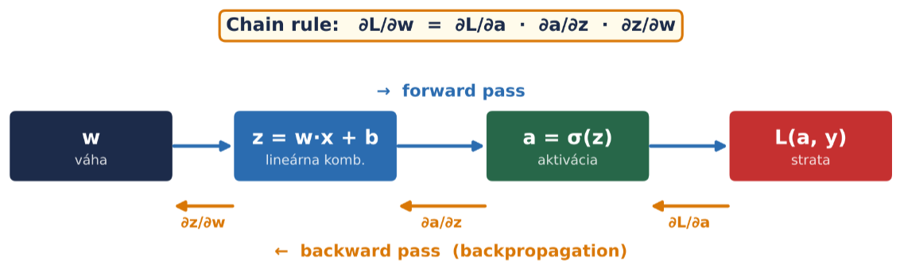

Normalne pri forward pass ideme takto

1. Vaha $w$
2. Linearna kombinacia $z = w \cdot x + b$
3. Aktivacia $a = \delta (x)$
4. Strata $L(a, y)$

Tuto ideme odkonca, dobime derivacie

1. Vieme stratu, spravime $\partial L / \partial a$
2. $\partial a / \partial z$
3. $\partial z / \partial w$

$\partial L / \partial w = \partial L / \partial a \cdot \partial a / \partial z \cdot \partial z / \partial w$

Treba sa pozerat na derivacie  
Derivacie aktivacnych funkcii, derivacie neviem coho  
Staci vediet 1. derivaciu  
System musi mat derivaciu

Backprop zvycajne nenajde globalne minimum  
Najde lokalne alebo uviazne v sedlovom bode  
Pre hlboke siete sedlove body dominuju nad lokalnymi minimami  
V praxi to vacsinou nevadi

Backprop nemeni architekturu siete, iba hodnoty vah a biasov  
Pocet vrstiev a neuronov je fixny pocas celeho treningu

Velkost kroku zavisi od $\eta$ aj $| \partial L / \partial w |$ (hyperparameter aj strmost povrchu)  
Blizsie k minimu su kroky prirodzene mensie

Nie kazdy forward pass musi vidiet cely dataset, v buducnosti budeme pouzivat mini-batche

### Problemy pri treningu siete

#### Vanishing gradient

Sigmoid

- Dobre vlastnosti
  - V strede spravi mala zmena velky rozdiel - rozhodnost
- Neprijemne vlastnosti
  - Uplne "na zaciatku a na konci" sa "hybe pomaly" - saturovany
    - Velmi to spomali trening pri tychto hodnotach
  - Derivacia sigmoidu = max 0.25
    - V kazdom kroku sa zmeni minimalne o 0.25 nasobok
    - Nasobime max. 0.25
    - Po viac vrstvach sa moze stat ze vysledok bude 0
    - Prve vrstvy su takmer bez gradientu - prestanu sa ucit

ReLU - rectified linear unit

- Derivacia 0 alebo 1
  - V bode 0 actually nema ale tvarime sa ze ma - dame tam proste ze je bud 0 alebo 1
- Cize sa ten trening nespomali ako pri sigmoide
- Nevyhoda - pri 0 sa neuron neuci, "da sa z toho nejak dostat ale vy sa z toho nedostanete"
  - Riesenie - leaky relu, elu, ...

Vanishing gradiet = siet sa uci cim dalej tym pomalsie

#### Exploding gradient

Pri predchadzajucich problemoch bol problem s malymi vahami  
Preco nedrzat velke vahy?  
Vahy sa mozu zacat exponenscialne zvysovat, potom nepresnosti s pocitanim a dalsie obmedzenia

Riesienie - zamedzit _nieco_ >1

#### Preco ReLU

> preco nie tho

## Trening a vyhodnotenie - od vystupu siete po generalizaciu

### Binarna klasifikacia

Jeden vystup, bud ano alebo nie, detekujeme ci vstup je dana trieda  
Transformujeme sigmoid funkciou  
Podla vystupu sa rozhodneme ci ano alebo nie, napr. ak $\ge 0.5$ tak ano  
Vystup sigm ide do loss funkcie, na zaklade ktorej klasifikujeme

> Ordinalne kodovanie

$p$ = predikcia  
Loss funkcia - **binary cross-entropy** - $- (y \cdot \log p + (1 - y) \cdot \log (1-p))$  
Vystup $p = P(trieda_1 | x) \in (0, 1)$ - klasifikacia na zaklade thresholdu (typicky 0.5)  
Ake je pravdepodobnost ze trieda je $1$ na zaklade $x$

#### Binary Cross-entropy

Loss funkcia

$- (y \cdot \log p + (1 - y) \cdot \log (1-p))$

### Viac tried

Napr. rozoznavanie viac zvieratiek

Keby to chceme rozoznavat len na zaklade 1 vystupneho neuronu - **ordinalne kodovanie**  
Povieme si (vymyslime si) napr. ze pes = 0, macka = 1, vtak = 2, ...

Problem - tymto hovorim ze pes je viac podobny macke ako vtakovi  
Tiez hovorime ze macka = priemer medzi psom a vtakom  
Tiez problem ze sa to bude snazit napchat do priemeru (najmensia chyba), cize ked poviem ze vsetko su macky tak bude najmensia chyba  
Pri este viac triedach - okrajove triedy mozno vobec nebudu nikdy na vystupe

Riesenie - **one-hot kodovanie** - tolko vystupov kolko mame tried  
(to predtym bolo _ordinalne_ kodovanie)

#### One-hot kodovanie

One-hot = prave jedna jednotka (vo vektore)  
Ocakava sa ze vzdy bude spravny vysledok len jedna trieda  
Dame to do viacrozmerneho priestoru  
Napr. pes = (1, 0, 0), macka = (0, 1, 0), vtak = (0, 0, 1)  
Kazda trieda ma vlastny nezavisly vystup  
Vysledky su vektory, ktore su na seba kolme, skalarny sucin = 0  
**Vektory su nezavisle** - zmena jednej triedy nijak neovplyvni ostatne  
Vsetky vzdialenosti su na seba nezavisle, vsetky vzdialenosti su rovnake ($\sqrt 2$)

Keby si to predstavime v priestore

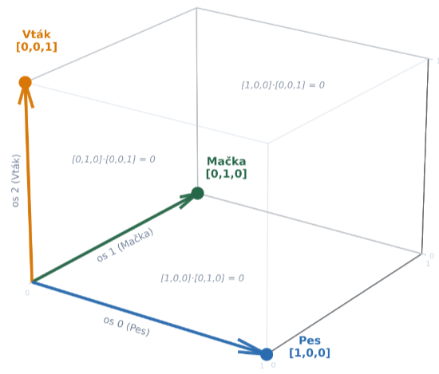

Kazda trieda dostane vlastny neuron (na vystupe)  
Pre `k` tried = `k` vystupnych neuronov = `k` hodnot pred softmaxom  
Loss sa pocita cez vsetky triedy - softmax + cross-entropy

> Softmax = aktivacna funkcia
> Cross-entropy = loss funkcia

#### Softmax

Multi-triedne rozdelenie pravdepodobnosti  
Spravi to ze suma vsetkych vystupov = 1, vsetky vystupy su medzi 0, 1  
Cize v podstate normalizacia  
Normalizacia na rozdelenie pravdepodobnosti  
Sigmoid toto robi na jednom neurone, softmax to robi na vela neuronoch

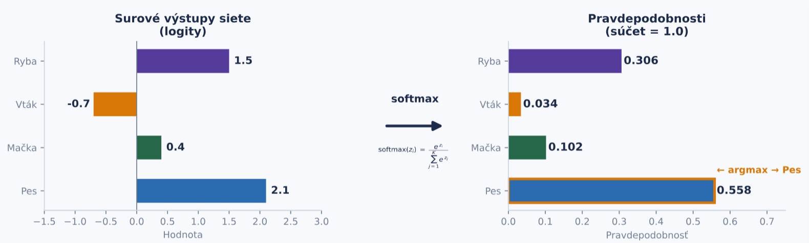

$softmax(z_i) = \dfrac{e^{z_i}}{\sum_{j=1}^{K}e^{z_j}}$

> argmax = trieda s najvacsou pravdepodobnostou = finalna predikcia

#### Logit

O tomto uz sme sa bavili predtym, len chybala definicia  
Surovy vystup zo siete (pred aktivaciou)  
$\sum x \cdot w + b$

Vystup zo siete je napr. $(-0.5, 0.4, 2.1)$ - toto su logity  
Aplikujeme softmax na vsetky logity - na vsetky vystupy zo siete  
Softmax z toho spravi napr. $(0.02, 0.08, 0.9)$ (vymyslam si hej, actually sa to pocita)  
Dostaneme rozdelenie pravdepodobnosti (najvacsia pravdepodobnost vyhrava, v tomto pripade posledny neuron)

Preco softmax a nie nejaky priemer - velke rozdiely chcem zosilnovat  
Nechceme to zosilnovat vahami, lebo to vyvolava nestabilitu (mala zmena na zaciatku = velka zmena na vystupe), viac nachylne na pretrenovanie a explozie

#### Cross-entropy

Loss funkcia i guess  
$L = - \sum_{k=1}^{K} y_k \cdot \log \hat{p}_k$  
Suma cez vsetkych $K$ tried  
Kedze vieme ze onehot dava ze vsade 0 ($y_k = 0$) okrem spravnej hodnoty ($y_c$) (skalarny sucin), tak dostaneme nieco taketo...  
$L = -(0 + 0 + ... + 1 \cdot \log \hat{p}_c + 0 + ...)$  
Cize $L = -(1 \cdot \log \hat{p}_c)$  
Po zjednoduseni $L = - \log \hat{p}_c$

Po softmaxe dostaneme napr. vystup $(0.8, 0.1, 0.1)$, co sa dobre porovnava s $(1, 0, 0)$ - spravime skalarny sucin  
Dostaneme napr. ze $0.8$ v tomto pripade  
Dame na zaciatok minus $\rightarrow -0.8$  
Chceme minimalizovat, cize chceme co najmensie cislo  
Keby po softmax dostaneme $(0.1, 0.8, 0.1) \rightarrow 0.1 \rightarrow -0.1$, toto nie je az taky maly vystup = je horsie

V skutocnosti optimalizujeme logity (nie uplny vysledok?), potom sa nam zoptimalizuje aj transformacia

Dosledok - GPU pocita len jeden logaritmus = $- \log \hat{p}_c$, nepocita sumu cez vsetky triedy  
Aj pri 100 clenoch je to je len jeden - ten uplne posledny na konci (cross-entropy)  
Softmax ale musi prejst cez vsetky triedy (suma v menovateli)

### Ako natavit threshold

Ako povieme ze ktora trieda je vysledok  
Aby si bola siet "ista"  
Napr. ze "vysledok musi byt aspon 0.9, inak povieme ze neviem"  
By default moze byt ze 0.5  
Mozeme ho ale posunut - ten "stred" bude az 0.7 napr  
0.5 tresta chyby rovnako, irl je vacsinou jedna chyba "drahsia"  
Pri rontgene - na jednu stranu mozeme povedat ze zdravy clovek je chory (zbytocna panika), alebo chory clovek je zdravy (neodhalime chorobu) - potrebujeme to nastavit co optimalnejsie

> Jedno z rieseni by mohlo byt dalsiu triedu niekde v strede

Vystupna vrstva zavisi od ulohy

| Uloha                   | Pocet vystupov | Aktivacia | Loss funkcia         | Vystup                                       |
| ----------------------- | -------------- | --------- | -------------------- | -------------------------------------------- |
| Regresia                | 1              | Ziadna    | MSE                  | Realne cislo                                 |
| Binarna klasifikacia    | 1              | Sigmoid   | Binary Cross-Entropy | Pravdepodobnost $P(trieda_1 \| x) \in (0,1)$ |
| Multi-class ($K$) tried | $K$            | Softmax   | Cross-Entropy        | $p_1, p_2, ..., p_K$ pricom $\sum = 1$       |

### Metriky vyhodnotenia klasifikatora

Ako merat uspesnot klasifikatora  
`Siet dosiahla 90% accuracy. Je to dobry vysledok? A je to vobec 90%?`

**Confusion matrix**

|           | Skutocnost          | Skutocnost          |
| --------- | ------------------- | ------------------- |
| Predikcia | True Positive (TP)  | False Positive (FP) |
| Predikcia | False Negative (FN) | True Negative (TN)  |

> Riadky = co model predikoval  
> Stlpce = skutocnost  
> Hlavna diagonala = spravne predikcie  
> Vedlajsia diagonala = nespravne predikcie

True positive - ja som povedal ze je pravda, a actually to je pravda  
True negative - ja som povedal ze nie je, a actually nie je

False positive - klamal som - povedal som ze je ale nebol - povedal som ze positive ale nebola to pravda  
False negative - nezachytil som - ja som povedal ze nie je ale bol - povedal som ze je negative ale nebola to pravda

V skutocnosti je ich ovela viacej ([link]())

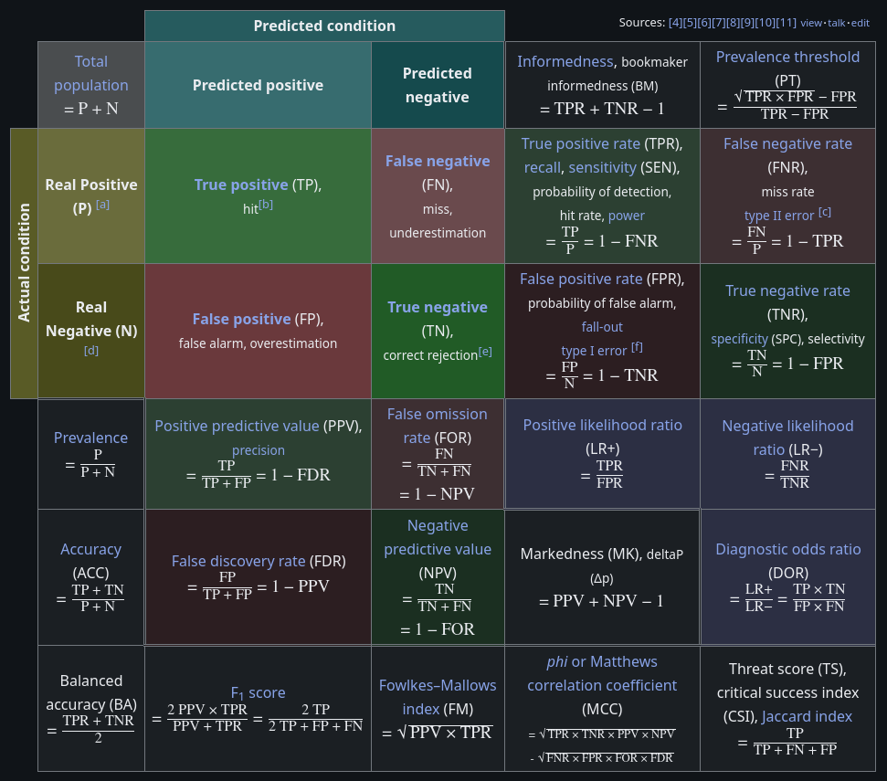

#### Accuracy

**Accuracy** = $(TP + TN) / celkovy pocet$

Mozeme dostat napr. ze accuracy = 96%  
Otazka - Je to dobre?  
Odpoved - depends - podla vyvazenosti realnych dat - aka je distribucia v realite

- ak realne je 50% spamu, 50% nie, tak nas sytem je dobry
- ak realne je to 95% na 5% tak nas system je zly, iba o 1% lepsi ako "nahoda"

Pre toto sa accuracy pouziva len pri vyvazenych datach

#### Baseline nahody - co dosiahne klasifikator bez ucenia

$P(correct) = P(A) P(\overline{A}) + P(B) P(\overline{B})$

Ak je rozdelenie dat napr. 95/5

- Ak predpovedame vzdy vacsinovu triedu (vzdy povieme ze je pravda) - `95%`
- Ak vyberame 50/50 - `50%`
- Ak kopirujeme rozdelenie tried (95 pravda, 5 nepravda) - `90.5%`

Cize v konecnom dosledku - 90% natrenovane moze byt horsie ako "nahoda" - zavisi od situacie (rozdelenia, pocet tried, ...)

#### Precision a recall

Take dve dvojicky, take dva opaky

$P = TP / (TP + FP)$  
$R = TP / (TP + FN)$

Precision - z tych ktore som oznacil ako spam, aku mam uspesnost, kolko bolo actually tak  
Recall - kolko dat sme zachytili - ked mam 1000 spamov, kolko som ich zachytil

Precision = presnost  
Recall = kolko zachytim

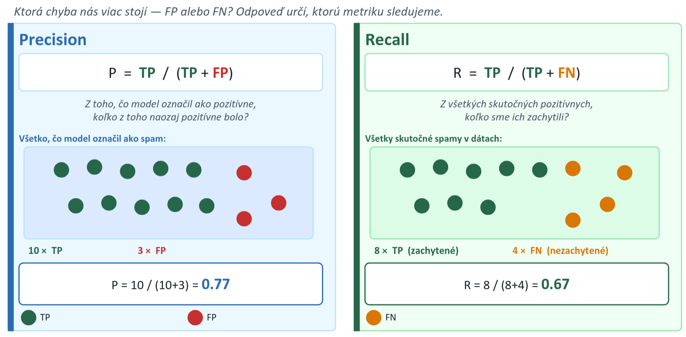

V podstate take opozita

- Ak poviem ze toto je spam, tak si chcem byt sure
- Nasledok - nedetekujeme vsetky

Napriklad z 1000 spamov - povieme ze 10 je urcite spam (s pravdepodobnostou asi 100%), ale v skutocnosti ich bolo 300  
Mozeme mat extremne presny system, ale len kvoli tomu ze vo velmi vela pripadoch poviem ze to nie je spam (aj ked actually bol)

Ked vieme tieto 2 cisla tak vieme skoro vsetko povedat o systeme  
Problem - mame 2 cisla ale nam sa paci ked mame len jedno cislo  
Riesenie - harmonicky priemer = F1 score

#### F1 score

a.k.a. hramonicky priemer

$F1 = 2 \cdot P \cdot R / ( P + R )$

Rozsah od 0 (najhorsie) do 1 (najlepsie)  
Hovori jednak ako su daleko cisla od seba, aj nieco o samotnych hodnotach

Preco nie priemer - chceme zachytavat extremy  
Napr. P = 0.99, R = 0.01  
Priemer = 0.5 (zdanlivo relative OK, aj trochu precizne aj recallove)  
Harmonicky priemer = 0.02 (nie dobre)

Alebo keby mame taketo dva pripady  
P = 0.99, R = 0.01  
P = 0.50, R = 0.50  
Podla priemeru sa moze zdat ze to je to iste, ale pritom vobec

Chceme zistit ci su cisla v harmonii

Cielom je mat co najvyssie F1 score, alebo sa trochu priklonit k P alebo R ak potrebujem

#### Precision-Recall krivka

Zmenou thresholdu sa posuvame po krivke - bud viac k precision alebo viac k recall (podla toho co potrebujeme)  
Vyssi threshold = vyssia precision, nizsi recall, a naopak
Optimum - ako keby mame co najvacsie to F1 score  
Threshold ktory mi da najvacsie F1 score je ako keby najlepsi

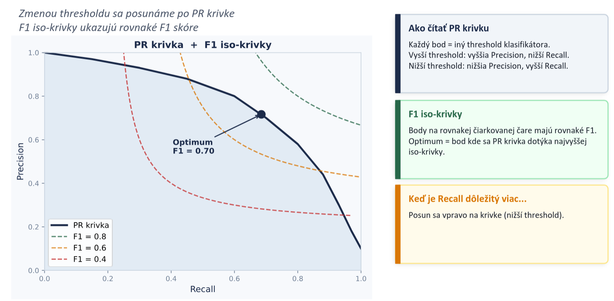

#### Ktoru metriku kedy pouzit

| Metrika          | Vzorec                               | Kedy pouzit                           | Na co pozor                               |
| ---------------- | ------------------------------------ | ------------------------------------- | ----------------------------------------- |
| Accuracy         | $\dfrac{TP+TN}{N}$                   | Vyvazeny dataset                      | Nevyvazene data                           |
| Precision        | $\dfrac{TP}{TP+FP}$                  | Drahy FP - spam, pozicky              | Ignoruje FN                               |
| Recall           | $\dfrac{TP}{TP+FN}$                  | Drahy FN - onkologia, podvody         | Ignorue FP                                |
| F1-score         | $F1 = 2 \cdot P \cdot R / ( P + R )$ | Kompromis medzi P a R, da jedno cislo | Penalizuje ked je jedna hodnota moc nizka |
| Confusion matrix | -                                    | Vzdy ako prvy pohlad                  | Nie je to cislo                           |

Nie je "univerzalna najlepsia" metrika, vyber zavisi od toho, co chceme dosiahnut, co nas viac stoji (FP alebo FN)

### Rozdelenie datasetu

Ako spravne rozdelit na train-validation-test  
Napr. 70/15/15

_Opakovanie..._  
Train - siet sa uci vahy = parametre, ci vacsi tym lepsie nauceny model, siet ich vidi pri kazdej epoche; pocitanie gradientov  
Validation - ladenie hyperparametrov, sledovanie overfittingu, model ju nevidi priamo ale ovlyvnuje ju  
Test - zaverecne vyhodnotenie, **pouziva sa iba raz** (na samom konci), simuluje realne nasadenie

Ako ma byt split cca

- Maly dataset ($\approx j 100$) - 70/15/15
- Stredny dataset ($\approx j 1000$) - 80/10/10
- Velky dataset ($\approx j 100k$) - 95/2.5/2.5

Test otvorit len raz alebo velmi malo krat, v ziadnom pripade nemenit test  
Test sada mysi byt dostatocne velka na statisticky nestabilne metriky - nie podiel, ale absolutny pocet rozhoduje

#### Pravidlo entity

Jedna entita patri len do jednej sady

Ak mame data o zakaznikovi  
Ak o jednom zakaznikovi dame nieco do train, nieco do valid, nieco do test - tak to je zle  
Jeden zakaznik train, druhy valid, treti test - dobre

Ak by sme to robili "zle", tak sa system nauci rozoznavat pacienta, nie priznaky ktore chceme

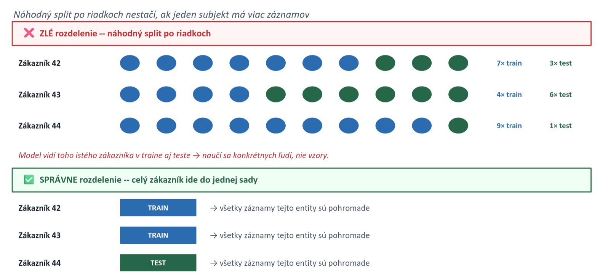

_Rozdel entity, nie zaznamy_

#### k-fold cross-validacia

Ak mame velmi malo dat  
Alebo velmi vela dat o malo entitach (entity nemozeme rozdelit $\rightarrow$ mame malo dat)

Napr. `k = 3`  
Dataset si rozdelime na 3 skupiy  
Povieme ze 2 kupiny su train, jedna valid  
Budeme trenovat 3 krat, postupne striedam skupiny  
Najprv trenujem na 1. a 2., potom na 1. a 3., potom na 2. a 3. (pricom na tej zostavajucej validujem)

Napr. 3 pacienti - validujem na jednom, potom validujem na druhom, potom validujem na tretom (pricom trenujem na tych dalsich dvoch)

Nevyhody - `k`-nasobne pomalsie - musim `k`-krat trenovat, komplikovanejsi pipeline (?)

### DOMACA ULOHA

> w4 prednaska

1% ludi ma rakovinu  
Typek chodi a kazdemu a hovori ze nema rakovinu  
Aky ma recall, aka precision

> Zabudol som si napisat ze za kolko ludmi pride, tak povedzme ze 100  
> Actually neviem ci to vobec je treba zadefinovat

| Confusion matrix | Skutocnost | Skutocnost |
| ---------------- | ---------- | ---------- |
| Predikcia        | TP = 0     | FP = 0     |
| Predikcia        | FN = 1     | TN = 99    |

$P = TP / (TP + FP)$  
$P = 0 / (0 + 0)$  
$P = 0%$, resp. nedefinovane, neda sa vypocitat

$R = TP / (TP + FN)$  
$R = 0 / (0 + 1)$  
$R = 0%$

$acc = (TP + TN) / celkovy pocet$  
$acc = (0 + 99) / 100$  
$acc = 99%$

$F1 = 2 \cdot P \cdot R / ( P + R )$  
$F1 = 2 \cdot 0 \cdot 0 / ( 0 + 0 )$  
$F1 = 0$, resp. nedefinovane

## Konvolucne neuronove siete

Konvolucne NN - velmi prepojene s hlbokymi NN  
Plne prepojene NN su takmer vzdy nepouzitelne

Z historie...  
Dvaja ujovia (Hubel a Wiesel) zistili ze su dva typy buniek v mozgu - jednoduche a komplexne  
Kazda jednoducha bunka reaguje na jednoduchy pattern _na jednom mieste_  
Ina jednoducha na inom mieste  
Komplexne bunky agreguju udaje z jednoduchych  
Velky boom v CNN v roku 2012 - AlexNet

### Konvolucia

Konvolucia hlada konkretny vzor na konkretnom miete  
Na zaciatku siete jednoduche patterny, postupne zlozitejsie  
Pooling = komplexne bunky

Aky je dany priznak silny na danom mieste  
Vysledok = jedno cislo

#### Convolution vs. Cross-correlation

Actually zo spracovania obrazu a matematiky sa toto nazyva cross-correlation  
Convolution je nieco ine, ale v terminologiii NN to nazyvame convolution

|              | Mathematical convolution                                              | Cross-correlation (to co CNN actually pocita)                          |
| ------------ | --------------------------------------------------------------------- | ---------------------------------------------------------------------- |
|              | $(f \ast g)$                                                          | $(f \bigstar g)$                                                       |
|              | $(f \ast g)[n] = \sum f[k] \cdot g[n - k]$                            | $(f \bigstar g)[n] = \sum f[k] \cdot g[n + k]$                         |
| Kernel       | $K = \begin{matrix} 1 & 0 & 0 \\ 0 & 0 & 0 \\ 0 & 0 & 0 \end{matrix}$ | $K' = \begin{matrix} 0 & 0 & 0 \\ 0 & 0 & 0 \\ 0 & 0 & 1 \end{matrix}$ |
| Kernel       | Flip o $180 \degree$                                                  | Priamo bez flipu                                                       |
| Komutativne? | Ano, $f \ast g = g \ast f$                                            | Nie, ale pri CNN nam to nevadi                                         |

#### Viacej kanalov

Ked mame napr. RGB obrazok, tak sa robi konvolucia pre kazdu zlozku zvlast  
Zvlast `R`, zvlast `G`, zvlast `B`  
Ako keby sa to rozsekalo na pasiky (rezy)  
Potom sa to zase "zlepi" naspak dokopy

Viacrozmerna konvolucia - RGB obrazku - rez  
Kazdy rez detekuje ine priznaky na rovnakych poziciach

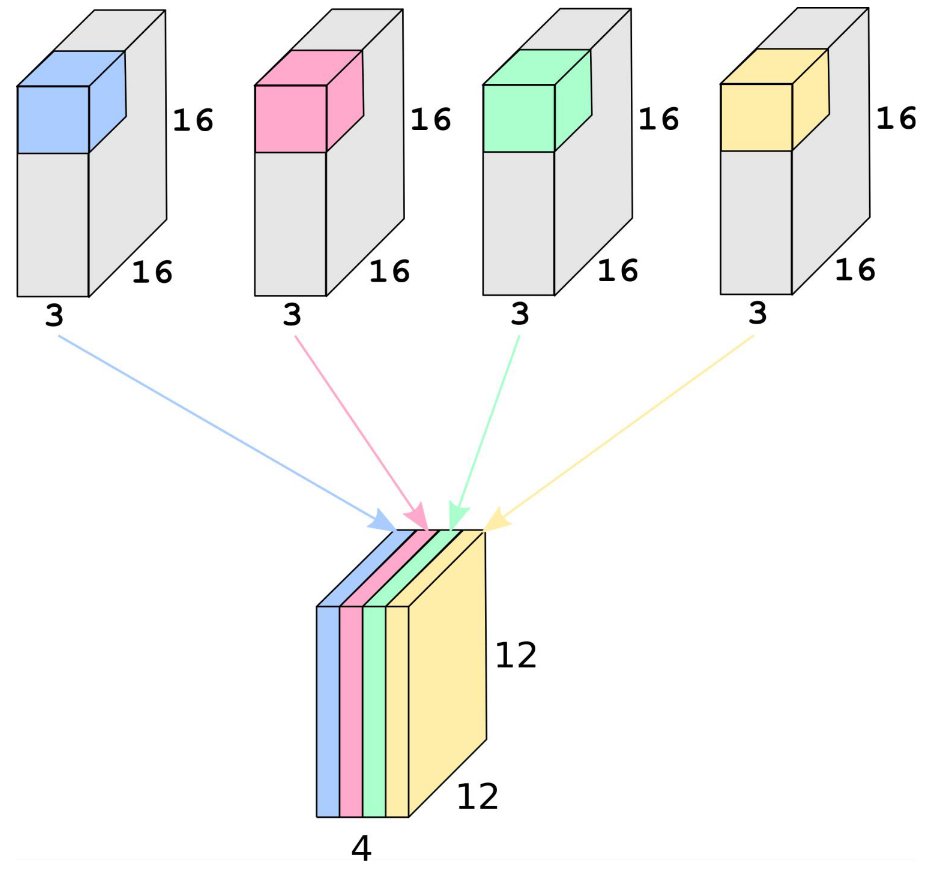

#### Padding

Pridanie "prazdnych okrajov" okolo obrazku  
Ako keby sa umelo zvacsi obrazok pridanim pixelov dookola - bud `0` alebo priemer alebo nieco

Neprijemna vlastnost konvolucie - znizuje rozmer  
Keby ho nepouzivame - kazdou konvoluciou sa zmensi obrazok  
Postupne sa stracaju informacie  
Okrajove pixely vplyvaju menej ako tie v strede

Siet moze detegovat umele hrany - ale to nemusi byt az taky problem lebo okraje obrazku

Pripadne `Conv2d(..., padding="same")` v pytorch zachova rozmer  
Ak mame 3x3 kernel tak by to bolo to iste ako `Conv2d(..., padding=1)`

Vseobecny vzorcek velkosti  
$W_{out} = \dfrac{W_{in} - K + 2P}{S} + 1$

> $W_{out}$ = vysledna velkost (sirka obrazku)  
> $W_{in}$ = vstupna velkost (sirka obrazku)  
> $K$ = kernel size  
> $P$ = padding  
> $S$ = stride

#### Pocet parametrov

Preco su tie CNN take super oproti Fully-connected?  
FC su prepojene kazde z kazdym  
Ak je obrazok 224x224, 3 channels (RGB) = ~150k parametrov  
~150k parametrov pre jeden neuron  
Musi sa ich znova ucit pre kazdu poziciu obrazku  
Ignoruje strukturu obrazku  
Extremne vela nulovych parametrov  
Komplexne transofmacie

Pri CNN  
**Local connectivity** - kazdy neuron je spojeny iba s malym poctom blizkych (lokalnych) neuronov  
**Parameter sharing** - jeden kernel je pouzity na cely obrazok, jedny vahy detekuju jeden input hocikde na obrazku  
Ak pouzijeme 3x3 kernel = 9 parametrov  
Ovela efektivnejsie vypoctovo aj parametrovo, "odolne" voci posunom

Klucovy dosledok - **Translation equivariance**  
Because the same kernel is used everywhere, the network learns to detect a feature regardless of where it appears on the image  
Cat on the left = cat on the right

Chceme detegovat rovnake priznaky na inych poziciach - ak sa obrazok posunie o 1px tak sa siet nemoze rozbit/prepocitavat alebo co idk  
Robime to iste na inych polohach  
Ak sa bude obrazok posuvat, tak sa bude aj priznakova mapa posuvat

A co ked je obrazok rozne "zoomnuty", otoceny, svetelne podmienky?  
Treba to mat v datach aby sa to siet naucila

#### Receptive field

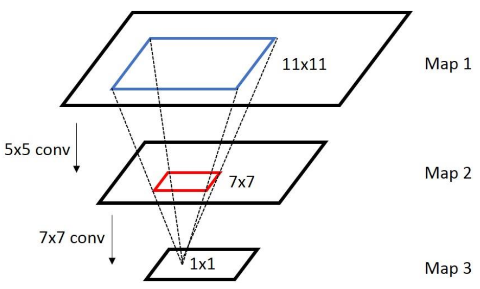

V prednaske bol iba tento obrazok, tak sa to pokusim len nejak vlastnymi slovami  
V podstate ze aku cast obrazka vidi jeden neuron  
Alebo aka cast obrazku vplyva na jeden neuron

Ak sa postupne konvoluciou zmensuje obrazok  
Na jeden pixel v `Map 3` vplyva 7x7 pixelov z `Map 2` na ktore vplyva 11x11 pixelov z `Map 1`  
Ako sa postupne mapa meni velkost - v konecnom dosledku mozeme mat 1x1 zavisle od 11x11 (z predpredchadzajucej vrstvy)

#### Feature maps

Priznakove mapy  
Vystupy konvolucnej vrstvy v CNN  
Detekuje nejake priznaky  
Postupne po vrstvach detekujemm zlozitejsie veci - hrany, krivky, textury, ...  
Vkladame nelinearitu po kazdej vrstve  
Zlozite veci rozdelime na vela jednoduchych

#### Stride

Ako sa posuvam - doteraz bolo o 1, aj v gifoch vyssie  
Nemusim sa ale posuvat len o 1px ale aj o viac  
Vacsi stride = nizsia narocnost, ale mozem missnut nieco  
Mam pocit ze vacsi stride = vacsie zmensenie obrazku  
Vacsinou sa stale pouziva 1  
Idealne stride mensi ako velkost kernelu

---

Male kernely mozu byt v registroch/L1/L2 cache procesora  
Extremne rychle  
Krasna paralelizacia  
Pocitame to iste nad inymi datami

---

#### Pooling

Pri complex cells  
Uz sa az tak nepouziva

Zoberie sa kernel a stride a aplikuje sa na vstup  
Kernel nema ziadne vahy, ale namiesto toho nejaky algoritmus - average, max, ...

> Cize napr. ked dame kernel size = stride, tak obrazok doslova rozsekame na casti

Kazda cast je reprezentovana najvacsou hodnotou (pri pouziti max)  
Ma to aj vyhodu - odolnost voci malym odchylkam, vypoctovo je to jednoduchsie  
Stracame ale nejake (priestorove) informacie, mozno aj nejake nepresnosti (pri pixel-perfect detekcii)  
Na konci NN sa zvykne este pouzivat -

Global average pooling - transformujeme napr. 7x7 -> 1x1

##### Max pooling

Zoberie sa najvacsia hodnota z okna

##### Average pooling

Zoberie sa priemer hodnot v okne (napr. 2x2)  
Zachova viacej kontextualnej informacie  
Az tak velmi sa nepouziva

##### Global average pooling

Priemer z celej feature map  
Napr. $7x7x512 \rightarrow 1x1x512$  
Nahradza fully-connected layer  
Pouziva sa v modernych sietach - ResNet, MobileNet

### Architektury

input - conv - activation - pool - classification - class  
kroky `conv - activation - pool` sa opakuju niekolko krat  
Pri `conv` sa aplikuje `n` kernelov, kazdy detekuje nieco ine (edge, texture, ...), vystupom je `n` feature maps  
Aktivacne funkcie (ReLU, Sigmoid) pridavaju nelinearitu  
Pool = downsampling - znizovanie poctu parametrov, pridava robustnost  
Pri konci sa casto vyuzivaju plne prepojene vrstvy, ked uz to mame pretransformovane na 1x1 - `classifier`  
Vysledkom je class - trieda

ResNet - skipovanie vrstiev - **residual learning**

## Overfitting

Preco sa model uci naspamat a kedy to zastavit  
Dobra presnost pri treningu, pri nasadeni nepouzitelny

### Bias a variance

Dva zdroje chyby modelu  
Velky bias - triafam sipky na to iste miesto, ale nie do stredu - **underfitting**  
Model je prilis jednoduchy

Velky variance - skacem kade tade - **overfitting**  
Model prilis zlozity

Chceme najst nejaku rovnovahu

$E((y - y_{pred}^2)) = bias^2 + variance + irreducible noise$

Bias

- Systematicka chyba
- Model nedokaze zachytit skutocne vzory v datach
- Fittovanie priamky na nelinearny problem

Variance

- Nestabilita modelu
- Hlboka siet na malych datach
- Ked siet moc "overthinkuje" - siet sa uci hluposti, moze zacat memoizovat
- Zvysuje sa ked je prilis vela parametrov (vahy)

Ireeducible noise

- Neodstranitelny sum
- Nieco co model nedokaze zachytit - farby aut pri ciernobielych datach
- Ked je v datach nejaky nahodny prvok - hod mincou - nedokazeme popisat fyziku za tym

Krivky pocas trenovania - train loss vs. val loss

- Ak su krivky daleko od seba - velky rozdiel medzi train a val - overfitting
- Ak su krivky vysoko - vysoke chyby - underfitting

#### Early stopping

Najlepsia obrana proti overfittingu  
Pri velmi dlhom trenovani zacina loss stupat  
Early stopping - trenuj iba dovtedy kym loss klesa

**Best Checkpoint** - bod, kde je model najelpsie natrenovany - ako keby asi globalne minimum?  
**Patience** - kolko epoch este trenuj po dosiahnuti best checkpoint  
**Early stop** - ked skonci patience - koncime s trenovanim

### Regularizacne metody

Ako prinutit model generalizovat namiesto memoizovania  
Early stop nestaci  
Zmenit model nie je vzdy mozne - ak chceme aby vahy davali vyznam

#### Normalizacia a standardizacia vstupov

Velky nepomer medzi datami ktore vyjadruju nieco ine - vek (desiatky) a prijem (10k, 100k)

Normalizacia -
Standardizacia - Z-score

Metody velmi podobne, ale rozdielne v dvoch veciach

- Cistlivost na outliers - standardizacia robustnejsia
- Ohranicenie - obrazky su 28x28 - viem presnu hranicu = normalizacia

Vzdy sa pocita iba z train

#### L2 regularizacia

$L_{reg} = L + \frac{\lambda}{2} \cdot \sum_i w_i^2$

$L$ = povodny loss  
$\lambda$ - regularizacny clen - typicky $10^{-2}, 10^{-4}$ - proti explodingu  
$\sum$ - penalizacia za velke vahy

Weight decay  
Po derivaciach - $\lambda w_j$  
Snazi sa znizit loss znizenim vah - 4 male vahy maju mensi vply v ako jedna velka

"Proporcne znizuje"

Vacsinou v DL pouzivame toto, ale mozeme aj obidve

#### L1 regularizacia

To este len to nie je na druhu  
Deivacia absolutneho clena je znamienko - $+1$ alebo $-1$  
Snazi sa vynulovat vahy (namiesto zmensenia)

"Stale znizuje"

Vacsinou pouzivame v tradicnom ML

#### Dropout

Nahodne vypinanie neuronov  
Nad siet dam masku - nuly a jednotky - podla Bernoulliho rozdelenia  
$Bernoulli(1-p)$  
`p` je hyperparameter - dropout rate  
Kazdy forward vypnem ine neurony  
Jednotlive neurony sa nespoliehaju jeden na druhy  
Neurony sa ucia podstatne a robustne veci nezavisle od ostatnych  
Je to trochu redundatne, ale to praveze pomaha pri  
Assemble effect - viac malych > menej (1) velkych  
Namiesto trenovanie jednej velkej siete naucime viac malych, spravime priemer

Hyperparameter `p`

- $p = 0$ - ziadny dropout
- $p = 0.5$ - bezne pre plne prepojene vrstvy
- $p = 0.1 - 0.2$ - bezne pre konvolucne vrstvy

Ale co pri inferencii - ked mame vsetky neurony zapnute  
Pri treningu su iba niektore  
Musime preskalovat

#### Batch normalization

Preco nerobit normalizaciu vsade (nie len pri vstupe)  
Vnutri siete - po aktivacnych funkciach  
Ked mame vanishing gradient problem - stracame smerodajnu odchylku (data)  
V skutocnosti je to standardizacia nie normalizacia

Batch - podmnozina trenovacich dat - napr. 64 dat s ktorymi trenujeme

Kroky

1. Vypocet priemeru
2. Vypocet smerodajnej odchylky
3. $\hat{x}$ = standardizacia - odpocitam od kazdej hodnoty priemer, cele to vydelim smerodajnou odchylkou; _numericka stabilita (?)_
4. $\hat{x}$ naskalujeme (natiahneme) a posunieme ($+ \beta$) - trenovacie parametre (siet si ich upravuje sama?)

Mozeme si to predstavit ako dalsiu vrstvu  
Idealne medzi vrstvu (linear/konvolucnu) a aktivacnu funkciu

Nie je idealne aj batch normalization aj dropout, nie je to strasne ale nie az tak ok

#### Datova augumentacia

Pridame nejake umele data  
Obrazok flipneme, crop+resize, color jitter, rotacia, blur  
Augumentacia musi zachovat label a realitu - vertikalny flip moc nie, prilis velky crop moc nie

### Inicializacia a transfer learning

## Transformery

Neuronove siete na spracovanie sekvencii  
Nie obrazy, nie tabulkove data

Problem ostatnych - neuvazuju nejak v celku, v kontexte

Zavislosti v sekvenciach - slova medzi sebou maju zavislost  
Doteraz feed-forward = vzdy sa siri z predu dozadu  
Recurrent - nie len od vstupu na vystup, ale aj spojenia ktore uchovavaju kontext, pamatanie vnutorneho vztahu

### Rekurentne NN

Vyuzivaju hidden state a feedback loops

Nevyhody

- Neviem "naraz" povedat celu vetu
- Nevyuzivaju potencial GPU
- Problem s dlhymi zavislostami - pri velmi dlhom texte "zabudne" kontext, na konci si nepamata veci zo zaciatku

### Transformer

Architektura na spracovanie sekvencii

Kroky

- Tokenizacia
- Tvorba embeddingov
- Self-attention - najvacsi dopad/vyhoda

Self attenton - normalizacia - skip connection - feed forward

Predtym ako dam sekvenciu do siete - tokenizacia  
Rozbijem na mensie casty - tokeny - ktore sa poslu do siete

Embeddingy - ciselne srandy zo slov ktore sa davaju do siete - lebo siet pocita s cislami

#### Self-attention

_Attention is all you need_

Mechanizmus, ktory sa pouziva na urcenie dolezitosti tokenov  
Za ucelom lepsie pochopit vztahy

Attention = mechanizmus DL, riadi modely, ab yuprednostnovali alebo venovali pozornost najrelevantnejsim castiam vstupnych udajov  
Nedavame doraz **kazdemu** slovu (tokenu), ale iba dolezitym podstatnym

Ako?  
Attention score = vaha dolezitosti a pozicii

Self-attention - ako je kazde slovo zavisle od kazdeho ineho  
Veta `How are you doing?` - attention kazde slovo s kazdym  
Vznikne nejaka matica

Self-attention

- Query - Q - co hladam
- Key - K - co mam, co nesiem
- Value - V - co budem posielat dalej

Tieto vektory sa definuju pre kazdy token

Zistovanie attention score z vektorov

- Query A - mas nieco uzitocne?
- Key B - toto mozem poskytnut
- Vysledok - skalarny sucin vektorov - AB - skalarna hodnota - skore

Toto sa robi pre vsetky tokeny  
Dame do matice  
Vynasobime matice  
Dostaneme maticu

> Softmax

Ked zistime score, musime poslat nieco dalej - Value  
Vynasobime (nieco) s (niecim) a dostaneme kontextovu reprezentaciu slova

Ako zislam vektory (Q, K, V)  
Kazdy self-attention blok si udrzuje 3 matice vah, kazdu pre jeden vektor  
Ked sa vektor vynasobi maticou, dostaneme  
Matice sa trenuju - v CNN to boli kernely  
"Matice" su jednoduche linearne vrstvy

#### Tokenizacia

Mam vetu  
Ako z nej spravim hodnoty (cisla) ako vstup do siete  
Rozsekame na tokeny (napr. na slova, ale nemusi byt vzdy len takto)  
Potrebujem kazdy token zakodovat do embedding vektora  
Embedding vektory sa budu uz kazdy s kazdym dopytovat na seba (ta vec z self attention)

Embedding vektor - N-rozmerny vektor, ktory nesie informaciu o tokene  
Potrebujeme aby ked su tokeny vyznamovo blizke, tak nech su vektory blizko pri sebe

Matica embedding vektorov - slovnik  
Koduje vyznam slova bez ohladu na kontext

Slovnik GPT-3 - `~50k` tokenov, `~12k` rozmerny vektor = $~50k \cdot ~12k = ~617M$ parametrov = W_e$  
Z kade ziskam maticu $W_e$?  
Su to parametre, model si ho tvori sam

Nie je dolezite len co token znamena, ale aj kde sa nachadza - na zaciatku, na konci  
K embedding vektoru sa prilepi kodovanie pozicie  
Vysledna vektorova reprezentacia tokenu = vyznam + pozicia, potom je priparaveny vstupit do transformerovych blokov  
Vypocita sa attention - obohateny o (?), potom moze ist do MLP, ...  
Kazdy model je schopny pracovat len s urcitym poctom vektorov, limitovany na pocet tokenov ktore vie naraz spracovat = **velkost kontextu**

Ako ziskam vystup? Po tomto mam stale len cisla  
Co s tym spravime? Zavisi od toho co chcem docielit  
Zoberieme napr. posledny vektor vystupnej sekvencie  
Slovo dostaneme pomocou matice unembedding vektorov  
Transponovana matica  
Tiez je trenovana  
Softmax  
Dostaneme vektor pravdepodobnosti vystupnych slov alebo co

3 hlavne architektury

- Cisty enkoder - BERT
- Cisty dekoder
  - GPT
  - spracovava vystup, snazi sa generovat dalsi vystup slovo po slove
  - Rozdiel oproti enkoderu ma maskovany attention - diva sa len na predchazajuce slova (nevidi do buducnosti)
- Aj aj
  - Ked chcem na vstupe sekvenciu, na vystupe tiez; chcem pre vetu generovat inu vetu
  - Preformulovanie textu - enkoder pochopi, dekoder vypluje
  - Prekladac - enkoder pochopi, dekoder prelozi do druheho jazyka

### Vision Transformery - ViT - sekvencne spracovanie obrazu

CNN su krali minulosti  
Limitacie - lokalne receptivne pole - pozera sa na lokalny kontext, zanedbava globalny  
Toto riesia transformery, ktore vnimaju zavislosti bez ohladu na toho ako su daleko od seba  
Na obrazok sa nedivame ako na obrazok, ale ako na sekvenciu tokenov  
Transformujem 2D obrazok na 1D vektor

ViT architektura  
Na zaciatku potreujem obrazok dat do 1D - embedded patches  
Spravim embeddingy, info o pozicii

Linarna transofmacia a embeddingy

Kodovanie pozicii

Ako z enkoderu budem ziskavat features ktore ma zaujimaju  
Klasifikacny Token  
Vo ViT sa dava na zaciatok prazdny token ktory je klasifikacny  
Ocakava sa ze cela (?) informacia sa da do tohto tokenu  
Tento token sa potom da do FC vrstvy

Multi-head attention  
Podobne ako self-attention, ale nie jedna attention pre cele ale viacej nezavislych  
V CNN mame viacej kernelov, kazdy sa uci nejaky priznak  
Tuto to je ze mame heads, kazda si vsima nejake ine vztahy/dolezite veci

Vyhody ViT oproti CNN

- Pozera sa na cely obrazok naraz,

Limitacie

- Velmi vela parametrov - GPT3 - 175B
- Narocne data
- Treba velmi velke mnoztvo dat
- Nedostatok induction bias - slabsi na malych suboroch udajov, treba dlho trenovat

Ako sa to da vyriesit - Transfer Learning

- Predtrenujem - Pre-training - trenovanie na rozsiahlom, vseobecnom subore udajov (jft-300m)
- Fine-tuning - dotrenujem, doladim na moju specificku ulohu; tym padom znizuje poziadavku na specificke anotovane data

## Trening NN

Ako sa vlastne NN nieco nauci - celkovy pohlad  
Take opakovanie

treningova slucka

- data
- forward - siet vypocita vystup, aktivacne funckie
- loss
- backpropagation
- update

batch vs. epoch

- je velmi drahe robit forward (a backward) nad celymi datami
- zobereme z dat mensiu, statisticky vyznamnu vzorku, idealne z kazdej triedy nejake data, idealne nahodne, cim vacsia zvorka tym lepsie ale pomalsie
- toto je batch
- typicky velkost 32-256
- vacsi batch - pomalsie, pamatovo narocnejsie (musia sa cele zmestit do pamate gpu),
- update vah
- epocha = vsetky kroky ktore by potreboval na vsetky data

Stochastic gradient descent - batch size = 1  
Batch gradient descent - batch size = 1000

Inicializacia vah - ake vahy dat na zaciatok (pred prvym treningom)

- Ak su vsetky vahy 0 - vsetky vysledky budu 0, tiez nechceme aby bolo vsetko rovnake - nie dobre
- Nahodne male cisla - v rozsahu 0-1 (ako normalizacia) - lepsie
- Xavier/He init
- Idealne - zobrat nejaku predtrenovanu siet, ale nemusi nam vyhovovat architektura, biasy, ... ktore nemozeme zmenit. idealne zahodit poslednu vrstvu lebo ta riesi konkretny problem a my chceme riesit iny

Aktivacne funkcie pridavaju nelinearitu, musia mat prvu derivaciu

### Regularizacia

Problem - overfitting  
Siet sa uci naspamat
Ak je siet moc velka

L2 regularizacia - tresta velke vahy  
Dropout - nahodne vypnutie neuronov

---

Train loss a val loss klesaju spolocne - dobre  
Val loss klesa pomalsie - normalne  
Val loss stupa ked train klesa - overfitting

Ked vela kolise - velky learning rate  
Ked je stabilne ale ide velmi pomaly dole - maly learning rate

### Optimizery

Gradient Descent GD, Stochastic GD, Minibatch SGD

GD - update na zaklade celeho datasetu, presny ale pomaly pre velke data
SGD - update z 1 data
Minibatch SGD - update z x dat

Zavadza sa novy parameter - Momentum  
"Pamat gradientu" - pohybuje sa rychlejsie v konstatnom smere, pomalsie ak sa smer meni  
Nemame len LR ale aj momentum

$w \leftarrow w - \ni \cdot v_t$  
$v_t = \beta \cdot v_{t-1} + g_t$

$\beta$ = momenturm, vacsinou velmi velky (0.9)  
Ak by sme dali $\beta = 0$ tak by to bol klasicky SGD  
Snazim sa pomocou neho odstranit sum  
Rekurzivny vzorec, najnovsia hodnota ma najvacsi vplyv, po case zabuda  
Pamatam si vsetko, ale cim je to davnejsie tym menej to vplyva

Adam - sam si vie momentum odhadnut a adaptovat za behu v kazdom kroku, velmi dobre s nim pracuje

## Embeddings

Ako NN rozumeju svetu

Embedding bude v podstate kodovanie, len inym sposobom  
Ordinalne kodovanie - problem "macka je priemer medzi psom a vtakom", vzdialenosti medzi nimi nedavaju zmysel  
One-hot kodovanie - dobry pri klasifikacnej ulohe, problem - velky priestor z vacsiny prazdny, hovorime ze slova nemaju vztahy

Embedding je funkcia $f(objekt) \rightarrow \mathbb{R}^n$, kde predpokladame ze objekty budu blizke body  
Napr. $f("pes") \rightarrow (0.21, 0.90, -0.02, ...)$

Latentny priestor = priestor kde ziju embeddingy  
Jeden objekt dostane jebem embeding, ale vsetky objekty tvoria latentny priestor  
Latentny priestor = cela mapa  
Typicky 100-1000 rozmerov  
Vektory sa daju scitat, odcitat, porovnavat, ...

Cosine similarity
~~$\dfrac{cos(A,B) = A \cdot B}{||A|| \cdot ||B||}$~~ Vzorec je iba kosinus uhla  
Euklidovska zvdialenost nie je dobra vo viacrozmenrych priestoroch  
Skor je dolezity uhol medzi nimi

Word2Vec  
Historicky milnik  
NLP - natural language processing

Doteraz sme robili supervised learning - mame labels  
Skip-gram - zobereme centralne slovo vety, vymazeme ostatne, model ich musi predikovat = self-supervised  
CBOW - opacne - zobereme slova okolo, ma sa predikovat stredne - autocorrect

Embeddingy nie us len pre slova  
CNN tiez vytvara embeddingy

Netflix - pouzivatel = vektor  
Kazdy film/serial = vektor

Spotify  
Discover weekly  
Kazda skladba = vektor, ~128 dimenzii, ~100M skladieb  
Kazdy pouzivatel = vektor, jeho posluchy, likes, skips, ...

### Encoder - decoder architektura

Nielen, ze odkazu spravit latentny pristor, ale aj vedia z neho vygenerovat nieco uzitocne naspat  
Autoencoder - zober poskodeny obrazok, na vystupe mi daj opraveny  
Alebo dam grayscale, daj mi farebny  
Vytvorime bottleneck - encoder zakoduje z 784 priestoru do 32, to bude bottlenect, decoder transformuje 32 do 784

## Vysvetlitelnost NN

Saliencne mapy a Grad CAM

Model sa nemusi ucit len z objektu, ktory ma rozpoznavat  
Pozadie, svetlo, zoom, text, ...  
Na beznych satach moze mat vysoku uspesnost, ale na nebeznych nemusi

### Vysvetlitelnost ci interpretovatelnost

Priklad - odhad ceny bytu  
$cena = w_1 \cdot pocetizieb + w_2 \cdot plocha bytu + b$  
Vieme co je $w_1, w_2$ => interpretovatelny

Interpretovatelnost

- modelu rozumieme priamo z jeho struktury
- vieme citat priamo

Vysvetlitelnost

- model je prilis zlozity na priame poochopenie
- musime skumat pomocou nastrojov

Ako sa pytame NN na jej rozhodnutie?

1. co model povedal - aku triedu, s akou istotou, trafil sa? - vystupna vrstva
2. co sa deje vo vnutri modelu - ake crty vo vrstvach, ako sa meni reprezentacia napriec sietou - skryte vrstvy
3. na co sa model pozeral - ktore vstupy najviac ovplyvnili rozhodnutie - saliency maps, grad-cam metody - vstup

### Saliencne mapy

Ako sa zmeni rozhodnutie siete, ak zmenim pixely vo vstupnom obrazku?  
Ako sa zmeni rozhodnutie o konkretnej triede, ak zmenim pixely vo vstupnom obrazku?

siet je $f(x,w) = \hat{y}$  
obrazok je $x$

zmena = parcialna derivacia -> backprop  
skore konkretnej triedy (4) podla pixelu 3 = $\dfrac{\partial f_4(x)}{\partial x_3}$  
Saliencne mapy - mapa toho ze ktory pixel ako ovplyvni - heatmap  
Pre kazdy obrazok zvlast (alebo triedu?)  
Tieto mapy su ale zasumene/rozpixeloane/...  
My by sme potrebovali skor oblast - v tom nam pomoze vnutro cnn - grad cam

### Grad CAM

Ako sa zmeni rozhodnutie o konkretnej siete, ak zmenime nejaku priznakovu mapu

$\dfrac{\partial f_4(x)}{\partial A_3}$  
Len co je to ta $A_3$ (priznakova mapa)

Ako to vypocitat

1. spravim saliencnu mapu pre $A_3$ - pixel by pixel $\partial$; vznikne matica 14x14
2. spriemerujeme 14x14 = 196 do jednej vahy $\alpha_3$
3.

$\sum_{}^{}$

grad cam

- gradient podla poslednej conv vrstvy
- ukazuje dolezite oblasti
- citatelnejsi, viac oblastny

naco je to dobre

- debug modelu
- odhalenie biasu a leakage
- kontrola, ci sa model pozera na spravne casti obrazu
- budovanie dobry v citlivych aplikaciach

## Object Detection

- Classification - single class label
- Localization - one class + one bounding box
- Object Detection - multiple objects, each with class and bbox
- Instance Segmentation - multiple objects, pixel-level masks

Object Detection - 4 informacie stacia  
Confidence - ako je si siet ista

Problemy

- Vnutorna variancia v ramci tried - strasne vela druhov psov,...
- Invariancia voci velkosti
- Pomery stran objektov
- Occlusion - objekty sa prekryvaju - navzajom, s niecim inym
- Real-time demands

### Foundations

Bounding box = bbox  
GT = ground truth - to co je ozaj pravda

Bbox representation

- bud top-left + bottom-right - corner format
- alebo center + w + h - center format

Bboxy su zarovnane, neskosene (obdlzniky, vodorovne ciary su ozaj vodorovne)

Ako vieme ci detekcia je "spravna"? niekolko moznosti

- vzdialenosti centerov + threshold
  - problem - scale dependent voci velkosti bbox - 20px odchylka je super ak ma objekt 4000px, zle ak ma 15px
  - problem - ignoruje tvar/velkost objektu - width, height, scale
- prienik 2 ploch
  - problem - nie je normalizovane
  - problem - 100% prienik ak odhad je vnutri GT
  - riesenie - vydelit zjednotenim - IoU

IoU - intersection over union  
Vzorec $\dfrac{|A \cap B|}{|A \cup B|} = \dfrac{|A \cap B|}{|A| + |B| - |A \cap B|}$

$A \cap B$ - prienik - intersection  
$A \cup B$ - zjednotenie - union

Problem - viac kandidatov - na jeden objekt dostaneme 4-5 detekcii  
Ktore nechat?  
**Non-Maximum Suppression**  
Vyberiem bbox, ktory ma najvacsiu confidence  
Vsetky ostatne v ramci daneho IoU potlacim  
Az toto je vystup

### Detection

Ako actually detegovat objekty?  
Mame viacej metod - traditional cv, one-stage deep, two-stage deep  
Two-stage ma vyssiu accuracy ale je pomalsie, one-stage naopak  
My budeme preberat one-stage DL, konkretne YOLO

Prva vyzva - mame silnu backbone (cnn/nn/transformer) - chceme to pouzit na detegovanie bboxov  
Musime premodelovat posledne vrstvy  
Mame tu aj klasifikaciu aj regresiu - ale problem ze nevieme kolko bude objektov, potrebujeme fixny vystup (pocet neuronov)
Problem - potrebujeme fixnu siet, ktora zvlada variabilny pocet objektov

Podme postupne - keby mame len lokalizaciu jedneho objektu - x, y, w, h, class (onehot)  
Problem - detegujeme len jeden objekt, nie viac

Dalsie riesenia, spravime niekolko ($n$) bboxov  
Problem, co ak actually mame $n+1$  
Co ak mame velmi velke $n$, napr. 100 a actually budu len 2 bboxy - vela prazdnych outputov a nevieme co s nimi

Druha moznosti - na kazdej pozicii spravime predikciu  
Dense prediction  
Velmi vela predikcii, vypoctovo narocne

Musime vyriesit 3 problemy

- scale bbox
- aspect ratio bbox
- overlapping center

Ako riesit

- Two-stage
  - Where first, then what
  - Najskor hladaju kandidatov na objekt, potom ich klasifikuju
  - Vacsinou fixne pravidla - najdi 64, 128, ... bboxov a potom klasifikuj
  - More precise, slower
- One-stage
  - Predict everything at once
  - Strudcured grid of cells, each cell owns it's prediction(s)
  - Higher speed, one forward pass

#### Sliding window

Apply clssifier at every possible position and scale  
Musim prejst obrazkom niekolko krat pre niekolko scales (vacsinou 4-6 krat, ale velmi zalezi od podmienok/poziadaviek; stride)  
Hlavny problem - vypoctova zlozitost

OverFeat  
Sliding window - prekryvajuce sa pixely nemusime 2krat pocitat (receptive field?), co vyrazne znizi vypoctovu zlozitost

#### YOLO

You Only Look Once

Prva verzia a podstatne myslienky  
Dostanem obrazok, a chcem vsetko rovno na kompletku spravit  
Vidi cely obrazok, nie iba vyrazy, ma globalny kontext  
End-to-end - da sa naraz naucit?

Podstata  
Potrebujeme zjednodusit - grid $S \times S$ - 5x5 - Grid-based detection  
Chceme ukotvit bboxy na pozicie  
Bunka zabezpecuje detekciu objektu, ktoreho center padne do tej bunky  
Kazda bunka je rozdelena na `B` - kolko bboxov dokaze bunka spracovat - napr. 2  
Chceme zachytavat confidence a bboxy  
Klasifikacna mapa - pre kazdu bunku - za pravdepodobnosti ze je to objekt, dava ze aky je to objekt (iba jeden)  
Predpokladame ze v jednej bunke je **iba jeden** typ triedy  
Toto velmi zjednodusuje mozstvo a shape toho co co chceme detegovat  
Funguje teda horsie, ak je v obrazku velmi ela malych objektov ktore sa prekryvaju (a su inych tried), ale takych uloh nebyva az tak vela  
Vyrazne ale zvysuje rychlost  
Pre kazdy cell 5 hodnot - !!!

Confidence score a Class prediction  
Pravdepodobnosti _nie_

Ci to je objekt alebo nie, ak hej tak penalizovat zle

Loss function

1. center(xy)
2. size(wh)
3. confidence(obj)
4. confidence(noobj)
5. class prob

### Metrics & Evaluation

I guess vyhodnotenie ci sme spravne predikovali

Kusok zlozitejsie ako pri normalnej klasifikacii

Potrebujem zistit nie len jedno cislo (ci som spravne predikoval) ale viac hodnot:

- localization quality - is the box tight around the object
- classification quality - is the correct class predicted
- precision
- recall

Co robi detekciu "spravnu"?

- spravna trieda
- dostatocny overlap - IoU > threshold
- not a duplicate - dany bbox nedetekuje uz detekovany objekt inym bboxom

Vyber thresholdu

- 0.50 - box must cover >50% - even imprecise box can qualify as TP
- 0.75 - must be tightly aligned, penalizes poor location
- COCO - evaluates 10 thresholds, averages them

FP hurts precision  
FN hurts recall

Precision-Recall tradeoff  
Vyssi threshold = menej detekcii = vyssi precision, nizsi recall  
Nizsi threshold = viace detekcii = vyssi recall, nizsi precision  
Neexistuje "jeden najlepsi" threshold  
Riesenie - **Average Precision** (AP) - threshold independent summary of precision  
AP = "finalna znamka" detekcie?  
AP je plocha pod Precision-Recall krivkou  
Sumarizuje precision-recall tradeoff do jedneho cisla

Mean average precision - `mAP`  
Average recall - `AR`  
Mean average recall - `mAR`

#### COCO metrics suite

| Metric   | IoU Thresholds                      | Description                                      |
| -------- | ----------------------------------- | ------------------------------------------------ |
| AP       | 0.50 : 0.05 : 0.95 (start:step:end) | Primary COCO metric - mean AP over 10 steps      |
| AP50     | 0.50                                | AP@IoU=0.50 - VOC-style, loose match             |
| AP75     | 0.&5                                | AP@IoU=0.75 - strict, tight boxes required       |
| $AP^S$   | 0.50 : 0.95                         | Small objects - <32px - area $32^2 \approx 1024$ |
| $AP^M$   | 0.50 : 0.95                         | Medium objects - 32px to 96px                    |
| $AP^L$   | 0.50 : 0.95                         | Large objects - >96px - area $approx 9216$       |
| $AR_1$   | 0.50 : 0.95                         | Average recall - max 1 detection per image       |
| $AR_10$  | 0.50 : 0.95                         | Average recall - max 10 detection per image      |
| $AR_100$ | 0.50 : 0.95                         | Average recall - max 100 detection per image     |
