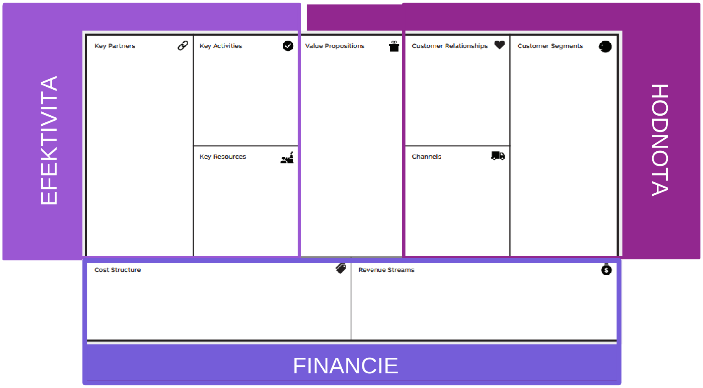
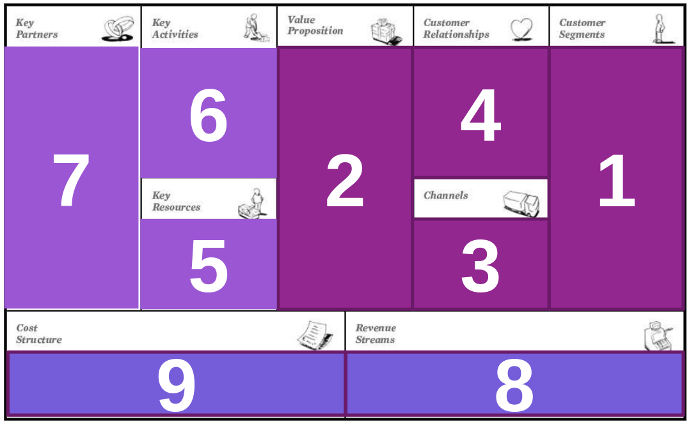

# PP

Podnikanie  
Hodnotenie - cvicenia 10, projekt 40 (dokument 30 + prezentacia 10), skuska (teoria + prakticka) 31/50; semester 30/50

## Uvod do podnikania

Podnikanie = proces, pri ktorom podnikatelia odhalia problem dostatocneho poctu potencialnych zakaznikov a prinesu take riesenie za ktore su zakaznici ochotni platit  
Basically ze najdeme **problem**, na ktory najdeme **riesenie**. Musime najst aj dostatocny pocet **zakaznikov**, ktori su za to ochotni **zaplatit**

Dovody k rozbehnutiu vlastneho biznisu

- Pracovat sam na seba
- Viac flexibility
- Moznost presadit sa
- Venovanie sa vlastnej zalube
- ...

### Obchodny zakonnik

Pravne upravuje problematiku podnikania

Zo 4 casti

- Vseobecne (zakladne) ustanovanie
  - Zakladne pojmy a definicie
- Obchodne spolocnosti a druzstvo
  - verejna obchodna spolocnost, komanditna spolocnost, spolocnost s rucenim obmedzenym, akciova spolocnost, jednoducha spolocnost na akcie
- Obchodne zavazkove vztahy
  - Podmienky pre uzatvaranie zmluv, druhy zmluv
- Spolocne prechodne a zaverecne ustanovania

Podnikanim sa rozumie **sustavna cinnost**, **vykonavana samostatne** podnikatelom **vo vlastnom mene** a **na vlastnu zodpovednost**, **za ucelom dosiahnutia zisku** alebo na ucel dosiahnutia meratelneho pozitivneho socialneho vplyvu

Znaky podnikania

- Sustavnost
  - Pravidelnost a opakovatelnost cinnosti
  - Nie prilezitostne alebo nahodne
- Samostatnost
  - Podnikatel sam rozhoduje o predmete a rozsahu cinnosti, o dobe a mieste vykonu cinnosti
  - Podnikatel nie je vo vztahu podriadenosti
- Vykon cinnosti vo vlastnom mene
  - Podnikatel musi mat obchodne meno
  - FO - meno a priezvisko, moze mat dodatok (odlisenie)
  - PO - nazov, pod ktorym je registrovana alebo zriadenia, nesmie byt zamenitelne, nesmie vzbudzovat klamlivu predstavu
- Vykon cinnosti na vlastnu zodpovednost
  - Podnikatel zodpoveda za
    - Zavazky vyplyvajuce z podnikania - **rucenie**
      - Obmedzene rucenie - do vysky nesplateneho vkladu
      - Neobmedzene rucenie - cely majetok, aj osobny
    - Porusenie pravnych predpisov
    - Vysledok podnikatelskej cinnosti (zisk, strata)
- Ucel dosiahnutia zisku alebo pozitivneho socialneho vplyvu

### Zakon o zivnostenckom podnikani

- Vseobecne ustanovania
- Druhy zivnosti
  - Volne, viazane
  - Vyrobne, obchodne
- Rozsah zivnostenskeho opravnenia
- ...
- Prilohy

### Zakon o dani z prijmov

- Zakladne ustanovania
- Dan fyzickej osoby
- Dan pravnickej osoby

### Subjekty podnikania

#### Fyzicka osoba

Clovek, obcan so sposobilostou na pravne ukony - 18 rokov, metalne zdravie

#### Pravnicka osoba

Subjekt vytvoreny ludmi, povazovany podla zakona za samostany, je nositelom prav a zavazkov

Podmienky

- Vznik podla zakona
- Samostatny subjekt
  - Pravna subjektivita - sposobilost na pravne ukony
  - Nadobudat prava, preberat na seba zavazky a zodpovednost za ich plnenie
- Zapis do prislusnej evidencie
  - Obchodny register
    - [www.orsr.sk](https://www.orsr.sk)
    - Verejny zoznam, do ktoreho sa zapisuju zakonom ustanovene udaje o podnikateloch
    - Vedu ho registrove sudy, su v sidle krajskych sudov
  - Su aj ine registre, ale tie nas zevraj nebudu zaujimat ci co
- Ustanovanie statutarneho organu
  - FO, ktore konaju v mene PO, vykonavaju pravne ukony za PO

Druhy PO

- Zdruzenia FO alebo PO - obchodne spolocnosti, druzstvo, obcianske zdruzenia, ...
- Ucelove zdruzenia mjetku - nadace, statne fondy
- Jenotku uzemnej samospravy - obce
- Ine subjekty podla zakona -

#### Subjekty, ktore mozu byt podnikatelom

- Osoba zapisana v OR
- Osoba, ktora podnika na zaklade zivnostenskeho opravnenia
- Osoba, ktora podnika na zaklade ineho zivnostenskeho opravnenia \_
- \_

### Formy podnikania

- Zivnosti
- Obchodne spolocnosti
- Druzstvo
- Statny podnik
- \_
- \_

### Startup

Je zalozene na nejakej inovativnosti  
Ma potencial rychlo rast

Charakteristicke vlastnosti

- Nizke zaciatocne naklady
- Vyssie podnikatelske riziko nez u tradicky podnikov
- Potencialne vyssia navratnost (v pripade, ked sa spolocnosti etabluje)

Obsahova stranka startup podnikania

- Kreovanie a rozpracovanie podnikatelskeho napadu
- Zalozenie a vznik podnikatelskeho subjektu

## Kreovanie podnikatelskych napadov

Konvergentne myslenie - vyber jedneho riesenia
Divergentne myslenie - hladanie viacerych rieseni

Proces vyvoja napadu

1. Hladanie prilezitosti
2. Generovanie napadov
3. Honodtenie a vyber napadov
4. Planovanie implementacie

### Sposoby identifikovania podnikatelskych napadov

Analyza trhu

- Odhalenie diery na trhu
- Sledovanie trendov
- 90% startupov zlyha, 42% z toho kvoli tomuto

Cielene hladanie napadov

- Vyuzivanie internetu na hladanie napadov
- Velmi malo pouzivane

Hobby, praca

- Zamyslame sa nad tym co nas bavi, co radi robime
- Identifkacia svojich zrucnosti, schopnosti
- Vyuzitie nadobudnutych skusenosti z prace

Kupa

- Odkupim napad od niekoho

Pozicanie

- Zo zahranicia
  - Napady ktore nie su na nasom trhu
  - To, coho je nedostatok - slaba konkurencia

Potreby, problemy

- Riesenie problemov s ktorymi sme sa stretli

#### Podnikatelske napady

Zapisovat si  
Premyslat nad nimi  
Vzdy ked sa objavia nove napady/trendy tak treba prehodnotit napady, prepajat, vylepsovat  
Pytat sa ci existuju zakaznici  
Nie kazdy napad musi byt zrealizovany

### Techniky kreovania napadov

Brainstorming

- Ked nevieme ako riesit problem
- Otvorena mysel, aj blaznive napady
- Zameranie na kvantitu viac ako na kvalitu

Brainwriting

- Jednotlivec pise napady na papier

Lotus Brainstorming

- 'V strede' je napad a rozpracovavame ho dookola
- Rozpracovanie do vacsich detailov
- Z jedneho napadu vznikne dalsich 8

What if

- Zalozene na brainstormingu
- Tim sa snazi najst odpovede na neocakavane udalosti (co ak sa stane...) a vyuzit pohlad inych ludi

Storyboarding

- Pomocou obrazkov, videi sa vytvori storyboard

SCAMPER

- Substiture, Combine, Adapt, Modify, Put to another use, Eliminate, Reverse

6-Thinking hats

- White - facts
- Black - caution
- Blue - process
- Red - feelings
- Green - creativity
- Yellow - benefits

Idea napkin

Customer Journey Mapping

Round Robin

- Vyuziva prvky brainstormingu
- Zalozena na cirkularnom procese
  - Vyberie sa myslienka/napad, ktory chceme rozpracovat
  - Jeden clen ho rozpracuje a posunie dalsiemu clenovi
  - Opakovanie dookola

Checklist dobreho naparu

- Riesi konkretny prbolem/potrebu?
- Je unikatny a odlisitelny od konkurencie?
- Ma potencial na skalovanie?
- Je realizovatelny vzhladom na zdroje a regulacie?
- Prinasa zisk (dlhodobo udrzatelny)?

## Analyza trhu a konkurencie

### Analyza trhu

Analyza trhu pomaha pochopit

- Zakaznika - kto, jeho potreby, spravanie, motivacie
- Velkost trhu - pocet potencialnych zakaznikov
- Konkurenciu
- Trendy a prostredie

Analyza trhu

- Proces!
- Dokladne preskumanie trhu v ramci konrketneho odvetia/oblasti
- Pomaha identifikovat sposob aky lepsie pozicionovat podnikanie za ucelom zvysenia konkurensiechopnosti a lepsieho uspokojovania potrieb zakaznikov

Trh

- TAM - Total Addressable Market - celkovy trh - vsetci, ktori by teoreticky mohli produkt pouzit
- SAM - Serviceable Available Market - dostupny trh - skupina, ktoru mozes oslovit
- SOM - Serviceable Obtainable Market - dosiahnutelny trh - cast, ktoru realne vies ziskat

Metody zberu dat

- Primarny vyskum - ja zbieram data
  - Dotazniky, rozhovory, pozorovanie, testovanie, ...
  - Vyhody - data presne na mieru, poznanie nazorov cielovej skupiny, moznost overenia hypotez
  - Nevyhody - Financne a casovo narocne, znalosti v oblasti analyzy trhu
- Sekundarny vyskum - pouzivam data ktore zozbieral niekto iny

Benefity analyzy trhu

- Zacielenie produktov a sluzieb
- Redukcia rizik
- Sledovanie trendov
- Benchmarking

### Konkurencia

Podnikatelske subjekty, ktore ponukaju rovnaku alebo podobnu sluzbu, ...

Priama konkurencia - rovnaky problem, zakaznik, riesenie  
Nepriama konkurencia - rovnaky problem a skupina zakaznikov, odlisne riesenie

Odlisenie od konkurencie

- Vlastnosti produktu
- Servis
- Marketing
- Dizajn
- Procesy
- Cena
- Pridana hodnota (darcek)
- Nieco nove

### Analyza konkurencie

Zamerriava sa na identifikovanie ucastnikov trhu, ktor9 ponukaju rovnake alebo...

1. Stanovenie produktov a sluzieb, ktore chceme zhodnotit
2.
3.
4.
5.
6.
7.
8. Sledujte vysledky

Faktory

- Trhovy podiel
- Marketing
- Vlastnosti produktu
- Unikatnost
- Cena
- Silne stranky
- Slabe stranky
- Lokalita
- Kultura
- Hodnotenia zakaznikov

### Metody analyzy trhu a konkurencie

#### Pestel/Steep analyza

Zhodnocuje podnikatelske prostredie, v ktorom podnik realizuje svoju podnikatelsku cinnost

- Politicke
- Ekonomicke
- Socialne
- Technologicke
- Environmentalne
- Legalne

#### SWOT analyza

Strengths, Waknesses, Opportunities, Threats  
Metoda strategickeho planovania pouzivana na hodnotenie podniku/produktu/projektu za ucelom naplnenia stanoveneho ciela

Vieme ovplyvnit

- Silne stranky
- Slabe stranky

Nevieme ovplyvnit

- Prilezitosti
- Hrozby

Strategie

- Ofenzivna
- Defenzivna
- Strategia spojenectva
- Strategia uniku

#### Porterov model 5 sil

- Threat of new entrants
- Threat of substitutes
- Bargaining power of suppliers
- Bargaining power of customers
- Competitive rivalry

#### BCG matica

Boston Consulting Group

#### Buyers Journey Mapping

## Segmentacia zakaznikov, Persona

### Strategie vyberu trhu

Trhovy potencial - najvyssi trhovy dopyt za urcitu dobu  
Trhova kapacita - celkovy odbyt za urcitu dobu  
Trhovy podiel - pomer medzi odbytom podniku a trhouvou kapacitou za urcitu dobu

Trhovo nediferencovany marketing

- Oslovenie vsetkych zakaznikov
- Nerobi rozdiel medzi zakaznikmi
- Masovy alebo vyrobkovo nediferencovany

Cieleny marketing

- Oslovenie urcitej casti
- Koncentrovany alebo diferencovany marketing
- Proces
  1. Vymedzenie segmentacnych a premennych segmentacia trhu
  2. Rozvoj profilu vyslednych segmentov
  3. Zhdnotenie atraktivity segmentu
  4. Vyber cieloveho segmentu
  5. Vymedzenie pristupov umiestnenia
  6. Vyber, rozvoj a uplatnenie koncepcie umiestnenia

### Segmentacia

Benefity segmentacie zakaznikov

- Efektivnejsia marketingova strategia
- Optimalizacia zakaznickej cesty
- Moznost predikovania spravania sa zakanznikov
- Personalizacia zakaznickej skusenosti
- Zlepsenie zakaznickej lojality a opatovny nakup
- Zlepsenie vykonnosti
- Podpora vyvoja produktu

Nedostatky segmentacie zakaznikov

- Zvysene naklady
- Technologicke vyzvy
- Velky pocet moznosti = narocnost rozhodovania
- Problem s implementaciou a meranim

Proces segmentacie

- Definovanie trhu
- Analyza sucasnych/potencialnych zakaznikov
- Vytvorenie person
- Definovanie segmentov a ich pomenovanie

Typy segmentacia trhu

- Ziadna segmentacia
- Uplna segmentacia
- Segmentacia na zaklade jedneho kriteria
- Segmentacia na zaklade viacerych kriterii

Segmentacia zakaznikov

- Demograficka segmentacia - Kto? - vek, pohlavie, prijem, zamestnanecky status, vzdelanie, ...
- Geograficka segmentacia - Kde? - krajina, stat, region, mesto, hostota, jazyk, klima, populacia
- Psychograficka segmentacia - Preco? - zivotny styl, nazory, zaujmy, obavy, hodnoty, personalita, postoje
- Behavioralna segmentacia - Co? - ocakavany prospech, miera pouzivania/nakupu, lojalita, kroky vykonavane pri nakupe

Ine sposoby segmentacie

- Hodnotova segmentacia
- Firmograficka segmentacia
- Generacna segmentacia
- Segmentacia podla zivotnej fazy
- Sezonna segmentacia

### Persona

Predstavuje komplexny popis jedneho zakaznickeho segmentu  
Ako keby jedna osoba predstavuje celu skupinu

Negativna persona - reprezentuje ludi, ktorych nechceme ako zakaznikov

### Trhove zacielenie a umiestnenie

#### Trhove zacielenie

Rozhodnutie o tom, na ktory segment sa chce podnik zameriavat  
Moze byt 1+ segmentov

Sustredenie na

- Jeden segment
- Vyberova specializacia - kazdy iny produkt na iny trh
- Trhova specializacia - jeden trh, viac produktov
- Vyrobkova specializacia - jeden vyrobok, viac trhov
- Uplne pokrytie trhu - viac vyrobkov, viac trhov

#### Trhove umiestnenie

Po rozhodnuti, na ktore segmenty sa podnik zameria je potrebne definovat prostriedky pre ziskanie zakaznika

Faktory, ktore vytvaraju celkovy dojem o produkte

- Vlastnosti vyrobku
- Cena
- Distribucna siet
- Reklama

## Validacia napadu

Proces ziskavania informacii zamerany na **zistanie zaujmu** zvoleneho zakaznickeho segmentu o produkt alebo sluzbu

- Vystavenie podnikatelskeho napadu realnemu svetu predtym nez predstavite finalny produkt alebo sluzbu
- Serie rozhovorov s ludmi z cieloveho segmentu
- Spravidla sa vykonava predtym ako do produktu/sluzby investujete (financie, cas)

Preco validovat napad

- Zameranie sa na ponukanie takeho produktu, o ktory ma zakaznik zaujem
- Realizacia kvalitnejsich rozhodnuti, zameranie sa na podstatne oblasti
- Odhalenie rizik a ich eliminacia
- Minimalizacia nakladov - upravnie podnikatelskeho napadu pred investovanim

Kedy validovat

- Este uplne na ziaciatku pred vsetkym treba spravit analyzu trhu (tu sa este nevaliduje)
- Validovat mozeme
  - Pri napade
  - Pri prototype
  - Pri predaji

Proces validacie

1. Stanovanie ciela - co chceme validovat (problem, produkt, vlastnosti, cena), co chceme zisti (maju ludia zaujem, riesi produkt/sluzba dany ciel, ...)
2. Definovanie hypotez (vyrokov, mozu obsahovat predikciu ktoru je mozne si overit), je potrebne zacat od klucovej hypotezy; zaroven treba stanovit kriteria na zhodnotenie hypotezy
3. Zber dat - prieskumy, rozhovory, email, vytvorenie MVP (Minimum Viable Product (najjednoduchsia verzia produktu)), fyzicky prototyp, Crowdfundingova platforma, AB testovanie, pozorovanie
4. Validacia - rozhodnutie - potvrdenie alebo vyvratratenie hypotezy - ak sa potvrdila tak vylepsovat napad, ak sa nepotvrdila hlavna tak vymysliet nieco ine, ak sa nepotvrdila nejaka vedlajsia (cena, vlastnosti) tak rozmyslat ci sa to neda nejak upravit

### Rozhovory

#### Ako sa pytat

Je potrebne si stanovit

- Ciel rozhovoru - idealne tak isto ako ciel validacie
- Respondentov
- Otazky

Ako oslovit respondentov - fyzicky, email, sprava (socialne siete), propagacia (vyssie naklady)

Ako sa pytat - hovorte o ich zivote, nie o svojom napade

- Aka je vasa skusenost s ...
- Ake bolo ked ste sa ...
- Ake boli pociatocne vyzvy, ktore ste museli zvladnut
- Ake riesenia ste vyskusali
- Ake boli vase frustracie...
- Co vas odraza od...
- Co ste robili za ucelom...
- Ktore veci fungovali a ktore nie
- Co vsetko ste vyskusali...

Je lepsie zameriavat sa na minulost, ako na to "co by boli ochotni spravit"

Vyhybajte sa zlym datam - su 3 druhy dat, ktore mozu znehodnotit validaciu

- Komplimenty - respondenti chcu s vami sympatizovat, chcu vas podporit/pomoct
- Taraniny - vseobecne frazy, ktore vam nepomozu, "mal by som urcite zaujem" - treba sa opytat na konkretne veci
- Napady - drzte sa ciela rozhovoru, nove napady mozu vyviest z kontextu

Budte pripraveni pytat sa spravne - aj "tazke" otazky

#### Ako sa nepytat

Otazky tykajuce sa nazorov  
Otazky, z ktorych sa snazime identifikovat "priemerne" spravanie (treba sa pytat na poslednu skusenost)  
Otazky ktore su velmi vseobecne  
Ano/nie otazky  
Kvantitativne otazky

### Nastroje na validaciu

Lean Startup Machine Valdation Board PowerPoint Template

## Business modelovanie

### Biznis model, zamer, plan

Model = vyjadruje, ako chce firma zarabat peniaze, generovat zisk  
Plan = dokument, ktory predstavuje strategiu firmy  
Zamer = skrateny biznis plan, zvacsa 3-5 stran, vyzaduje ho napr. ministerstvo pri ziadosti o ziskanie prispevku na podnkanie

### Biznis plan

Podnikatelsky plan

- **Dokument**, ktory sprostredkuva prvy a najdolezitejsi dojem o firme
- Mapuje a analyzuje **cele obdobie** od umyslu podnikat az po obdobie
- Pripravuje sa na **dlhe obdobie**, preto treba zohladnovat rizika
- **Podkladovy material** pre invesotra

Vyznam podnikatelskeho planu

- Poskytuje info o podniku
- Podklad na presviedcanie investorov, manazment firmy, ...
- Zabezpecuej kontrolu stanovenych cielov
- Prezentacia podniku v pripade potreby ziskania financnych prostriedkov

Na ake otazky by mal odpovedat

- Aky uzitok bude mat realizacia podnikatelskeho planu pre zakaznika
- Aky uzitok bude mat ten, ktoreho podnikatelskym planom oslovujeme
- Ake rizika mozu ohrozit realizaciu podnikatelskeho planu a ako im budeme predchadzat

---

Druh podnikatelskeho planu podla ucelu spracovania

- Pre existujuci alebo zacinajuci podnik
- S cielom ziskat partnera pre podnikanie
- Pre banku alebo investora

Treba dbat na specifika podnikatelskeho planu

Pred spracovanim treba odpovedat na 2 klucove otazky

- Kto je adresatom podnikatelskeho planu
- Ake ocakavame reakcie adresata - co od neho chceme

---

Format podnikatelskeho planu

- Lahko citatelny
- Nepouzivat moc male pismo
- Rozsah < 30 stran (vratane priloh)
- Skratky v obmedzenom mnozstve + vysvetlenie
- Odborna technologia - vysvetlit pre citatela z ineho odboru

Struktura

- Titulny list
- Zhrnunie projektu
- Identifikacia firmy
- Popis predmetu podnikania, vyrobkov a sluzieb
- Trh a konkurencia
- Marketing
- Vyrobny proces
- Techicko-organizacny plan
- Financny plan
- Prilohy

Zakladne casti

1. Opis produktu, opis vyrobku
2. Analyza trhu
3. Marketing
4. Strategia, manazment a ludske zdroje
5. Technicko-organizacny plan
6. Financny plan

### Biznis modelovanie

### BMC model

Biznis Model Canvas - prehladne vizualne zobrazenie napadu

Vyuzitie

- Branstorming novych napadov
- Utriedenie myslienky v predhladnej a jednoduchej forme biznis planu
- Prvotna validacia napadu
- Porozumenie zakaznikom - ake maju problemy
- Porozumenie konkurencii
- Kde zakaznici hladaju riesenia? Ako k nim dostanem moj produkt
- Analyzovanie existujucich obchodnuch modelov

3 celky - efektivita, hodnota, financie

#### 1. Zakaznicke segmenty

Kto je nas zakaznik?  
Je rozdiel medzi zakaznikom ktori plati (kupuje nas produkt) a tym, ktory pouziva nas produkt?  
Je diferenciacia medzi pouzivatelom a kupujucim dolezita?

Segmentacia - rozdelenie potencialnych zakaznikov na zvonku heterogenne a zvnutra homogenne skupiny podla

- Kvalitativnych a kvantitativnych charakteristik
  - Demograficke
  - Psychograficke
  - Behavioralne

#### 2. Hodnota pre zakaznika

Definujte problem, ktory riesite

Ako v sucasnosti riesi dany problem zakaznik?  
Ake riesenia skusil?  
Co sa mu nepacilo na rieseni, ktore vyskusal?  
Kolko platil za toto riesenie?  
Kde hladal riesenia?

Dolezity vztah medzi segmentami zakaznikov a hodnotou pre zakaznika  
Kazdy segment je spojeny s hodnotou pre zakaznika

#### 3. Kanaly

Ako si ziskam zakaznika?  
Ako mu dam vediet o svojom produkte?  
Ake nastroje na komunikaciu s potencionalnym zakaznikom vyuzijem?  
Ako ho odmenim za vernost a pozitivne referencie?  
Ktore distribucne kanaly zkaznik preferuje?  
Sposob dorucenia produktu alebo sluzby?

#### 4. Vztah so zakaznikmi

Ako si ziskam zakaznika?  
Ako si ho udrzim?  
Ako si s nim vybudujem dlhodoby vztah?  
Aky servis mu budem zabezpecovat, aby o mne hovoril druhym?

#### 5. Klucove zdroje

Ake klucove zdroje su dolezite pre vyrobu produktov alebo sluzieb?

- Fyzicke - vyrobne zariadenie, budovy, vozidla, stroje, ...
- Ludske - zamestnanci
- Intelektualne - znacky, znalosti, partnerstva, patenty
- Financne - hotovost, moznosti akcii

## Rozhodovanie o forme podnikania

Formy podnikania

- **Mozeme si vybrat**
  - **Zivnosti**
  - **Obchodne spolocnosti**
- Nemozeme si vybrat
  - Druzstvo
  - Statny podnik
- Urcuje predmet podnikania
  - Slobone povolania - osoba ktora podnika na zaklade ineho nez zivnostenskeho opravnenia podla osobitnych predpisov
  - FO ktora vykonava polhonostpodarsku vyrobu a je zapisana do evidencie podla osobitneho predpisu - ludovo neoficialne tzv. farmari

### Kriteria pre vyber formy podnikania

Potrebna vyska kapitalu (financnych zdrojov)  
Rozdelenie podnikatelskeho rizika (rucenie)  
Danove a obvodove zatazenie  
Osobnost buduceho podnikatela a jeho schopnost byt manazerom

### Zivnost

Zakon o zivnostenskom podnikani  
Podla definicie vymedzenie podnikania = vymedzenie zivnosti

Podmienky

- Vseobecne - 18 rokov, sposobilost na pravne ukony, bezuhonnost
- Osobitne (len pri niektorych druhoch) - odborna sposobilost (vyucenie v odbore + doklad o odbornej praxi), ina sposobilost (vykonanie skusky, certifikat)

Druhy zivnosti

- Remeselne - su uvedene, specificky vymenovane - treba odbornu sposobilost
- Viazane - tiez vymedzene - treba certifikat alebo skusku
- Volne

### Obchodne spolocnosti

Typy

- Verejna obchodna spolocnost
- Komanditna spolocnost
- Spolocnost s rucenim obmedzenym
- Akciova spolocnost
- Jednoducha spolocnost na akcie

Zakladne imanie

- Penazne vyjadrenie suhrnu penaznych a nepenaznych vkladov vsetkych spolocnikov

Vklad spolocnika

- Suhrn penaznych prostridkov a inuch peniazmi ocenitelnych hodnot, ktore spolocnik vklada do spolocnosti a podila sa nimi na vysledku podnikania spolocnosti
- Druhy
  - Penazne - hotovost
  - Nepenazne - budovy, patent, vozidlo - hodnota sa da vyjadrit v peniazoch znaleckym posudkom

Statutarny organ

- Osoby, ktore konaju v mene pravnickej osoby - za pravnicku osoby vykonavaju pravne ukony
- Kadza PO musi mat statutarny organ

Rucenie

- Zodpovednost za zavazky vyplyvajuce z podnikania
- 2 druhy
  - Neobmedzene - celym svojim majetkom, aj osobnym
  - Obmedzene - len do vysky vkladu do podnikania

#### Verejna obchodna spoocnost

Charakteriskika - spolocnost aspon 2 osob, ktore podnikaju pod spolocnym obchodnym menom a rucia za zavazky spolocnosti spolocne a nerozdielne celym svojim majetkom  
Rucenie - neobmedzene  
Statutarny organ - vsetci spolocnici by default, v spolocenskej zmluve sa mozu dohodnut  
Doklad o zalozeni - spolocenska zmluva  
Rozdelenie zisku - rovnym dielom medzi spolocnikov

#### Komanditna spolocnost

Charakteriskika - spolocnost v ktorej jeden alebo viac spolocnikov ruci za zavazky spolocnosti do vysky svojho nesplateneho vkladu zapisaneho v obchodnom registri (**komanditisti**) a jeden alebo viac spolocnikov celym svojim majetkom (**komplementari**)  
Rucenie - komplementari neobmedzene, komanditisti do vysky nesplatenych vkladov (min 250 evri)  
Statutarny organ - iba komplementari, v spolocenskej zmluve sa mozu dohodnut  
Doklad o zalozeni - spolocenska zmluva  
Rozdelenie zisku - medzi komplementarov (rovnakym dielom ak nie je urcene inak) a komanditistov (podla vysky splatenych vkladov) - moze byt aj napr. 75% komplementarom, 25% komanditistom

Komanditisti velmi male prava

- Podielat sa na zisku
- Nahliadat do uctovnych knich
- Ziskat rovnopis uctovnej zavierky

Komanditisti vlozia zdroje, komplementar s nimi naklada/podnika

#### Spolocnost s rucenim obmedzenym

Charakteriskika - spolocnost, ktorej zakladne imanie tvoria vopred urcene vklady spolocnikov. Moze byt zalozena 1-50 osoba. Vhodna je pre male a stredne podnikanie  
Rucenie - spolocnost celym majetkom, spolocnici do vysky svojho nesplateneho vkladu  
Statutarny organ - konatelia  
Doklad o zalozeni - spolocenska zmluva  
Rozdelenie zisku - podla pomeru splateneho vkladu

Zakladne imanie min. 5000 evri  
Kazdy spolocnik min. 750 evri

Pred podanim navrhu na zapis do OR

- Kazdy penazny vklad splateny najmenej na 30%
- .
- .
- .

Organy

- Valne zhromazdenie
  - Vsetci spolocnici
  - Zvolavaju ho konatelia, minimalne 1x za rok
  - Moze ho zvolat aj spolocnik, ak vklad dosahuje 10% ZI
  - Schopne uznasania ak je pritomna nadpolovicna vacsina
  - Prijatie rozhodnutia - aspon 2/3 hlasov
- Konatelia
  - Staturarny organ
  - Riadiaci organ
  - Vykonny organ
- Dozorna rada (nepovinne)
  - Aspon traja clenovia
  - Podavaju spravu valnemu zhromazdeniu

#### Akciova spolocnost

Charakteriskika - spolocnost, ktorej zakladne imanie je rozvrhnute na urcity pocet akcii s urcitou menoviout hodnotou. Minimalne 1 PO alebo 2 FO
Rucenie -  
Statutarny organ - predstavenstvo
Doklad o zalozeni - zakladatelska zmluva (ak 2+ zakladatelia) alebo listina (ak 1 zakladatel)
Rozdelenie zisku - dividenda

ZI aspon 25000 evri

Organy

- Valne zhromadzenie
- Predstavenstvo
- Dozorna rada

Dividenta - podiel na zisku pripadajuci na 1 akciu urcitej menovitej hodnoty  
Napr. "40 eur zisku na 100 eur akcie"  
1 akcia v menovitej hodnote 100 eur = 40 eur zisku  
1 akcia v menovitej hodnote 1000 eur = 400 eur zisku

#### Jednoducha spolocnost na akcie

Charakteriskika - podstata rovnaka ako a. s., vymedzene su len rozdiely
Rucenie -  
Statutarny organ -
Doklad o zalozeni -
Rozdelenie zisku -

ZI 1 euro  
Minimalny pocet zakladajucich clenov - 1 osoba

Nemoze byt zalozena na zaklade vyzvy na upisovanie akcii, t. j. cele ZI musi byt spratene zakladatelmi pri jej zalozeni

### Porovnanie zivnosti a s.r.o
