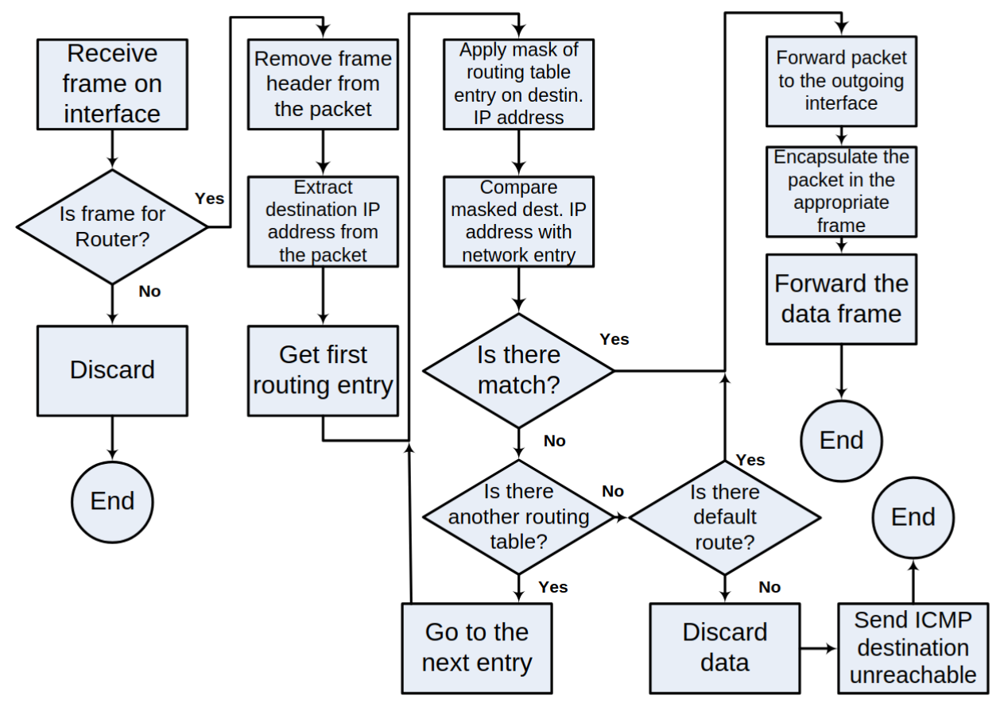
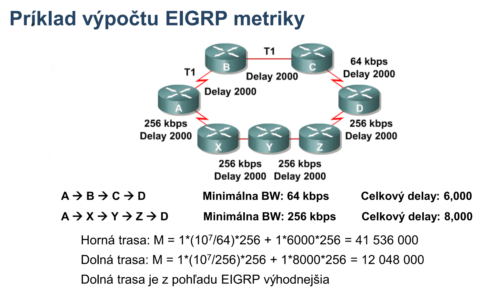
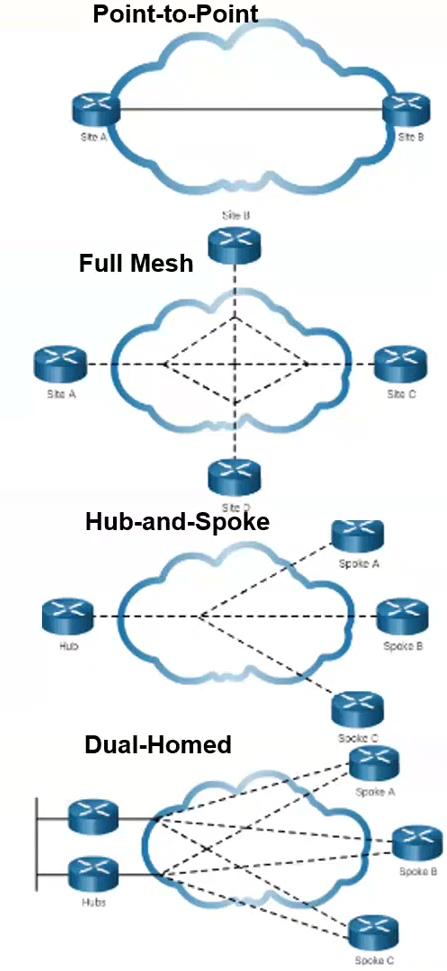
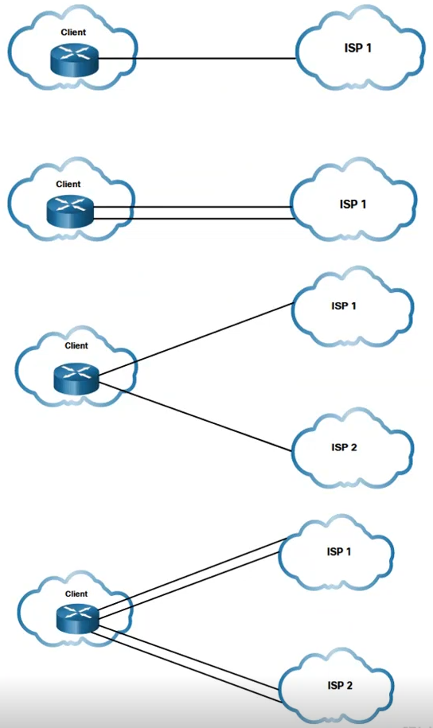

# PS2

Poznamocky k predmetu Pocitacove Siete 2

## Opakovanie

Smerovaci proces



Metody spracovania paketov

- Process switching
  - Kazdy paket prejde celym procesom smerovania
- Fast switching
  - Prvy paket do daneho ciela prejde celym procesom smerovania
  - Vysledok smerovania si router odlozi do tzv. "route cache", na zaklade coho budu smerovane dalsie pakety
- Cisco Express Forwarding (CEF)
  - Router si vysledky pre smerovanie pripravi dopredu

Smerovacie protokoly podla algoritmu

- Distance-vector
  - RIP, EIGRP
  - Celkovo jednoduchsie, vhodne pre mensie siete
  - Smerovace si vymienaju zoznam sieti a (z ich pohladu) najlepsie vzdialenosti do nich
  - Smerovace nepoznaju celu topologiu
  - Informacie ziskavaju od susedov
    - Periodicky (RIP + IGRP), aj ked sa nic nedeje (sluzi ako Keep-Alive)
    - Ked nastane zmena (Event-Driven) (EIGRP) - tabulka sa posle len na zaciatku a pri zmene, Keep-Alive pomocou Hello sprav
  - Spravy: vektory vzdialenosti
- Link-state
  - OSPF, IS-IS
  - Celkovo komplexnejsie, vhodne pre vacsie siete
  - Smerovace si vymienaju informacie pre tvorenie grafovej reprezentacie siete
  - Kazdy smerovac detailne pozna celu topologiu (lepsie, ale narocnejsie (CPU, RAM))
  - Link-state packets (LSP), Link-state databaza (LSDB)
  - Spravy: popisy prepojov
- Path-vector
  - BGP, MultiProtocol-BGP
  - Smerovace si vymienaju zoznam sieti a CESTU (namiesto vzdialenosti pri DV) od seba ku nim
  - Spravy: vektory atributov (t.j. polia)

Dalsie delenie smerovacich protokolov

- Interior Gateway Protocols (IGPs)
  - Smerovanie vo vnutri autonomneho systemu
  - RIP, EIGRP (Distance-vector) alebo OSPF, IS-IS (Link-state)
  - Pre IPv6 RIPng, EIGRP for IPv6, OSPFv3, IS-IS for IPv6
- Exterior Gateway Protocols (EGPs)
  - Smerovanie medzi jednotlivymi autonomnymi systemami
  - BGP (Path-vector)
  - Pre IPv6 BGP-MP

Metrika

- Ohodnotenie cesty do cielovej siete
- Ak do cielovej siete existuje viacej ciest, dany protokol vyberie tu najlepsiu na zaklade metriky
- Kazdy protokol si urcuje metriku inak
  - Protokoly pracujuce s jednym typom metriky
    - RIP - hops
    - OSPF - rychlost linky
  - Protokoly pracujuce s kompozitnou metrikou
    - EIGRP - rychlost + oneskorenie, volitelne aj zataz a spolahlivost

Administrativna vzdialenost

- "Doveryhodnost" smerovacieho protokolu
- Mozem mat nasadenych viacero protokolov ktore mi hlasia cestu do cielovej siete ale musim vybrat iba jeden - na zaklade metriky
- Cim nizsia metrika tym lepsie

## EIGRP

Enhanced Interior Gateway Routing Protocol  
Cisco Proprietary, zacina sa rozsirovat IETF open standardizacia  
Pokrocily classless distance-vector protokol (podla Cisco "hybridny", aj ked actually nie)  
Jediny distance-vector ktory garantuje bezsluckovost  
Automaticka aj manualna sumarizacia, autentifikacia, rychla konvergencia  
Je schopny zistit a pouzit backup route hned, aj bez komunikacie so susedmi  
Udrziava si tabulku o susedoch, pri zmene topo posle iba parcialnu spravu o zmene (na rozdiel od RIP - celu tabulku)  
Podla cisco vhodny aj do velkych sieti

Multicast `224.0.0.10` a `FF02::A`

Administrative distance

- Interne (vnutri autonomneho systemu): 90 (jedno z najnizsich)
- Externe: 170
- Sumarne polozky (discar routes, iba lokalne?): 5

Metrika - kompozitna - sklada sa z viac parametrov

### Vlastnosti

#### Protocol-dependent modules (PDM)

Ma nezavisle moduly - ked je treba (vyjde novy L3 protokol) tak sa dorobi modul do EIGRP a nemusi sa prerabat protokol sam o sebe  
Modul sa stara o format L3 adries, nie samotny protokol  
Cinnost EIGRP je rovnaka pre rozne L3 protokoly

#### Reliable Transport protocol (RTP)

Koncept (ani nie protokol, skor idea), ktory zabezpecuje spolahlivost  
Multicastom sa posielaju spravy

- Sused musi potvrdit prijatie spravy, inak sa nebudu posielat dalsie spravy
- Kazda sprava ma svoje sekvencne (poradove) cislo
- Ak sused potvrdi = _Conditional Receive_ = vsetko v poriadku
- Ak sused nepotrvrdi = _Laggard_ = pribrzdeny
  - Vyzaduje viacej komunikacie (unicast) kde sa snazia dobehnut to co sa stratilo
  - Ak aj tak dlho (`3x`) nepotrvrdi - vyhlasim za mrtveho (nasledne to oznamim aj susedom)

#### Udrziavanie vztahov so susedmi

Hello mechanizmus

- Pravidelne posielanie hello sprav (male, nenarocne, nepotrvrdzovane spravy) aby sa zistilo ci sused zije
  - Na pomalsich linkach (< ~1.5Mbps) kazdych 60 sekund
  - Na rychlejsich linkach kazdych 5 sekund
- Ak sused odpoveda, je zivy
- Ak sused neopovie 3-krat (15, resp. 180 sekund) -> vyhlasim ho za mrtveho -> zabudnem co poslal -> poslem update topo

Router si uklada "neighbor table" - `do show ip eight neighbors`  
Info sa prenasa iba ked nastane zmena v topo a iba medzi susedmi

Aby dvaja boli susedia, musia mat v pakete (co si vymenia) zhodne parametre:

- Cislo autonomneho systemu
- K-hodnoty (K-values) - vahove konstanty metriky, ktore pouzivaju
- Spolocna IP siet - adresa a maska

Ak susedia nie sme tak si nevymienaju routovacie tabulky  
Ziadny neighbor = ziadne routing info

### Pojmy v EIGRP

#### Reported Distance (RD)

Vzdialenost do siete, ktoru mi nahlasil sused  
Sused nareportoval ako je daleko do danej siete

#### Computed distance (CD)

Reported distance + moja vzdialenost k susedovi

#### Feasible Distance (FD)

(Celkom dolezity pojem)  
Doposial historicky najkratsia distance zo vsetkych CD (od poslednej zmeny nejakej linky Active -> Passive, resp. naopak)  
Najvyhodnejsia, resp. najkratsia cesta do cielovej siete  
CD mozu byt viacere, FD iba jedna  
Lokalna hodnota ktora nie je nikam ohlasovana  
Nemoze stupat (lebo by sa ohrozila bezsluckovost), moze iba klesat

Zmenit sa moze iba dvoma sposobmi

1. Smerovac sa dozvie o novej (kratsej) ceste do cielovej siete
2. Ak smerovac strati informaciu o ceste do cielovej siete a musi sa odznova spustit vypocet

#### Feasibility Condition (FC) - "RD < FD"

Zarucuje bezsluckovost  
RD < FD => nemoze obsahovat slucku  
Ak RD >= FD, tak je mozne ze sused routuje cezomna = slucka

Ak neplati FC -> moze/nemusi obsahovat slucku -> nemozeme priamo vlozit do tabulky

#### Successor a Feasible successor

Successor - next-hop router na ceste do najlepsej, najkratsej ceste do cielovej siete bez sluciek  
Feasible successor - backup Successor (tiez bez sluciek)  
Possible successor - nesplna FC - mozno vedie do cielovej siete, ale moze routovat cezomna takze moze mat slucky (ked nastane situacia kedy by sa mal pouzit tak sa ho opytam)

Pri zmene v sieti

- Ak je successor dostupny - nic sa nedeje, nic sa nezmeni
- Ak successor nie je dostupny
  - Ak mame Feasible successora tak ho hned pouzijeme -> bez vypadkov, rychla konvergencia, vsetci su happy
  - Ak nemame Feasible successora - musime znova spustit difuzny vypocet (potom sa tam zmeni aj FD (historicke minimum))

#### Diffusing computations

Generujem query na suseda reku "pocuvaj, ja som stratil cestu do cielovej siete (cezomna je to za nekonecno), vies o nej nieco?" a sused posle reply (bud jedno alebo druhe)

- "routujem cez teba, ak nevies ty cestu do cielovej siete tak ani ja neviem" alebo teda "cez teba za nekonecno = cezomna za nekonecno"
- Ak sused neroutoval cezo mna, tak z jeho pohladu sa nic nezmenilo takze mozem pouzit jeho, "jasne, cezomna za 20 (napr.)"

Mozem dalej pokracovat v routovani az ked dostanem odpovede na vsekty queries co som poslal. Ak mam 4 susedov, poslem 4 queries, musim dostat 4 odpovede  
Susedia sa tiez mozu pytat svojich susedov ak je taka situacia, cize to moze trvat dlhsie

Aby to nebolo take jednoduche, Feasible successor nemusi byt vzdy pouzity

- Povedzme ze cesta cez Feasible successora je za 25, a cez Possible successora za 20
- Router obetuje ten cas konvergencie a radsej sa spyta Possible successora ci sa da routovat cez neho (rychlejsia linka)

#### Neighbor table

Tabulka susedov  
Susedia si medzi sebou vymienaju routovacie tabulky  
Troubleshooting sa zacina prave tu!

#### Topology table

To, co dostanem od suseda  
Tabulka informacii o cielovych sietach a ich stave, FD, RD
Troubleshooting pokracuje tu!

#### Passive state & Active state

Paradoxne by som povedal ze to je naopak ale nevadi  
Passive - dobra route do cielovej siete, ktoru pouzivam  
Active - route ktora sa prepocitava a nesmie sa pouzivat (bezi difuzny vypocet)

### Metrika v EIGRP

Zklada sa z 6 parametrov (najcastejsie sa vyuzivaju prve dva)

- Bandwidth (staticky parameter, implicitne zapnuty)
- Delay (staticky parameter, implicitne zapnuty)
- Reliability (dynamicky vyhodnocovany, implicitne vypnuty)
- Load (dynamicky vyhodnocovany, implicitne vypnuty)
- MTU (staticky parameter, nevstupuje do vypoctov)
- Hop count (funguje len ako tvrdy limit na max dlzku cesty v hopoch)

| Paremeter   | Popis                                                                                                       | Staticky/Dynamicky parameter? | Implicitne zapnuty/vypnuty? |
| ----------- | ----------------------------------------------------------------------------------------------------------- | ----------------------------- | --------------------------- |
| Bandwidth   | Fyzicka priepustnost sietovej karty (`do show int g0/0`, tam napr. `BW1000000 Kbit/sec`)                    | Staticky                      | Zapnuty                     |
| Delay       | Natvrdo definovane oneskorenie interface-u (`do show int g0/0` tam napr. `DLY100` v desiatkach mikrosekund) | Staticky                      | Zapnuty                     |
| Reliability | Momentalna spolahlivost linky (`do show int g0/0`, tam napr. `reliability 255/255`)                         | Dynamicky                     | Vypnuty                     |
| Load        | Momentalna zataz linky (`do show int g0/0`, tam napr. `txload 1/255,  rxload 1/255`)                        | Dynamicky                     | Vypnuty                     |
| MTU         | Susedia musia mat rovnake                                                                                   | Staticky                      | _Nevstupuje do vypoctov_    |
| Hop count   | Iba hard limit na max dlzku                                                                                 | _-_                           | _-_                         |

Pri dynamickych je problem ze ako casto treba posielat updates, preto je by default off

#### Vypocet metriky

Metrika = $BW + \sum{ \forall D }$

- $BW$ - bandwidth = $\left( \dfrac{10^7 \text{ [Kbps]}}{\text{najpomalsie rozhranie [Kbps]}} \right) \cdot 256$
- $D$ - delay (v desiatkach mikrosekund) = $\sum{ \forall \text{ oneskorenia } [10 \mu s]} \cdot 256$

Mozu sa pouzit aj K-values - vaha pre kazdy parameter



### Load balancing

`equal-cost load balancing`

- Vie robit kazdy protokol
- Ak maju 2 routes rovnaku metriku tak medzi nimi robim LB

`unequal-cost load balancing`

- Vie iba EIGRP
- Kedze je metrika radovo v milionoch, je tazko trafit 2 rovnake metriky na LB
- Nastavi sa variance = koeficient, ktory hovori kolkokrat vacsia/mensia moze byt metrika s ktorou este budeme robit LB
- Basically nejaka odchylka
- Ak je metrika 2x horsia, pojde tou cestou 2x menej paketov

> Nie je to bug, je to feature

### Druhy EIGRP paketov

Vsetky EIGRP su "vtrepane do IP paketu, ktory je potom vtrepany do dalsieho L2 frame-u"  
Hlavicky su vsetky rovnake, meni sa telo paketu  
Podporuje TVL (Type Lenght Value), co znamena ze dlzka moze byt variabilna - viacej info naraz  
Druhe policko v hlavicke (opcode - operational code) urcuje typ paketu

Ak multicast, tak `224.0.0.10`, resp `FF02::10`

- Hello (Type 5)
  - Zistujem ci sused zije alebo nie
  - Nepotrvrdzovane
  - Multicast
  - Casto posielane (5, resp. 60 sekun)
- Update (Type 1)
  - Prenasaju smerovaciu informaciu - siet, maska, metrika
  - Multicast, pri spomenalych cez unicast
  - Su dolezite - musi byt potvrdzovany
- Query (Type 1)
  - Pytam sa na specificku cestu (ak som ja stratil informaciu o ceste)
  - Obvykle multicast
  - Potvrdzovane
- Reply (Type 4)
  - Odpoved na Query
  - Posiela sa unicast na adresu toho, kto sa pytal
  - Potvrdzovane
- Ack (Type 2)
  - Cez toto sa robi potvrdzovanie

### Default route

Neexistuje default route ako taka, treba workaround  
"Potom si dajte pozor, default route je uplne brutal"

```
ip route 0.0.0.0 0.0.0.0 serial0/1

redistribute static  # bud toto
network 0.0.0.0  # alebo toto
```

## OSPF

Link-state smerovaci protokol  
Pomerne casto sa pouziva  
Smerovanie vo vnutri sieti (autonomneho systemu)  
Event-Driven (nie az tak optimalizovany ako EIGRP)

> T1 pri linke = 1.5 Mbps  
> Stav konvergencie = prepocitavam - nieco sa na sieti deje

> Prikaz `OSPFv3` je prikaz na pomylenie - nieco s Cisco deamonom - nie je to iny protokol, len Cisco implementacia?

### Link-state

Smerovace si vymienaju parcialnu informaciu o topologii  
Reprezentovane grafom  
Strom najkratsich ciest  
Pamatovo aj vypoctovo narocnejsie  
Vhodne pre vacsie siete  
Hierarchicky dizajn siete - mame jednu chrbticovu siet, ostatne siete (oblasti?) sa na nu napajaju  
Sumarizovat siete mozno iba na hraniciach tychto oblasti

#### Ako to funguje

1. Popis okolia smerovaca - router zisti priamo pripojene siete a ostatne smerovace
2. Odosielanie LSP/LSA (Link-state Packet/Link-state Advertisement) kde presne popise svoje spojenia s ostatnymi na multicast
3. Preposielanie LSP v celej sieti - co prijmem bez zmeny preposlem - v ramci danej oblasti
4. LS databaza
5. SPF (Shortest Path First) tree - algoritmom hladam najkratsie cesty do danych sieti na zaklade info z tabulky (kazdy router za seba - nie je jeden celkovy strom)

### OSPF

Open Shortest Path First  
Najrozsirenejsi LS routing protocol  
Otvoreny protokol (RFC 2328)  
Classless, VLSM, lubovolna sumarizacia (iba na hraniciach oblasti!), autentifikacia, rychla konvergencia

Metrika - odvodena od rychlosti linky - **cost** `= ceil(100 / Bandwidth)`

- V dnesnych sietach (1Gb+) by to znamenalo ze vzdy bude metrika 1
- Da sa zmenit

V sucasnosti 2 verzie

- OSPFv2 pre IPv4
- OSPFv3 pre IPv6

Multicast

- `224.0.0.5` alebo `FF02::5` - vsetky OSFP smerovace
- `224.0.0.6` alebo `FF02::6` - DR/DBR smerovace

Destination MAC L2 frame bud `0100:5e00:0005` alebo `0100:5e00:0006`

Policko `protocol` v hlavicke L3 packetu ma cislo `89`

Routre su identifikovane pomocou tzv. Router ID  
LSA, LSP  
Single-area, multi-area

> Dijkstra Algorithm

### Pojmy v OSPF

- Link - interface
- Link-state - informacie/vlastnosti o linke (adresa, maska, metrika, typ siete, neigh)
- Link-state ID - unikatny identifikator **linky** v databaze, zvycajne zhodne s Router ID, DR router IP
- Router ID
  - Jedinecny identifikator kazdeho routra v topologickej oblasti
  - Da sa zmenit prikazom `router id`
  - By default najvyssia IP spomedzi loopbacks
  - Ak nie su loopbacks tak najvyssia IP zo vsetkych rozhrani a subrozhrani
  - Da sa konfiguracne zmenit
- Oblast (Area)
  - Mnozina sieti a smerovacov, ktore poznaju spolocnu topo
  - Identifikovana 4B cislom
  - Kazda oblast musi byt spojena s oblastou `AREA 0` (Backbone Area)
  - Hranica oblasti je na routeri (nie na linke)
- Hranicny router - na rozhrani medzi dvoma oblastami
  - Area Border Router (ABR) - musi byt clenom oblasti `0`; Robi sirenie, filtrovanie a sumarizaciu medzi oblastami
  - Autonomous System Border Router (ASBR) - tiez ABR + hranica medzi AS a vonkajsim svetom

Databazy v OSPF

- Adjacency Database - `show ip ospf neigh` - susedia a komunikacne vztahy medzi nimi
- Link-State Database (LSDB) - `show ip ospf database` - topologicka db, obsahuje graf siete; vsetky routre v rovnakej oblasi maju rovnaku LSDB
- Frowarding Database - `show ip route ospf` - info o vsetkych dosianutelnych sietach a next hopoch (router teoreticky pozna vsetko o sieti, tu je len vycuc potrebny pre smerovanie)

Link-State Advertisements (LSAs)

- Prenasa topologicku informaciu
- Datova struktura, nie paket; v jednom pakete moze byt viac LSAs
- Popisuje linku
- Posielana pri zmene topo na multicast (az po hranicu oblasti)
- Je ich 12, pouziva sa 6, na CCNA budu 2

Typy/funkcie routerov v OSPF?

- Designated Router (DR)
  - "Ako nejaky boss", hovorca
  - Ostatne spravia vztah iba s tymto routerom, nie sami medzi sebou
  - Komunikujem iba s nim (v danom segmente (segment != area pozor na to!!))
- Backup Designated Router (BDR)
  - Sleduje ci DR zije, ak zomre tak prevezme funkciu
  - Nemusi existovat
- Ostatni (DROTHER)
  - Komunikuju s DR, nie medzi sebou

Vztahy smerovacov

- Neighborhood
  - Jednoduchsi, lahsi vztah
  - Medzi lubovolnymi smerovacmi v OSPF
  - Neprenasa sa routing info, iba info o schopnosti komunikovat
- Adjacency
  - Vaznejsi vztah
  - Vymienaju si aj routing info

### OSPF packety

- Hello
  - Posiela sa kazdych 10 (broadcast siete a Point-to-Point) alebo 30 sekund (NBMA siete a Point-to-Multipoint (starsie))
  - Dead interval = `4 x hello interval`
  - V OSPF musia mat susedia rovnake casovace **!!!** Ak treba zmenit, tak treba vsade
- DDP (DBD) - Database Description Packet
  - Volba Master/Slave pocas Exstart
  - Prenasa len "titulky", "nadpisy"
- LSR - Link-state Request
  - Ziadost konkretnej polozky z topologickej db suseda
- LSU - Link-state Update
  - Prenos samotnej topologickej informacie
  - Obsahuje 1+ LSA poloziek
- LSAck
  - Potvrdenie prijatia LSA
  - V jednom LSAck sa moze potvrdit viac LSA

Vkladane priamo do packetu  
Kazdy ma svoju vlastnu hlavicku

Prechody medzi stavmi

1. Down - pociatocny stav
2. Init - pocujem suseda, ale neviem ci on pocuje mna
3. Two-Way - vzajomne sa pocujeme so susedom, voli sa DR/BDR
4. ExStart - dohodneme sa kto bude porovnavat databazy (Master/Slave)
5. Exchange - porovnavanie databaz (DDP)
6. Loading - prenos/vymienanie informacii v db
7. Full - susedia maju rovnaky obsah databaz

- Kroky 1-3
  - Lokalizovanie susedov
  - Vytvorenie komunikacnych vztahov
  - Volba DR/BDR (ak je treba) (`do show ip ospf neigh`)
    - Podla priority (0-255, default = 1)
      - Najvyssia priorita = DR
      - Druha najvyssia = BDR
      - Priorita 0 = nezucastnuje sa volieb - mozeme vyuzit na nejaky vykonovo slaby router
      - Ak priorita nerozhodne, pouzije sa Router ID
    - By default nepreemptivne (navzdy)
  - Pomocou Hello paketov na multicast
  - Co sa musi zhodovat aby boli smerovace susedia
    - Spolocnu siet a masku
    - Cislo a typ oblasti
    - Autentifikaciu
    - Hello a Dead interval
- Kroky 4-6
  - Synchronizacia topologickych databaz
- Krok 7
  - Vypocet stromu najkratsich ciest
  - Naplnenie smerovacej tabulky
  - Udrziavanie aktualneho stavu smerovacej db

### Typy OSPF sieti

Point-to-Point (PPP?)

- Dva routre su priamo pripojene linkou
- Casto vo WAN

Broadcast Multiaccess (BMA)

- Viacej routerov prepojenych v Ethernetovej sieti

Non-broadcast Multiaccess (NMBA)

- Viacej routerov prepojenych v sieti, ktora nepodporuje broadcast (Frame Relay)

Point-to-Multipoint

- Viacej routerov prepojenych v hub-and-spoke topologii v NBMA

Virtual links

- Specialna OSPF siet, ktora prepaja vzdialene OSPF oblasti s chrbticovou sietou (backbone area)
- Ak sa nejaka siet neda priamo pripojit na backbone, tak sa vytvori virtualny link (nejaky tunel) cez existujucu areu k backbone

## WAN technologie

Wide Area Network  
Geograficky vacsia rozloha  
Prepojenie viacej LAN medzi sebou  
Nie kazdy moze vybudovat WAN - financna narocnost (tahanie stoviek metrov kablov) - ISP, Telekomunikacne firmy

### Private vs. Public WAN

Private

- Urcene pre firmy
- Vyrazne vyssia cena, garantovane pripojenie, stabilita, technicka podpora atd.
- Service Level Agreement (SLA) - podpisana zmluva kde sa urcuju tieto podmienky
- Pre predstavu - rychlost okolo 10-20Mbps za 3000 evri mesacne
- Rozdelenie
  - Dedicated - Leased Lines
    - Fyzicky je nejaka kapacita linky, ktoru ISP prenajima
    - Rychlosti napr. T1/E1 (1.5Mbps) alebo T3/E3 (43Mbps)
    - Ja mam rezervovanu svoju "ruru" a nikto iny ju nemoze pouzivat -> z polhadu ISP neefektivne
    - Dnes uz sa nepouziva
  - Switched - efektivnejsie ako Leased Lines, teoreticky viem predat vacsiu kapacitu ako mam (nebude sa na 100% vyuzivat stale)
    - Circuit-switched
      - PSTN, ISDN
      - Dnes uz sa nepouziva
    - Packet-switched
      - Dnes najbeznejsie **MPLS** (Multi Protocol Label Switching), existuje aj Metro Ethernet, Frame Relay, ATM

Public

- Pre beznych pouzivatelov, male firmy, kto si nemoze dovolit tolko investovat
- Negarantovane, lacnejsie
- Internet - Broadband VPN
- Pouzivane technologie - DSL, Cable, Wireless

### WAN na ISO/OSI

- L1
  - Hardware - elektricke, mechanicke, ... parametre fyzickej linky
  - Organizacie ISO, EIA, ITU-T
  - Protokoly/Standardy? SDH, SONET, DWDM; v labe V.35 (max. 2.048Mbps)
- L2 software
  - Frame Relay, ATM, HDLC
  - Protokoly Ethernet WAN (Metro Ethernet), DSL, Wireless, MPLS, PPP (Point-to-Point Protocol), HDLC

### WAN topologie

Topologie

- Point-to-Point - 2 zariadenia prepojene medzi sebou
- Full mesh - kazdy s kazdym
- Hub-and-Spoke - najbeznejsie - Hub (centrala) kde su pripojeni Spokes (zakaznici); Spokes nie su spojeni medzi sebou
- Dual-homed - Ako Hub-and-Spoke, ale s redundanciou



Single-Homed vs. Dual-Homed

- Single-Homed - jeden uplink na jedneho ISP - SPOF
- Dual-Homed - jeden uplink, dvaja ISP
- Multihomed - dva uplinky, jeden ISP
- Dual-Multihomed - dva uplinky, dvaja ISP - redundancia



### Terminilogia

- Local loop
  - Last mile
  - Technologia (linka) ktorou sa ja ako zakaznik pripajam na ISP
  - To najdrahsie (vykopove prace, ...)
- Demarcation point
  - Miesto kde sa oddeluju zakaznicke zariadenia od zariadeni ISP
  - Tu konci zodpovednost ISP
- Data terminal Equipment (DTE)
  - L3
  - Router, Terminal, PC
  - Pripaja sa cez DCE na Local loop
- Data Communications Equipment (DCE)
  - L1, L2
  - Vacsinou Modem, dnes DSL Modem alebo Cable Modem
  - Moze byt aj Optical Converter, ak je opticky kabel od ISP
  - Prisposobuje data na WAN technologiu

### Komunikacia na WAN

- Paralelna
  - Viac bitov naraz
  - Vzajomne rusenie a sum - CrossTalk
  - Bity nepridu naraz - skew time - treba sync
  - Vacsia cena
  - Rychlejsie
- Seriova
  - Bit po bite

### Prepojovanie okruhov

- Prepojovanie okruhov (Circuit-switching)
  - Dedikovana cesta az kym sa neuvolni, ale plytvanie zdrojov
  - Synchronny prenos - Linka bola v case rozdelena do casovych slotov (TDM), zakaznik dostal jeden slot
  - V sucasnosti optika - Dense Wavelength Division Multiplexing (DWDM) - zakaznik ma poskytnutu frekvenciu svetla
- Prepojovanie paketov (Packet-switching)
  - Pred vstupom do siete su data delene, rozkuskovane
  - Treba dodatocne info -> prenos "neuzitocnych" dat

### Moderne sposoby riesenia WAN

- Private WAN

  - Dedikovany broadband
    - Optika - "dark fiber" - ISP poskytne opticke vlakno, rob si s nim co chces
  - Packet-switched
    - Metro Ethernet - Ethernet v MAN/WAN
    - MPLS (MultiProtocol Label switching) - pri privatnych sietach
      - Casto pouzivane
      - L2.5 - pomocou Labelov, Tagov - dohodneme si s ISP rovnake labels

- Public WAN
  - Digital Subscriber Line - xDLS - vyuziva existujuce telefonne dvojlinky
  - Cable - cez kablove TV - koaxial
  - Wireless - WiFi, 3G, 4G, LTE

## HDLC a PPP

Nad seriovymi linkami - tie bleskove kable v Packet Tracer

### DTE a DCE

Digital Terminal Equipment a Data Circuit Equipment  
Router a Modem

DCE vacsinou generuje clock rate - female kabel, novsie boxy automaticky  
Cisco prikaz napr. `clock-rate 128000` bude 128kbps

### HDLC

High-level Data Link Control  
L2, Point-to-Point, full duplex, vyzaduje clock na L1

ISO standard, vlastny header  
Cisco proprietary implementacia - cHDLC - pridana info o L3 protokole, ked sa povie HDLC tak sa vacsinou mysli cHDLC

```
int s0/0/0
    encapsulation hdlc

do show int s0/0/0
do show ip int brief
do show controller s0/0/0  # ci je DCE alebo DTE
```

### PPP

Novsia verzia HDLC, stavana nad nim, format ma ako on  
RFC 1661, 1662  
Je mu v podstate jedno co je na L1 aj L3

Dva podprotokoly

- LCP - Link Control Protocol - zostavenie a ukoncenie linky, konfig
  - Da sa specifikovat autentifikacia, kompresia, kontrola chyb a kvality, multilink (nieco ako EtherChannel), PPP Callback (basically prezvonim firmu, aby mi zvolali naspat, nech neplatim za dobu pripojenia) a dalsie
- NCP - Network Control Protocol - aky L3 protocol budem pouzivat

Zalozenie linky malo fazy

- Faza vytvorenia spoja - dohodnutie pozadovanej kvality, kompresie, multilink, auth, ... nejakym two-way handshakom
- Faza auth a overenie kvality (optional)
- Faza negociacia L3 protokolov - dohoda na IPv4 alebo IPv4 alebo CDP alebo dalsie
- Faza ukoncenia spoja

### Autentifikacia v PPP

"Doma mate typicky Ethernet, ten ale nepodporuje autentifikaciu. PPPoE (PPP over Ethernet) je PPP nad Ethernetom, cize podporuje aj auth"

- PAP - Password Authentication Protocol
- CHAP - Challenge Handshake Authentication Protocol
- EAP - Extensible Authentication Protocol

#### PAP

Klient (zakaznik) a Server (ISP)

2-way handshake

1. Klient posiela meno a heslo serveru
2. Server prejde lokalnu databazu a hlada tam toto meno a heslo, potom posle Accep/Reject

Nevyhody - plain text, trial-and-error attack (skusam mena a hesla, ako keby brute-force)

#### CHAP

3-way handshake

1. Server posle challenge
2. Klient posle meno a heslo - tu uz je to hash (md5)
3. Server posle Accept/Reject

Server posle: ID challenge, random retazec, hostname servera  
Klient da do md5: ID, random, heslo ktore nasiel k menu hostname servera  
Server spravil md5 s heslom ktore on pozna pre daneho usera a porovnal ho s hashou ktora mu prisla od klienta

## PPPoE

PPP over Ethernet  
RFC 2516  
Basically enkapsulacia do enkapsulacie PPP na L2 do Ethernetu

Potreba technologie, ktora umoznuje medzi ISP a zakaznikom podporu autentifikacie  
Nad ehternetom si zakaznik spravi session s PPP serverom (oznacovany aj ako AC, BNG, BRAS, ...)  
Okrem auth aj pridelenie IP, DNS, kompresia, sifrovanie

### Fazy

1. Active Dirscovery
   - Klient lokalizuje PPPoE server, ziska jeho MAC, zalozi spojenie, ziska Session ID
     - Server moze mat viac mien - Access Concentrator (AC), Broadband Network Gateway (BNG), Broadband Access Server (BRAS)
   - 4 kroky - Initiation, Offer, Request, Session-confirmation (podobne ako DHCP DORA)
     - PADI - PPPoE Active Discovery Initiation - Jedina ako broadcast, klient ziada o sluzbu/spojenie
     - PADO - PPPoE Active Discovery Offer - AC odpovie so svojim menom a detailami o sluzbe
     - PADR - PPPoE Active Discovery Request - Vyberie si jednu offer (moze dostat od viacerych AS) a poziada on cez PADR
     - PADS - PPPoE Active Discovery Session-confirmation - AC odpovie a prideli Session ID klientovi
2. Faza PPP Session
   - Dohodnu sa volitelne nastavenia a autentifikacia
   - LCP + AUTH + NCP (ako v PPP)
3. Faza ukoncenia
   - Termination request cez PPPoE Active Discovery Terminate (PADT)
   - Posiela klient alebo server
   - Prijatie vedie k uvolneniu zdrojov

### PPPoE config v Cisco

Pomocou tzv. **Templates** - vytvaraju/rusia sa virtualne rozhrania ako sa pripajaju/odpajaju klienti  
PPPoE **BroadBand Aggregator Profiles** - jedno zariadenie moze mat viac Profiles (rozne parametre), kazdy Profile moze mat viac Templates

## External BGP (eBGP)

External Border Gateway Protocol

Internet je skupina navzajom poprepajanych Autonomnych Systemov (AS) - ISP, firma, ...  
Z vonka posobi jeden AS ako jedna nerozdelena entita

IPX - Internet Packet Exchange - sposob, ako sa prepajaju ISP's  
Bod, v ktorom sa IPS's prepajaju sa nazyva IXP - Internet Exchange Point  
IPS's sa prepajaju navzajom za ucelom vzajomnej vymeny dat  
Na slovensku su 3 IPX - [six.sk](six.sk), [nix.sk](nix.sk), [peering.cz](peering.cz)

3 tiery providerov - Tier 1 posiela na Tier 2, Tier 2 na Tier 3, Tier 3 do sveta?

### BGP

Doteraz sa brali IGP (interior gateway) protokoly, toto je EGP (exterior gateway)

- IGP - detailne pozna vnutro, vonkajsok moze byt zahmleny pod default route
- EGP - vonkajsia topologia AS medzi sebou

BGP je jediny prakticky pouzivany inter-AS protokol  
Je typu Path Vector - vymena zoznamu sieti a zoznamu parametrov (atributov) o nich (metrika)  
Admin Distance - 20 pre eBGP, 200 pre iBGP  
Bezi nad TCP, port 179  
Aktualna verzia BGPv4 - RFC 4271  
Velmi velmi komplexny protokol  
Smerovanie medzi AS musi byt bezsluckove  
Susedne routre EGP musia byt explicitne nakonfigurovane na dohode spravcov (pri IGP je to automaticky)  
Nepracuje s metrikou, ale s atributami (hop-count, nejaky custom label, local preference), ktore su dohodnute  
Niekolko typov AS - Tiez private a public ako aj IP adresy  
Core routre by nemali mat default route, mali by mat routovaciu tabulku celeho internetu (momentalne >800k poloziek)

#### Pojmy

Komponenty

- BGP speaker - kazdy kto hovori BGP protokolom - je na nom spusteny BGP
- BGP neighbor alebo BGP peer - dvojica navzajom komunikujucich BGP spekerov

---

Druhy AS

- Single-homed
  - Jediny hranicny router do okoliteho sveta
  - Castokrat vobec nepodporuju EGP routing
  - Typicky firmy/podniky
- Multihomed
  - Viacero hranicnych routerov do okoliteho sveta
  - Napriek tomu, ze sa pripaja viacerymi bodmi, nedovoluje aby cez neho tiekla cudzia prevadzka
- Transit
  - Viacero hranicnych routerov
  - Sluzi na prenos tranzitnej prevadzky (mezdi inymi AS)
  - Typicky ISP

Prepojenie zakaznika k ISP - obvykle 3 moznosti

- Prijatie len Default route
  - Jednoduche, nenarocne pre router zakaznika
  - Moze viest k neoptimalnemu smerovaniu mimo siet zakaznika
- Default route a siete inych zakaznikov daneho ISP
  - Zakaznik moze optimalizovat routes do sieti inych zakaznikov toho isteho ISP
  - Zvysok sveta nahradeny default route - moze viest k neoptimalnemu smerovaniu mimo ISP
- Prijatie vsetkych ciest
  - Cela routing table celeho internetu
  - Najpresnejsie smerovanie kdekolvek
  - Narocne na hardware - momentalne >800k routes len pre IPv4

Kedy pouzit BGP - idealne ak je jedna z tychto situacii

- Nas AS ma viacere pripojenia na iny AS
- Nas AS umoznuje tranzit paketom cez seba na ceste do inych AS
- Je potrebna manipulacia s cestami pre pakety ktore opustaju nas AS
- Firma chce odlisit svoju prevadzku od prevadzky ISP

Kedy nepouzit BGP - v tychto pripadoch lepsie pouzit Default Route alebo staticke smerovanie

- Nas AS ma jedno pripojenie do internetu/k ISP
- Slabe zariadenie na okraji AS (malo pamate, nizky vykon)
- Slabe vedomosti o filtracii ciest a cinnosti BGP

## VPN

Virtual Private Network  
Firmy bezne potrebuju riesit vzdialene pripojenie do siete z roznych dovodov  
Je vytvorene point-to-point spojenie medzi koncovym pouzivatelom a VPN koncentratorom  
Vsetok traffic sa z hosta routuje na koncentrator

Realizacia - vytvorenie vitrualneho prepojenia - sietoveho tunela nad existujucimi sietami ISP

- Vytvorenie tzv. **Overlay** (siet VPN tunelov) nad tzv. **Underlay** (siete ISP)

Poziadavky na riesenie

- Sirokopasmovy/rychly pristup
  - `> j1Mb` az `j10Mb` - Cable, DSL, WiFi, WiMAX, Fiber ("Always on" technologie)
  - Je potrebne zvazit cenu, rychlost, bezpecnost, jednoduchost spolahlivost
- Bezpecny pristup
  - Privatne VPN sluzby ISP - napr. VPLS cez MPLS na SK
  - L3 VPN cez verejny internet

### Tunelovanie

Ked je potrebne vytvorit iluziu novej siete nad aktualne existujucou sietou  
Existujucu siet chceme vyuzit len ako transport, ale pre sluzby ma byt (takmer) neviditelna  
Existujuce pakety za enkapsuluju do novych paketov, z povodnych paketov sa stava payload

#### Terminologia

Prenasany protokol (passenger protocol)

- Povodny protokol, ktory musime zabalit
- Z tohto sa stane payload

Pomocny tunelovaci protokol (carrier protocol)

- Doplnkovy protokol, ktory sa pridava
- Umoznuje identifikovat prenasany protokol, realizovat zabezpecenie, auth, ...

Nosny protokol (transport protocol)

- Protokol, ktory aktualne bezi na fyzickej sieti
- Hlavicku tohto protokolu pridavame paketom

#### Tunelovacie protokoly

Tunelovanie je mozne realizovat s nim aj bez neho  
Pridava moznost auth, viacnasobne tunely, sifrovanie, ...

Napr. GRE, L2TP, PPTP, IPsec

Ak sa nepouzije, tak sa povodne pakety priamo vkladaju do novych paketov  
Minimalna rezia  
Napr. IPv6-in-IPv4

### Co potrebujeme na realizaciu VPN

#### VPN brana/brany (VPN gateway)

Typicky router (vykonnejsi), Firewall, Cisco Adaptive Security Appliance (ASA), VPN server, VPN koncentrator  
Idealne aby toto zariadenie malo hardware podporu sifrovania

#### VPN klient

VPN soft beziaci na OS hosta

### Typy VPN

#### Z pohladu moznosti nasadenia

Site-to-Site VPN

- Prepajanie vacsich celkov - pobocky firmy z centralou
- Nakonfigurovane na routeri pobocky
- Vsetko riesene na routri pobocky, klienti nemusia nic robit

- Split routing - okrajovy router vie co ma poslat na centralu a co do internetu (menej pouzivane)

Remote-access VPN

- Vznika on-demand - na vyziadanie, na urcity cas
- Nastavenie v OS klienta

#### Z pohladu kto ich manazuje

Podnikove VPN

- Firma si manazuje sama
- Protokoly pre site-to-site
  - GRE (nesifrovana), VxLAN, IPsec (sifrovana), GRE over IPsec (sifrovana)
  - Cisco - Cisco Dynamic Multipoint VPN (DMVPN), Cisco IPsec Virtual Tunnel Interface (VTI)
- Protokoly pre Remote-access
  - Vyuzivajuce VPN klienta - IPsec VPN
  - Nevyuzivajuce VPN klienta - SSL VPN

Privatne VPN sluzby poskytovane ISP

- Spravuje ISP
- Aktualne rozlisujeme
  - L2 MPLS VPN
  - L3 MPLS VPN

### Remote Access VPN

Primarne urcene pre mobilnych pracovnikov  
Klient sa pripaja do siete zamestnavatela  
Vytvara tunel zo svojho zariadenia na nakonfigurovanu VPN branu  
Zabezpeceny typ dynamickej VPN (len na urcity cas)

2 typy

- Client-based VPN - IPsec VPN
  - L3
  - Kazdy klient si nainstaluje na svoje zariadenie soft
- Client-less VPN - SSL VPN
  - L4
  - Bez potreby istalacie u klienta
  - Vyuziva PKI infrastrukturu klucov a certifikatov
  - Popularne
  - Vhodne len pre niektore L4 a vyssie aplikacie
  - Cez web browser

### Site-to-Site VPN

Vo firme konfiguracia routera na pobocke a na centrale  
Klienti netusia ze sa nieco deje, vsetko riesi rouer  
Trvale riesenie

#### GRE

Pomocny tunelovaci protokol  
L3  
Nesifrovany, nepouziva sa  
Pridava paketom dalsiu hlavicku  
Bezstavove, bez riadenia toku dat  
Overhead 24B

Konfig pomocou `int tunnel`

#### GRE over IPsec

Vyuziva vyhody GRE a IPsec  
Nad IPsec sa neda spustit routovanie  
Basically sa original prevadza zabali do GRE, a to sa zabali do IPsec?

#### Dynamic multipoint VPN (DMVPN)

Cisco riesenie  
Cast konfiguracie je nahradena automatizovanym procesom  
Vhodne pre vela pobociek
Odporucane pre hub-and-spoke

### IPsec VPNs

Nie je konkretny protokol, ale sada standardov  
Sifrovany
L3
Otvoreny standard  
Primarny ucel - vybudovat zabezpeceny tunel na L3  
Primarne na site-to-site, pre remote trochu zlozitejsia (malo klientov?)

Framework viacerych otvorenych standardov  
Poskytuje CIA vlastnosti (Confidentiality, Integrity, Authentication)
Stavebne bloky

- IPsec framework protocol
  - Authentication Header (AH) - nesifrovane, ma problem s NAT, niektore zariadenia vobec nepodporuju
  - Encapsulation Security Payload (ESP)
- Utajenie udajov (Confidentiality) - sifrovanie
  - Symetricke sifrovacie algoritmy - rovnaky kluc pre sifrovanie aj desifrovanie - DES, 3DES, AES, SEAL, RC sifry
  - Asymetricke sifrovacie algoritmy - iny kluc pre sifrovanie, iny pre desifrovanie, privatny a verejny kluc - RSA, PKI
- Integrita dat (Integrity) - dokaz, ze sprava nebola zamanena (MD5, SHA)
  - Hashovanie
  - MD5 (182bit kluc)(uz sa neoporuca), SHA (160, 256, 512-bit kluc)
  - Zoberie sa plain text - prezenie sa cez Hash function - mame hashovanu message
  - Problemom je ze sa nevie overit ci sa nemanipulovalo s hashom
  - V realite sa toto cele este zasifruje
- Autentifikacia odosielatela (Authentication) - dokaz, ze sprava prichadza od toho, kto si myslim ze je (PSK, RSA)
  - Pre-shared key (PSK) (problem s vymenou kluca), Signatury Rivest Shamir Adleman (RSA) (digitalne certifikaty)
- Diffie-Hellman - bezpecna vymena klucov
  - Nie je sifrovaci algoritmus (je pomaly)
  - Umoznuje, aby si strany dohodli spolocne kluce bez vymeny klucov samotnych

> Kluce by sa mali casto vymienat

Da sa realizovat v dvoch rezimoch

- Tunelovaci - kompletne nova hlavicka + ESP header + paticka
- Transportny - pouziva staru hlavicku + ESP header + paticka

#### Vytvorenie spojenie medzi IPsec susedmi

1. ?
2. IKE Phase 1 (IKE SA) - zalozi sa sifrovane spojenie
3. IKE Phase 2 (IPsec SA) - dohodnu sa vlastnosti sifrovaneho tunela
4. IPsec tunnel - zostavenie samotneho tunela
5. IPsec tunnel is terminated - po nejakej dobe - bud sa zrusi alebo vytvori nanovo

## Manazment, udrzba a monitoring siete

### Objavovanie zariadeni

CDP - Cisco Discovery Protocol  
Vieme objavit hocikoho kto vysiela ramce tohto protokolu

LLDP - podobne ako CDP, ale nie len pre Cisco

### Sprava zadiadeni

#### NTP - Network Time Protocol

Ako nastavit systemove hodiny

- Manualne - reboot
- Nakonfigurovat NTP

UDP 123, RFC 1305

Hierarchicky system zdrojov casu

- Stratum 0 - spolahlivy zdroj, refrence clock - urcuje cas
- Zazdy dalsi pripojeny je Stratum 1 (nie cez sietovu linku), Stratum 2 (ano cez sietovu linku), ...
- Max. Stratum 15
- Stratum 16 uz je nesynchronizovany

Presnost 10us pri Stratum 1, 0.5-100 ms pri Stratum 2+

Je zalozeny na UTC  
Nerozlisuje letny/zimny cas, ani casove pasma  
Za toto su zodpovedne OS serverov/klientov

#### Syslog

Zbierame data zo zariadeni  
UDP 514, FRC3164  
Posielaju sa data na syslog server

Format spravy

- Zavaznost sprav od 0 (najzavaznejsie) do 7 (najmenej zavazne)
- Facility - identifikacia sluzby
- Timestamp (prikaz `service timestamps log datetime msec`)

| Severity Name | Severity Level | Description                       |
| ------------- | -------------- | --------------------------------- |
| Emergency     | 0              | System unusable                   |
| Alert         | 1              | Immediate action needed           |
| Critical      | 2              | Critical condition                |
| Error         | 3              | Error condition                   |
| Warning       | 4              | Warning condition                 |
| Notification  | 5              | Normal, but significant condition |
| Informational | 6              | Informational message             |
| Debugging     | 7              | Debug message                     |

`syslog`, `rsyslog`, `syslog-ng`

### Udrzba zariadeni

IOS Systemove subory

> Commands

Obnova hesla

1. Vstupte do ROMMON rezimu
2. Zmente konfiguracny register na `0x2142` (by default `0x2102`)
3. Restartujte zariadenie
4. Urobte zmeny do povodnej konfiguracie po starte
5. Ulozte novu konfiguraciu

### Bezpecnost

L2

- CDP prieskumne utoky
- Telnet - idealne nepouzivat, namiesto neho SSH; admin pristup pomocou AAA, overenie portu 802.1X
- zahltenie MAC tabulky - port security, zakaz DTP, DHCP snooping, AAA, 802.1X
- VLAN utoky - zakazat DTP, vyhradena VLAN pre management, parking/black hole VLAN
- DHCP utoky - DHCP snooping

Vo vseobecnosti treba pouzivat sifrovane protokoly - SSH, SCP, SSL, SNMPv3, SFTP  
CDP iba na nevyhnutnych portoch  
ACL na filtrovanie neziadaneho pristupu

#### SNMP

Single Network Management Protocol  
Umoznuje spravovat a monitorovat zariadenia v sieti

SNMP prvky

- SNMP manager
- SNMP agent(s)
- MIB (Management Information Base) (databaza)

SNMP operacie

- Get - zisti/posli mi nejake info
  - `get-request`
  - `get-next-request`
  - `get-bulk-request`
  - `get-response`
- Set - nieco nastavujem (IP adresa, ...)
  - `set-request`
- Trap - ak sa u teba (na agentovi) stane nejaka zavazna udalost, daj mi o tom vediet?

SNPM Umoznuje

- Spravovanie
- Monitorovanie
- Hladanie a riesenie problemov
- Planovanie rozsirovania siete

MIB - Management Information Base

- Stromova struktura
- OID - object identifier
- To co potrebujem vacsinou zacina `1.3.6.1` - iso, org, dod, internet
- Napr. iso(1).org(3).dod(6).internet(1).mgmt(2).mib-2(1).system(1) - cize OID bude `1.3.6.1.2.1.1`
- Su nastroje na vytiahnutie podstatnych informacii z MIB - volaky MIB browser
- Public casti (pre vsetky zariadenia rovnake) a Private casti (vendor-specific)

SNMP verzie v1, v2c, v3 (idealne v3 - autentifikacia, sifrovanie, integrita spravy)

Typ udajov

- Skalarne - jeden udaj
- Tabularne - viacero udajov

### SPAN

Cisco Switch Port Analyzer  
Zrkadlenie celej prevadzky - Port Mirroring  
Monitorovanie v LAN  
Posiela cele ethernetove ramce a vsetko co je v nich zapuzdrene

> Remote SPAN - RSPAN - riesi sa v dalsich predmetoch - preposielanie tejto prevadzky niekam dalej

SPAN terminologia

- Ingress traffic - co prichadza do switcha
- Egress traffic - co odchadza zo switcha
- Source (SPAN) port - prevadzka tohto portu nas zaujima
- Destination (SPAN) port - na tento port posielame mirrorovanu prevadzku
- SPAN session
- Source VLAN - moze byt namiesto source port, ak chceme monitorovat celu VLAN, nie len port

## QoS

Quality of Service - kvalita sluzby  
Treba zistit, kde je bottleneck v sieti  
Rozne sluzby maju rozne poziadavky (oneskorenie, packet loss)  
QoS je velmi subjektivny pojem, silne zavisly od povahe sluzby  
Cez IP siet tecie viacero sluzieb (video, data, voice), ktore nie su rovnocenne

QoS - meratelne parametre - oneskorenie, RTT, strata packetov, jitter (rozdiel intervalov odosielania packetov napr. VoIP)  
QoE - quality of experience - kvalita vnimania - ako to clovek pocituje

V minulosti prenos hlasu v sietach s prepinanim okruhov  
Kazdy hovor mal zostrojeny svoj vlasny okruh, kade isla komunikacia, tu sa nepotrebovalo nic riesit  
Sposob prenosu bol velmi neefektivny, preto mame VoIP siete (paketove siete)  
Tu je problem ze sa touto sietou prenasaju viacere sluzby (konvergovana siet), cize treba riesit prioritizaciu sluzieb

Organizacia software frontu - prioritizacia urcitych packetov/typu sluzby

- FIFO
- LLQ - low latency queue - packet ma v hlavicke DSCP pole,
- CB-WFQ - Class-Based Weighted Fair Queuing

Service Level Agreement - SLA - zadefinovanie maximalneho oneskorenia, straty, ...

Konvergovana siet - viac typov prevadzky v jendej sieti - data, VoIP, ...

Faktory vplyvajuce na kvalitu

- Prenosova kapacita
- Celkove oneskorenie - pevna a variablilna zlozka
  - Processing Delay - variabilne - ked pride paket tak chvilu trva kym router zisti kam ho ma poslat
  - Queuing Delay - variabilne - cas, ktory paket stravi vo vystupnom fronte
  - Serialization Delay - fixne - cas, za ktory sa paket odvysiela interface-om
  - Propagation Delay - fixne - cas prechodu signalu na danom fyzickom mediu
- Kolisanie oneskorenia - jitter
- Straty paketov
  - Tail drop - ked sa naplni buffer pre interface-om (front), tak dalsie pakety ktore pridu sa zahodia
  - RED, WRED ((Weighted) Random Early Detection) - ked sa uz blizi k naplneniu buffera, tak sa nahodne zahodia pakety
-

### Nastroje pre poskytovanie QoS

- Klasifikacia
- Znackovanie (Marking)
- Predchadzanie zahlteniu (Congestion Avoidance) - Tail Drop, RED, WRED
- Riesenie zahltenia (Congestion Management) - planovacie mechanizmy pre obsluhu frontov
- Tvarovanie a obmedzovanie prevadzky (Shaping, Policing)
- Mechanizmy efektivnosti linky (Link Efficiency Mechanisms)

### Modely poskytovania QoS

- Best effort
  - Nic nekonfigurujeme, nic neriesime, bez riadenia QoS
  - Povodny model, na ktorom bol internet zalozeny
  - Vynikajuca skalovatelnost
  - Neposkytuje garancie sluzby
  - Nediferencuje medzi sluzbami
    - Paket pride vtedy, ked pride ✨
- Integrated Services (IntServ)
  - Aplikacie oznamuju siete ake parametre potrebuju/pozaduju
  - Poskytuje garantovane dorucenie a predikovatelne spravanie sa siete voci aplikaciam
  - RSVP - Resource Reservation Protocol - TCP/UDP port 3455, IP protokol cislo 46
  - Riadena zataz, nizke oneskorenie, vysoka priepustnost
- Differentiated Services (DiffServ)
  - Siet rozpoznava triedy prevadzky, ktore potrebuju osobitne QoS parametre
  - Toky triedi do tzv. agregatorov - tried - poskytuje QoS celym triedam
  - Per-Hop Behavior (PHB)

### Vytvaranie obsluznych tried

- Hlasove aplikacie - VoIP
- Mission-critical aplikacie - Oracle, SAP, SNA
- Interaktive aplikacie - Telnet, TN3270
- Velkoobjemove aplikacie - FTP, TFTP
-
-
-

## Juniper

Borievka  
Priamy konkurent Cisca  
Jednotny OS - JunOS

Akvizicia (odkupenie?) NetScreen - Firewally SSG
Routre - PTX (pre operatorov), MX (modularne core/enterprise)  
Switche - EX (enterprise), QFX (datacentrove)  
Firewally - SRX (modularne Next-Generation, enterprise), SSG (ScreenOS, nahradzane SRX)

### JunOS

Operacny system  
Postaveny na FreeBSD, sucasne sa presuvaju na Linux  
Pri boote sa vyzadjuve JunOS login - by default `root`, ziadne heslo  
Kompletne stromova struktura  
Iba jeden konfig, ako nahle je **aplikovany**, je hned ulozeny

```junos
cli
    ?
    <tab>
    configure
        edit interfaces lo0
            edit unit 0 family inet

        set system root-authentication plain-text-password

        show
        show | compare  // iba necommitnute zmeny

        commit  // kontrola logiky, aplikacia zmien
        commit and-quit  // commit + exit z konfig rezimu
        commit check  // iba skontroluje logiku (neaplikuje)
        commit confirmed  // aplikuje zmeny na urcity cas, ak sa zmeny nepotvrdia (prikaz commit) tak vrati zmeny naspat

    // ipv4 adresacia
    show interfaces terse
    configure
        // unit = subinterface?
        set interfaces em0 unit 0 famil inet address 192.168.1.1/24
        show | compare
        commit
    show interfaces terse

    ping 192.168.1.2

    show route

    // nie je potrebne zapinat ipv6
    // ipv6 adresacia
    configure
        set interfaces em0 unit 0 famil inet6 address fe80::1/64  // maska moze byt hocijaka
        set interfaces em0 unit 0 famil inet6 address 2001:dead:beef::1/64
        // ipv6 je automaticky aktivovana, ziadne 'ipv unicast-routing'
    show interfaces terse

    // loopbacks - nepodporuje viac ako 1, ale da sa dat viac adries na jedno rozhranie
        edit interfaces lo0 unit1
            set family inet address 192.168.1.200/32

    // static route
        set routing-options static route 0.0.0.0/0 next-hop 10.0.0.1
```

## MikroTik

Sustreduje sa na segment malych firiem, lokalnych operatorov, domacnosti, ...

Bezdrotove zariadenia pre ISP, RouterBoard  
Kombinovane zariadenia pre domacnosti  
Routre  
Switche, L3 switche  
Storage - NAS (20x NVMe), Switch, Router v jednom, bezi na RouterOS

### RouterOS

Nemaju ho vsade, niekde aj SwitchOS  
Uzavrety, zalozeny na Linuxe, velke mnozstvo architektur  
Min. 32MB RAM  
L2 hardware acceleration  
L3 niektore hw acc, niektore na CPU  
Licencia sucastou HW, licencne urovne 3 (iba AP client) a 4, 5, 6 ()

Cloud Hosted Router (CHR) - Router OS pre virtualne stroje

Firewall - stavovy, NAT, L7 filtering  
Routing - static, rip, ospf, bfp, isis  
DHCP klient aj server  
QoS, VRRP, NTP, DDNS, ...  
VPN a tunely  
Wireless  
CDP, LLDP, SSH, Telnet, ping  
Dot1X, RESP API  
Doplnkove funkcie - Docker, ZeroTier, podpora skriptov, Storage (NFS, SMB, NVMe-oF)

WinBox  
Webfig - GUI v prehliadaci, alternativa k WinBox  
MikroTik Pro - Android  
Proprieterne API, REST API  
**CLI** - SSH, Telnet, WinBox, vyssie modely aj konzola

Umozni nakonfigurovat vsetko, casto aj zlym sposobom  
Detailne specifiakacie zariadeni, testy vykonu, interna blokova struktura (diagram)

### Konfiguracia

Prihlasenie by default meno `admin`, bez hesla
Ak pyta zmenu hesla, `ctrl-c` pre zrusenie  
Stromova struktura  
Zadane prikazy su automaticky aplikovane

```routeros
/
    interface
        bonding
        bridge
        ehternet
    ip
        address
    ipv6
    log
    routing
    system
```

`tab` - doplna prikazy - vsetko, aj nazvy  
`?`  
`..`  
`/`

Pozor na farbicky

- cervena - nieco zle
- modra - cast stromu
- fialova - klucove slovo
- zelena - parametre
- hrubou vytlacene - povinne parametre

```routeros
/export show-sensitive  # bez pouzivatelskych uctov, tie sa tu neukladaju

/interface bridge
    add name=lo0
/interface etherent
    set [find default-name=ether2] name=ether1
    set [find default-name=ether1] name=ether2
/ip address
    ...

/user print
/user set admin password=heslisko

/system identity print
/system identity set ....

/ip service print
/ip service disable telnet
/ip service set ssh port=2222

# by default su interfaces zapnute
/interface print
/interface disable ether1
/interface enable ether1
/interface disable numbers=0,1

# loopback - virtualny interface (bridge) bez priradenia fyzickych portov
/interface bridge add name lo0

/interface print
/interface bridge print brief

# config switchu
/interface bridge add name=switch1
/interface bridge port add bridge=switch1 interface=ether1
/interface bridge port add bridge=switch1 interface=ether2
/interface print

# vlan
/interface bridge add name=switch1 vlan-filetring=yes
/interface bridge port add bridge=switch1 interface=ehter1  # trunk port
/interface bridge port add bridge=switch1 interface=ehter2 pvid=20  # access port
/interface bridge port add bridge=switch1 tagged=ether1 untagged=ether2 vlan-ids=20
# prenasane su iba vlans ktore su explicitne povedane ze sa maju prenasat (opacna logika ako cisco)
/interface bridge vlan print

# intervlan routing - subrozhrania, SVI
/interface vlan add interface=ether1 vlan-id=10 name=ether1.10
/interface vlan add interface=switch1 vlan-id=20 name=vlan20
/interface vlan print

# ehterchannel (LACP)
/interface bonding add name=bond0 slaves=ether1,ether2 mode=802.3ad  # lacp
/interface bonding print

# cdp (iba verzia 1) + lldp + mndp
/ip neighbor print detail

# adresacia
/ip address add address=192.168.1.1/24 interface=lo1
/ip address remove numbers=2
/ip address remove [find interface=lo0]
/ip address print
/ip route print

# ipv6
/system package print
/system package enable ipv6
/system reboot
/ipv6 address add address=2001:aaaa::1/64 interface=ehter1
/ipv6 address print
/ipv6 route print

# dhcp server
/ip pool add name=dhcp1 ranges=192.168.1.1-192.168.1.254
/ip dhcp-server network add address=192.168.0.0/24 gateway=192.168.1.1 dns-server 8.8.8.8
/ip dhcp-server add name=dhcp-server1 address-pool=dhcp1 interface=ether1 disabled=no
/ip dhcp-server print
/ip dhcp-server lease print detail

# dhcp klient
/ip dhcp-client add interface=ehter1 disabled=no
/ip dhcp-client print

# nat celkovo je rozdielny oproti cisco
# nat - staticky - 1:1
/ip address add address=1.1.1.1/30 interface=ether1  # vonkajsi interface
/ip firewall nat add chain=srcnat src=address=192.168.1.0 action=src-nat to-addresses=1.1.1.1  # smerom von
/ip firewall nat add chain=dstnat dst-address=1.1.1.1 action=dst-nat to-addresses=192.168.1.0  # smerom dnu

# pnat overload
/ip firewall ant add chain=srcnat src-address=192.168.1.0/24 action=masquerade out-interface=ether1

# port forwarding
/ip firewall nat add chain=dstnat in-interface=ehter1 dst-port=443 protocol=tcp action=dst-nat to-address=192.168.1.1 to-ports=443

# pppoe
/interface pppoe-client add add-default-route=yes disabled=no allow=pap,chap interface=ehter1 name=WAN user=mojemeno password=mojeheslo
/ip firewall nat add chain=srcnat src-address=192.168.1.0/24 action=masquerade out-interface=WAN

# static routing
/ip route add dst-address=192.168.2.0/24 gateway=192.168.0.1
/ip route print
/ipv6 route add ...
/ipv6 route print

# ospf
```

## Automatizacia

Konfiguracia velkeho mnozstva zariadeni

### Smart zariadenia

Zariadenia ktore zbieraju rozne informacie a na ich zaklade vyhodnocuju nejake rozhodnutia

### Datove formaty

Spolocny "jazyk" ktoremu rozumeju zariadenia ktore spolu komunikuju  
Definuje sposob ako ukladat a zdielat informacie

Najcastejsie formaty

- JSON
- XML
- YAML

### Application Programming Interface (API)

Softver, ktory umoznuje ovladanie a pristup k sluzbam a udajom aplikacie

Typy

- Otvorene/verejne
  - Dostupne verejnosti bez obmedzeni
  - Casto sa vyzaduje API Key (limitovanie poctu ziadosti, statistiky, ...)
- Interne/Privatne
  - Pouzite vo firme na pristup k firemnym udajom
- Partnerske
  - Mezdi firmami na zaklade zmluv

Standardy

- SOAP - Simple Object Access Protocol
  - Format XML
  - Transport HTTP alebo SMTP
- REST - Representional State Transfer
  - HTTP
  - JSON, YAML, XML
  - Jednoduche
  - Najviac pouzivane
- NETCONF
  - Nahrada SNMP
  - SSH
  - XML
- RESTCONF
  - Podobne REST
  - Config zariadeni
  - XML, JSON, YANG modely
- XML-RPC (Remote Procedure Call)
- JSON-RPC (Remote Procedure Call)

#### RESTful API

API je RESTful ak dodrziava tieto zasady

- Klient-Server
  - Server generuje udaje (backend)
  - Klient vizualizuje udaje (frontend)
  - Oba mozu byt nahradene bez zmeny druheho
- Stateless
  - Klientske data nie su ulozene na serveri
  - Stav relacie si uklada klient
- Cacheable
  - Klient si moze predpripravit odpovede dopredu

#### Rozdiely URI, URL, URN

URI - Uniform Resource Identifier - `https://www.example.com/book.html#page100`
URL - Uniform Resource Locator - `www.example.com/book.html`
URN - Uniform Resource Name - `https://www.example.com/book.html`

Protokol - `https://`
Fragment - `#page100`

### Nastroje na spravu konfiguracie

Vacsinou vykonavaju automatizaciu (vykonanie sluzieb na zariadeni) a orchestraciu (usporiadanie automaticky uloh do celkov, ktore formuju proces alebo workflow)

Najcastejsie pouzivane nastroje

- Ansible - bez agenta (nemusime na koncove zariadenie nic instalovat)
- Puppet
- Chef
- SaltStack

### Intent-Based Networking (IBN)

Stavia na principe SDN

Podla Cisca sa sklada z 3 faz

- Translation
  - Zachyti pouzivatelsku poziadavku na zmeny v sieti
  - Prelozi ju na politiky, ktore je mozne aplikovat na zariadenia
- Activation
  - Vytvorene politiky sa aplikuju na dane zariadenia
- Assurance
  - Kontroluje a monitoruje spravnost nastaveni

IBN vnima fyzicku a virtualnu infrastrukturu (Fabric)

- Overlay - logicka viratualna topologia, vyuziva tunely
- Underlay - fyzicka topologia

Samotna implementacia IBN Fabric - Cisco Digital Network Architecture (DNA)

- Prvky Cisco DNA
  - SD-Access
  - SD-WAN
  - Cisco DNA Assurance
  - Cisco DNA Security
- Riadenie cez Cisco DNA Center (kontroler)

## Virtualizacia

Spustanie logicky oddelenych (OS) na jednom fyziskom zariadeni  
Fyzicky stroj - host  
Virtualny stroj - guest (virtual machine - VM)

Kadza VM ma "pocit" ze bezi na vlastnom HW, vlastnu vRAM, vlastny priestor na HDD, vlastnu MAC a IP

### Hypervizor (VMM)

Softwarova medzicast ktora dovoluje virtualke rozpravat sa VM so zelezom  
Niekedy aj Virtual Machine Monitor  
Neobmedzena kontrola nad VM  
Prideluje VM zdroje, dokaze spustat vypinat VM, pridavat/odoberat/menit zdroje

#### 1. Typ

Nazyvany aj nativny, bare metal  
Priamo na HW  
Management cez web, ...

Napr. Citrix XenServe (Citrix XenCenter), VMware ESX (Vmware vSphere Client)

#### 2. Typ

Nazyvany aj hosted  
Bezi nad OS  
Management priamo cez OS (GUI, CLI)

Napr. Oracle Virtualbox, VMware Workstation/Player, KVM (take nieco medzi 1 a 2)/QEMU, Windows Virtual PC

### Siet vo virtualizacii

- Priame pripojenie VM do siete
- Preklad adries (NAT)
- Virtualna siet
- Lokalna (izolovana) siet

### Kontajnerova virtualizacia

Virtualizovana jedna/viac aplikacii, nie cely OS

- Web server
- Databazovy server

Kontajner je zvycajne prihcystany so zakladnou konfiguraciou  
Vsetky kontajnery na systeme zdielaju jadro OS

#### Docker

Kontajnerova virtualizacia pre Linuxove programy, v sucastnosti aj nativne na Windows  
Architektura x86_64, ARM, s390x, ppc64le  
Integrovany v mnohych technologiach - AWS, OpenStack, Puppet

#### LXC

Skratka pre Linux Container  
Vie virtualizovat viac procesov v jednom kontajneri  
Medzistupen medzi Dockerom a virtualizaciou OS

#### LXD

Hypervizor pre LXC kontajnery  
Nie az tak stabilny ako LXC

#### Incus

Dalsi evolution tohto

## Cloud computing

Zdielany vypoctovy vykon na niekolkych zariadeniach  
Zakaznik plati sa sluzbu, nie za software

### Modely

Privatny cloud

- Mam to u seba

Komunitny cloud

- Vyuzivany skupinou s rovnakym spolocnym zaujmom
  - Prepojenie univerzit v ramci jedneho vyskumu

Verejny cloud

- Ponukany verenosti
- AWS, Microsoft Azure, Google Cloud Platform

Hybridny cloud

- Kombinacia predoslych

### Sluzby

Software ako sluzba (SaaS)

- Aplikacie dostupne cez web, alebo klientske aplikacie
- Napr.
  - Ulozny priestor - Google Drive, Dropbox, MS OneDrive
  - Kancelarske prostredie - MS Office 365
  - Informacny system

Platforma ako sluzba (PaaS)

- Spravidla pre developerov
- Prostredia na beh vlastnych aplikacii
- Napr.
  - Java Virtual Machine
  - .NET prostredia
  - Databazy
  - Autentifikacia, Autorizacia (AAA)

Infrastruktura ako sluzba (IaaS)

- Poskytovatel poskytuje len konektivity
- Celkova administracia prostredia je na zakaznikovi
- Napr.
  - Pristor pre vlastne VM
  - Virtualne siete
  - Firewall-ing
  - Rozkladanie zataze

Podmoziny

- FwaaS - Firewall

### Orchestracia

Najsilnejsia zbran cloudu  
Inymi slovamii automatizacia  
Automatizovane spracovanie niekolko zariadeni naraz  
Velmi casto nasadzovane vo virtualnych prostrediach

Potrebne odlisit pouzitie

- Automatizacia konzovych zariadeni
- Automatizacia deploymentu

## SDN - Software Defined Networks

Softwarovo definovane siete  
Virtualizacia sietovych funkcii  
Programovo centralne riadena siet  
Nejaky controller co vsetko ovlada  
Cez API  
Mnozstvo protokolov - STP, OSFP, IGMP, ...  
Nemaju v laske casty pohyb zariadeni

V datovych centrak 10-ky tisic fyzickych serverov  
1 fyzicky server != 1 virtualny server

### Organizovnie

Kontroler je centralny riadiaci prvok celej siete  
Datova robin distribuovana vnikolkych zariadeniach

### Architektura SDN

RFC7426

Control plane (Riadiaca rovina)
Forwarding plane (Datova rovina)
Management plane

#### OpenFlow

Prve standardizovane Southbound API

### SDN kontrolery

POX  
OpenDayLight  
OpenMUL

### SDN prepinace

Softwarove

- Open vSwitch
- Indigo Virtual Switch
- Cisco Virtual Topology Forwarder

Hardware

- Brocade MLX smerovace
- HP prepinace
- Cisco smerovace (IOS-XE, IOS-XR, NX-OS), prepinace Nexus
- Juniper smerovace a prepinace
- Mikrotik

## SD-WAN

Paradigmy na WAN siete  
Kontroler + CPE (Customer Premises Equipment) zariadenia  
Centralny dashboard - prehlad o stave fyzickych a logickych liniek, oneskorenie, stratovost, jitter
