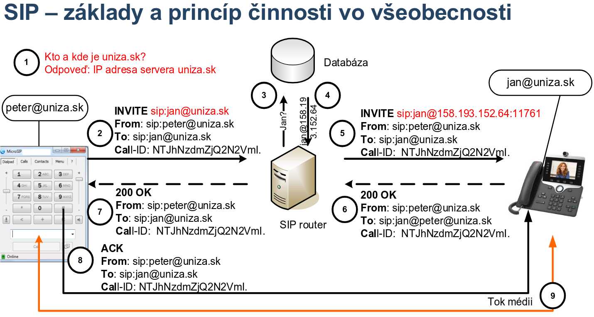
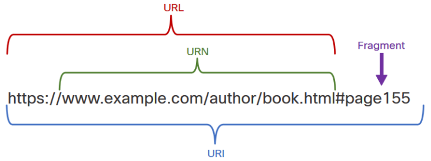

# PS3

Pocitacove Siete 3

## Uvod

Predmet zamerany na reatime multimedialnu (najma hlasovu) komunikaciu nad uz existujucou sietou  
Konvergovana siet  
"Close to realtime"  
Protokol **SIP**  
Komunikator - program (?) ktory umoznuje komunikaciu  
RTT max 250 ms

## DNS a ENUM

### Domain Name System (DNS)

_"Nieco na styl telefonneho zoznamu pre internet"_  
Ludia si lahsie pamataju slovne nazvy nez IP adresy

Spociatku sa preklad riesil rucne vytvaranymi databazami - subor `HOSTS.TXT` kedysi dostupny cez FTP na adrese `26.0.0.73`

RFC 1034 and 1035 a mnohe dalsie

Port 53

- TCP ak sprava (IBA DATA!) >512 B, alebo sa prenasaju cele zony
- UDP v ostatnych pripadoch (velkost <=512 B zarucuje, ze paket nemusi byt fragmentovany ani pri najmensom MTU - 576B)

Takmer zadadne sa pouziva UDP (nizka rezia)

Standardne nesifrovany, ale su riesenia

- DNS over TLS (DoT)
  - RFC 7858, 8310
  - TCP 853
  - Podporovane servery - `1.1.1.1`, `9.9.9.9`
- DNS over HTTPS
  - RFC 8484

#### Pojmy v DNS

**Zona**

Cast stromu, o ktorej ma server uplnu znalost a je za nu zodpovedny

**Domena**

- Hierarchicka struktura nazvov objektov, ktora vyjadruje ich prislusnost do istej oblasti, napr:
  - Krajina, stat, vlastnik, interna struktura vlastnika
  - Napr. `sk` - `uniza.sk` - `fri.uniza.sk` - `kis.fri.uniza.sk`
- Uplne "hore" je `.`, cize spravne by adresa mala byt napr. `uniza.sk.`, ale nie je potrebne to pisat

**Name servers** - Menne servery, Nazvove servery

- Servery udrzuju databazu mien a zdrojovych zaznamov - **resource records**
- Klient
- Server zodpoveda za zonu
- Server ktory spravuje zonu sa nazyva **autoritativny**

**Resolver**

- Klientska aplikacia, ktora ziskava informacie z DNS serverov
- Stub - hlupy - uplne spolieha na server a ocakava definitivnu odpoved
- Rekurzivny - nehlupy - spracuje aj ciastocnu odpoved, ak ho server "odkaze" na iny server, vie si s tym poradit

Kazdy uzol ma svoje vlastne meno (**hostname**) a patri do istej domeny

- hostname + domena = **Fully Qualified Domain Name** (FQDN)
- Komponenty FQDN sa oddeluju bodkou a volaju sa **labels** - max 63 znakov dlhy, `[a-z][A-Z][0-9]`, standardne len ASCII znaky, da sa aj inak
- FQDN celkovo max 255 znakov

**Resource record** - Zdrojovy zaznam

- Prvok databazy v DNS
- Casti
  - Vlastnik
  - Typ - druh informacie
  - Trieda - rodina protokolov
  - TTL - doba platnosti
  - RDATA - informacne telo
- Typy
  - SOA - Start of Authority - popis zony, povinny, musi byt prave raz - domenove meno, identita spravcu, seriove cislo, casoe udaje pre sync
  - A - IPv4
  - AAAA - IPv6
  - NS - Name Server - FQDN autoritativneho DNS servera danej zony
  - CNAME - canonical name - alias
  - MX - Main Exchanger - postovy server
  - PTR - Pointer - reverzny lookup - IP na FQDN
  - SRV - Service - lokalizacia servera
  - NAPTR - Naming Authority Pointer - vyuzivane pri ENUM, preklad telefonneho cisla do ineho formatu
- Trieda
  - IN - Internet - jedina pouzivana dnes
  - CH - Chaosnet - experimentalna siet na MIT
  - HS - Hesiod - tiez uz nepouzivane

**Zona**

- Podstrom domenoveho stromu
- Ako root celeho stormu je `.` (bodka)
- Zony mozu byt delegovane na nove autoritativne servery - zverim spravovanie niekomu inemu
  - Napr. `sk` oddeli `telecom.sk` nech si spravuju sami, `uniza.sk`, `edu.sk`, ...

#### Princip prace DNS

Vsetky domeny su organizovane v stromovej strukture  
Koren stromu je `.`  
Pre domenu `.` existuje 13 autoritativnych serverov - `A.ROOT-SERVERS.NET`, `B.ROOT-SERVERS.NET`, ..., `M.ROOT-SERVERS.NET`  
Tieto stromu obsahuju zoznam vrcholovy domen - **Top-Level Domains** = TLD  
Autoritativne servery TLD obsahuju zoznam domen druhej urovne, ich prislusne autoritativne servery a delegovania  
Takto sa ide rekurzivne do hlbky  
Ked klient potrebuje hladat v DNS, kontaktuje svoj prednastaveny DNS server  
Ak tento server nepozna "odpoved", tak bud ju rekurzivne hlada u svojho parenta, alebo odkaze na parenta (podla toho co pozadoval klient)

DNS sprava ma fixnu strukturu

- Header
- Question
- Answer
- Authority - info o DNS serveri, ktory ma presne alebo presnejsie info o hladanom mene
- Additional - pridavne pomocne informacie

#### Vytvorenie vlastnej zony

Musi obsahovat prinajmensom

- SOA zaznam - vlastnik, meno servera z ktoreho informacia povodne pochadza, administrativny kontakt, seriove cislo zony, casy refresh, retry, expire, negative TTL
- NS zaznam - odkaz na mena autoritativnych serverov - nema byt IP ani CNAME

Pri kazdej aktualizacii zony sa seriove cislo musi inkrementovat - idealne `YYYYMMDDrr`, kde `rr` je cislo revizie

Problem - ak je autoritativny NS je vo vnutri svojej domeny

- Napr. domena `gvoza.sk`, NS `ns.gvoza.sk`
- Riesenie - pridanie tzv. _glue record_ - `A` alebo `AAAA` zaznam, ktory nazvu z NS zaznamu v tej istej delegujucej zone prideluje IP adresu - inak by sa glue nemal pouzivat
  - Cize basically ze dame rovno IP adresu NS, nie jeho meno, cim sa porusi to co sa pisalo predchvilou

```txt
example.com.  NS  ns1.example.com
example.com.  NS  ns2.example.com
ns1.example.com   A   123.123.123.123  // toto je glue record
ns2.example.com   A   124.124.124.124  // toto je glue record
```

IPv4 a IPv6 su pre DNS len protokolmi na prenos jeho sprav, ale nemaju vplyv na to, co prekladaju

- Kontaktujeme server po IPv4 ale moze nam vratit IPv6 odpoved
- Kontaktujeme server po IPv6 ale moze nam vratit IPv4 odpoved

#### DNS v SIP - zaznam SRV

Vyuzivaju sa na lokaciu SIP proxy servera zodpovedneho za danu domenu

#### Vsuvka o regex

Budeme sa venovat tzv. POSIX-compatible regular expressions

| Znak                | Popis                                                      | Priklad                                                                                                           | Antipriklad                |
| ------------------- | ---------------------------------------------------------- | ----------------------------------------------------------------------------------------------------------------- | -------------------------- |
| `.`                 | Jeden lubovolny znak                                       | `a.c` = `abc`, `acc`, `adc`, ...                                                                                  | `a.c` != `abbc`, `abcc`    |
| `^`                 | Zaciatok riadku                                            | `^abc` = `abcdef`, `abc1234`                                                                                      | `^abc` != `123abc`, `aabc` |
| `&`                 | Koniec riadku                                              | `abc&` = `abcabc`, `123abc`                                                                                       | `abc&` != `abcd`           |
| `[]`                | Jeden z mnoziny znakov                                     | `a[123]b` = `a1b`, `a2b`, `a3b`; `a[x-z]b` = `axb`, `ayb`, `azb`; `a[pq1-3]b` = `apb`, `aqb`, `a1b`, `a2b`, `a3b` |                            |
| `()`                | Podkupina/blok, neskor s odkazom `\n`, kde $n \in {1 - 9}$ | `(abra)kad\1` = `abrakadabra`; `(wifi) je \1, ale (kabel) je \1` = `wifi je wifi, ale kabel je kabel`             |                            |
| `*`                 | Predchadzajuci znak sa nachadza 0 alebo viac krat          | `ab*c` = `ac`, `abc`, `abbc`, `abbbc`, ...                                                                        | `ab*c` != `acc`            |
| `+` (iba v ERE)     | Predchadzajuci znak sa nachadza 1 alebo viac krat          | `ab+c` = `abc`, `abbc`, `abbbc`, ...                                                                              | `ab+c` != `ac`             |
| `?` (iba v ERE)     | Predchadzajuci znak sa nachadza 0 alebo 1 krat             | `ab?c` = `ac`, `abc`                                                                                              | `ab?c` != `abbc`           |
| `{n}` (iba v ERE)   | Predchadzajuci znak sa nachadza presne `n` krat            | `a{3}` = `aaa`                                                                                                    |                            |
| `{n,}` (iba v ERE)  | Predchadzajuci znak sa nachadza aspon `n` krat             | `a{3,}` = `aaa`, `aaaa`, `aaaaa`, ...                                                                             |                            |
| `{n,m}` (iba v ERE) | Predchadzajuci znak sa nachadza medzi `n` a `m` krat       | `a{4,5}` = `aaaa`, `aaaaa`, ...                                                                                   |                            |

Zameny

- Nieco ako _find and replace_
- Pouziva sa delimiter - casto `!` a vyzera takto: `!hladanyvyraz!nahrada!`
- Napr.
  - `!abc!XYZ!` - ak najde `abc`, tak ho nahradi `XYZ`
  - `!mailto:!!` - ak najde `mailto:` tak ho nahradi za nic = da ho prec
  - `!^(43[0-5][0-9])$!sip:\1@uniza.sk!` - ak je cislo z rozsahu 4300 az 4359, tak ho nahradi za `sip:43..@uniza.sk` (SIP URI)

### ENUM

ITU-T E.164

Oznacenie pre cislo nielen verejnej telefonnej siete

Podla odporucania max. 15 znakov

- Kod krajiny = 1-3 cislice
- Geograficka oblast = $x$ cislic
- Cislo ucastnika = $15 - x$ cislic

Ak sa cislo zacina `0` - narodny hovor - `0902 ...`
Ak sa cislo zacina `00` alebo `+` - medzinarodny hovor - `+421 902 ...`

Napr. `421 41 513 4301`, `421 905 123 456`

Cislo v E.164 je mozne vyhladat v DNS

1. Zoberieme cislo - `+421 41 513 4301`
2. Odstranime neciselne znaky - `421415134301`
3. Medzi kazdu cislicu vlozime bodku - `4.2.1.4.1.5.1.3.4.3.0.1`
4. Medzi kazdu cislicu vlozime bodku - `1.0.3.4.3.1.5.1.4.1.2.4`
5. Pridame retazec `e164.arpa` na koniec - `1.0.3.4.3.1.5.1.4.1.2.4.e164.arpa`

Ak ma IP telefonia nahradit normalnu, musi byt aspon taka kvalitna  
Okrem dalsich zalezitosti treba mat mechanizmus na preklad `E.164` cisla na `SIP`/`H.323`/...  
Toto sa nazyva _E.164 Numbering Mapping_ = **ENUM**

## Session Initiation Protocol (SIP) a suvisiace protokoly

RFC 2543  
RFC 3261  
Velmi vela rozsirujucich RFC

SIP je je signalizacny protokol pracujuci na urovni aplikacnej vrstvy  
Definuje, ako sa ma iniciovat, modifikovat a ukoncovat interaktivne multimedialne komunikacne spojenie medzi 2+ pouzivatelmi

Vlastnosti

- Jednoduchost
- Flexibilny a lahko rozsiritelny
- Skalovatelny
- Bohata podpora vyvoja sluzieb (aktivator)

Princip cinnosti - trojcestny mechanizmus

- Invite
- .
- .

IP telefonia, telekomunikacia, multimedialna komunikacia  
Klucovy protokol pre ...

SIP je stabilna a odskusana technologia s mnohymi produktmi a rieseniami  
Funguje na mnohych otvorenych komercnych produktoch (Cisco, ...) ale aj open-source

Vyhody - nizsie ceny, kvalitnejsie sluzby, kvalitnejsi zvuk/obraz, ...  
Nevyhody - podvody s fake ID, robocalling, telemarketing nevyziadane volania, ...

Textove a binarne protokoly

|         | Vyhody                                                                                     | Nevyhody                                                                                     |
| ------- | ------------------------------------------------------------------------------------------ | -------------------------------------------------------------------------------------------- |
| Textove | Lahka citatelnost, zrozumitelnost, jednoduche ladenie, univerzalonst klientov              | Nizka efektivnost vzhladom na objem dat, nemoznost prenasat binarne data v nativnost formate |
| Binarne | Vyssia efektivita prenosu dat, kompaktny format, prirodzene vhodne na vymenu binarnych dat | Bez specialnych analyzatorov prakticky necitatelny, pri ladeni potrebni dedikovani klienti   |

### IP telefonia

Pre internet to bola "nova" sluzba koncom milenia  
Prenos hlasu (a ineho typu multimedialnych dat) cez siet v realnom case medzi 2+ ucastnikmi s pouzitim IP protokolu s pouzitim IP protokolu

### SIP signalizacia

Zostavenie spojenia pred hovorom - zvonenie

Casti?

- Lokalizacia uzivatela a mobilita
- Riesenie dostupnosti uzivatela
- Dojednavanie sposobilosti uzivatela
- Zlozenie spojenia
- Manazment nad spojenim

### Princip cinnosti

1. Princip klient/server - klient smeruje poziadavky na server, server spracovava ziadosti klientov
2. SIP je transakcne orientovany stavovy aplikacny protokol - request-response, spravy su asociovane v transakcii - vymena jednej ziadosti a nasledujucich odpovedi
3. Signalizacne spravy su textove (ASCII)
4. Styl a uprava hlaviciek je podobna ako SMTP alebo HTTP/1.1 - URI a URL adresovanie, chybove spravy, parsovanie, prilohy sprav ako MIME
5. SIP je end-to-end orientovany signalizacny protokol, logika umiestnena primarne v koncovych systemoch (servery, klienti)

_"Protokolova transakcia"_ je transakcia vytvorena vymenou ziadosti a nasledne generovanych odpovedi vyvolanych jej spracovanim  
Musi byt jednoznacne identifikovana (kvoli spracovaniu) - ID transackie a _Branch parameter_ (tzv. magic cookie)

_"Protokolovy dialog"_ je dialog v principe tvoreny viacerymi transakciami  
Stav dialogu zavisi od transakcii  
Tiez musi byt identifikovany

Kroky

1. DNS dopyt - pouzivatel `peter@uniza.sk` potrebuje vediet IP adresu servera `uniza.sk`, na ktoru bude dalej posielat poziadavky
2. Peter posiela `INVITE sip:jan@uniza.sk` - from `sip:peter@uniza.sk` to `sip:jan@uniza.sk` - na SIP router
3. SIP router sa dotazuje na databazu, ci pozna pouzivatela `jan`
4. Databaza vrati SIP routeru IP adresu pouzivatela `jan`
5. SIP router posiela `INVITE sip:jan@158.193.1.1:12345` (konkretna IP a port) - presmerovanie INVITE = Proxying
6. Pouzivatel `jan` z IP `158.193.1.1` posle response `200 OK` na SIP router (_pozor_, stale je from `sip:peter@uniza.sk` to `sip:jan@uniza.sk` aj ked sa fyzicky ide opacnym smerom)
7. SIP Router preposle tuto odpoved pouzivatelovi `peter`
8. Pouzivatel `peter` posle `ACK` **priamo** pouzivatelovi `jan`. Tymto sa ukonci trojcestny handshake, cim je signalizacia ukoncena
9. Tok medii prebieha **priamo** medzi pouzivatelmi `peter` a `jan`



> 3-way handshake = INVITE, OK, ACK

### SIP URI

SIP je internetovy protokol, preto pouziva internetove adresovanie - URI (Uniform Resource Identifier) = **SIP URI**  
Obsahuje dostatok informacii na zalozenie a udrzanie komunikacie so zdrojom  
Na preklad sa zvycajne pouziva DNS a ENUM



HTTP URI = protokol + hostname + cesta a nazov suboru + fragment = `https://` + `www.example.com` + `/author/book` + `#page155`
SIP URI = `sip:user@host:port;uri_parametre_hlavicky`, napr. `sip:peter@uniza.sk:12345;user=phone`

Typy SIP URI

- AOR - Address of Record
  - Identifikuje pouzivatela (nie zariadenie)
  - `sip:peter@uniza.sk`
  - Potrebuje DNS SRV zaznam pre lokalizaciu SIP servera obsluhujuceho domenu `uniza.sk`
- FQDN - Fully Qualified Domain Name
  - Identifikuje dane zariadenie na ktorom je dostupny pouzivatel
  - `sip:peter@158.193.1.1`
  - `sip:peter@pc6.kis.fri.uniza.sk`
  - `sip:+424531323@uniza.sk;user=phone`
  - Vyuziva sa v Contact hlavicke na smerovanie SIP sprav medzi konkretnymi zariadeniami
  - Vyzaduje A alebo AAAA DNS zaznam
- GRUU - Globally Routable UA URIs

Sip adresa moze prenasat aj heslo  
`sip:peter:tajneheslo@uniza.sk`  
Neodporuca sa pouzivat - prenasane ako clear text

### SIP Sietove Entity

- User Agent (UA)
  - Bud UA Client alebo UA Server = **UAC, UAS**
  - Stavovy
- SIP Server
  - Registrar server - prijima ziadosti o registracii klientov
  - Proxy server - presmeruje dotaz k nasledujucemu serveru (viac serverom = forking)
  - Redirect server - vrati klientovi odkaz na dalsi server
  - Location service - info o mieste, kde sa nachadza pouzivatel, nie je sucastou SIP ale databaza, LDAP, ...

Klient - entita, ktora vysiela dotazy a prijima odppovede - UAC, Proxy Server  
Server - entita, tkora prijima dotazy, spracuje ich a vysiela spat odpovede - UAS, Registrar, Redirect, Proxy Server
Realizacie implementuju _SIP Server_ - moze byt kombinacia Registrar, Redirect, Proxy, B2BUA

Realizacia UA

- Softphone - softverova aplikacia
- Hardphone - Cisco, Avaya, GrandStream, Snom, ...
- Messenger a pod.

SIP Gateway

- Specialny typ UA
- Rozhranie medzi SIP sietou a sietou s inym signalizacnym protokolom (H.323, ISDN)
- **Gateway != SIP Proxy**

Back 2 Back User Agent - B2BUA

- Specialny typ UA, ktory moze modifikovat SIP spravy
- Rozbija komunikaciu na 2 polovice - Call Legs
- Volajucemu sa predstavi ako volany, volanemu ako volajuci
- Zvycajne sluzi ako ALG gateway,
- Byva sucast Session Border Controller-a

Mobilita pouzivatela

- Problem pri kontakte pomocou IP (DHCP)
- Registracia pouzivatelov

**SIP Proxy = SIP router**

Outbound Proxy - vsetky klientske spravy su najprv poslane sem

SIP Transakcia

- Ziadost a jej odpovede az po

Typy SIP Proxy serverov

- Stateless
- Statefull

Lokalizacia SIP servera

- Manualne oslovenie IP adresy
- Multicast
- Poskytnute v DHCP
- DNS SRV (meno servera a port) + NAPTR (ake technologie su dostupne)

SIP Proxy

- medzilahla entita, v podstate SIP Router
- Zodpoveda za
  - Smerovanie, detekcia sluciek
  - Kontrolu spravnosti SIP sprav - syntax, adresa, autorizacia
  - Spracovanie a smerovanie SIP sprav - odpoved na dotaz, presmerovanie dotazu k cielovemu UAS
  - Bezpecnost - autentifikacia, autorizacia
- Spravy a polia ktorym nerozumie ignoruje

### SIP Spravy

Povodne UDP, teraz hlavne TCP

> **UAC** = User Agent Client
> **UAS** = User Agent Server

Dva druhy sprav

- Request - posiela UAC -> UAS, identifikovane menom (INVITE, BYE, ...)
- Response - posiela UAS -> UAC, identifikovane ciselnym kodom (`xxx`)

Format spravy

```txt
STARTOVACI_RIADOK
HLAVICKA

[TELO_SPRAVY]
```

Startovacia hlavicka = `metoda` + `sip uri` + `verzia sip`

#### SIP Hlavicka

Hlavicka SIP spravy sa sklada z poli hlaviciek
Mena su znakovo citlive  
Poradie nie je dolezite

Delia sa na

- Vyzadovane (mandatory) - To, From, Via, Call-ID, Cseq, Max-Forwards
- Nepovinne (optional) - Subject, Date, Authentication, ...

Niektore hlavicky maju vyznam len v ziadostiach, niektore len v odpovediach

#### SIP Telo

Moze byt prazdne  
Moze nieco obsahovat - prilohy v email  
Vacsinou obsahuje popis spojenia v SDP protokole - akou formou chceme komunikovat (hlas, text-chat, video, prenos suboru)

#### SIP Metody

INVITE, REGISTER, BYE, ACK, CANCEL, OPTIONS

INVITE

- Ziadost o zalozenie spojenia
- Obsahuje
  - Ako budeme komunikovat (v SDP enkapsulovane v SIP INVITE)
  - Dodatocne info - QoS ktore mozem poziadat od siete, alebo bezpecnostne info

ACK

- Ukoncuje _"Session setup three way handshake"_
- Uzatvara transakciu
- Potvrdzujem nim prijem "finalnej odpovede", ktora moze byt
  - 2xx accept
  - 3xx redirect
  - 4xx client error
  - 5xx server error
  - 6xx global failure

Spojenie je nadviazane po vymene min. 3 sprav - INVITE, 200 OK, ACK

BYE

- Ukoncenie _zalozeneho_ spojenia (hovoru)

CANCEL

- Ukoncenie _vytvaraneho_ spojenia - este nezalozenych
- Napr. INVITE bol poslany, ale finalna odpoved nebola prijata
- Proxy ju potvrdzuje spravou `200 OK`
- UAC ju potvrdzuje spravou `ACK`
- Po prijati CANCEL sa prestane spracovavat INVITE (aj UAC aj UAS)

REGISTER

- Klient informuje o svojej SIP URI a IP adrese
- Podporuje tym mobilitu v SIP (neviazeme sa na konkretnu IP)
- Ma zmysel len pri prijimani hovorov na SIP URI adresu s domenou (AOR)

OPTIONS

- Zistenie vlastnosti SIP Servera (alebo jeho dostupnost)
- Odpoved obsahuje podporovane SIP metody, rozsirenia, kodeky, ...
- Odpoved rovnako ako na INVITE - 200 OK, 486 Busy Here, ...

INFO

- UA si navzajom vymienaju doplnkove signalizacne informacie, ale nemenia sa charakteristiky zalozeneho spojenia

PRACK

- Provisional Response ACK
- Potvrdzujem prijem odpovedi `1xx provisional`
- Ak nie je prijaty PRACK, odpoved je poslana znovu

#### Odpovede

Generovane serverovskymi entitami  
Podobne HTTP - cislo (`xyz`) + vysvetlujuci text

Triedy

- 1xx info or provisional
  - Status volania pred jeho dokoncenim
  - 100 Trying, 180 Ringing, 181 Call Is Being Forwarded, 182 Call Queued, 183 Session Progres
- 2xx successful
  - Obsahuje telo s popisom medii volaneho UAS
  - 200 OK
- 3xx redirect
  - Nova pozicia volaneho (iny proxy alebo ina SIP URI) alebo informaciu o alternativnej sluzbe ktoru je mozne vyuzit
  - 300 Multiple Choices, 301 Moved permanently, 302 Moved Temporarily, 305 Use Proxy, 380 Alternative Service
  - Tieto odpovede su finalne
- 4xx client error
  - Chyba na strane klienta
  - 400 Bad Request, 401 Unauthorized, ....
- 5xx server error
  - Chyba na strane servera, klient moze pokusit ziadat o spracovanie znovu
  - 500 Internal Server Error, 501 Not Implemented, 502 Bad Gateway, 503 Service Unavailable, 504 Gateway Timeout, 505 Version Not Supported
- 6xx global failure
  - Spracovavanie dotazu zlyhalo, a nemoze byt nikdy uspesne
  - 600 Busy Everywhere, 603 Decline, 604 Does Not Exist Anywhere, 606 Not Acceptable

Neuspesne finalne odpovede (3xx - 6xx) su vzdy potvrdzoane hop-by-hop  
Odpovede 200 OK su potvrdzovane end-to-end

## SDP

Session Description Protocol  
RFC 4566, 2327

Navrhnuty ako popisny protokol popisujuci multimedialne spojenie zakladane cez multicastovy backbone internetu  
Nie je transportny protokol, definuje len format pre popis multimedialneho spojenia  
Neiniciuje samotne spojenie, ale vyuziva ine protokoly (SIP, SAP, RSTP, HTTP, email MIME)

Informacie poskytovane v SDP

- Popis a poziadavky spojenia (session description) - popis relacie a ucel, doplnkove info
- Caseove informacie (timing informations) - cas zaciatku a konca, cas opakovania
- Info o tom, ci je relacia privatna alebo verejna
- **Popis medii a transportne informacie**
- Dalsie info o spojeni
- Jazyk

Sklada sa z riadkov `type=value`  
Riadky maju definovane poradie, niektore su povvine niektore volitelne

Sklada sa z casti

- Session-level sekcia - zacina `v=`
- Media-level sekcia (jedna alebo viac) - zacina `m=`

Napr.

```txt
v=0
o=peter 0 0 IN IP4 192.168.1.1
s=-
c=IN IP4 192.168.1.1
t=0 0
m=audio 5000 RTP/AVP 0 8 96
a=rtpmap:0 PCMU/8000
a=rtpmap:8 PCMA/8000
a=rtpmap:96 iLBC/8000
m=video 5002 RTP/AVP 97
a=rtpmap:97 H264/90000
m=message 4535 TCP/MSRP *
```

Hodnoty

- `v` = verzia
- `o` = meno vlastnika, ID relacie, verzia, typ siete, typ adresy, IP adresa
- `s` = meno relacie
- `c` = typ siete, typ adresy, samotna IP adresa pre tok medii
- `m` = typ media, port, transport
  - typ moze byt: audio, video, text, application, message
- `a` = mapuje parameter `m` na kodovaciu schemu

Dalsie mozu byt

- `s` - nema pre SIP vyznam ale nemoze byt vynechany
- `t` pri SIP zvycajne hodnota `0 0`
- `a` moze mat rozne hodnoty - Recvonly, Sendonly, Sendrecv

## Transportne protokoly vo VoIP aplikaciach

Transportna vrstva - TCP, UDP

Transportne protokoly pre media

- UDP-Lite
- Datagram Congestion Control Protocol (DCCP)
- Real-time Transport Protocol
- RTP Control protocol

Transportne protokoly pre signalizaciu

- Stream Control Transmission Protocol

Ulohy transportnej vrstvy

- Segmentacia rekombinacia dat
- Dorucovanie medzi aplikaciami
- Spolahlivost
- Spojovanost
- Virtualne okruhy
- Riadenie toku

### Transportne protokoly pre media

Real-time data

- Generovane v realnom case
- Vysoke naroky na oneskorenie a jitter
- Segmenty vyzaduju dorucenie do isteho momentu, potom su nepouzitelne
- Relativne necitlive na straty

Nehodi sa ani TCP ani UDP

- TCP - velka rezia,
- UDP - nespojovane,

#### UDP-Lite

RFC 3828

Klasicke UDP

- Ma checksum ktory chrani cely segment (ak je `0x0000` tak sa nema overovat)
- Zahadzuje nespravne segmenty alebo akceptuje vsetky
- Niektore aplikacie by boli radi za **ciastocne spravne segmenty** - tuto schopnost ma UDP lite

UDP-Lite

- UDP pole `length` je nahradene `checksum coverage`
  - Pocet bajtov ktore su chranene checksumom
  - Ak je ok tak spracujeme
  - Ak nie je ok tak zahodime
- Chybu v nechranenej casti ignorujeme
- Ak je hodnota `8` tak sa verifikuje iba hlavicka - najmensia povolena hodnota
- Ak je hodnota `0` (vynimka) tak sa verifikuje cely segment

Treba pamatat ze L2 technologie verifikuju cely ramec - ak je poskodeny tak sa zahodi cely

#### Datagram Congestion Control Protocol (DCCP)

RFC 4340

Vychadza z dobrych vlastnosti TCP a UDP a pridava vlastne

- Riesenie zahltenia (neriesi flow control)
- Spojovanost - Request, Response, Ack; CloseReq, Close, Reset
- Nespolahlivost
- +Informuje o oneskori a stratach paketov

Pred komunikaciuou je potrebne vytvorit spojenie  
Po komunikacii je potrebne uzavriet spojenie  
Sekvencne ocislovane segmenty

Data sa prenasaju v segmentoch typu `Data`

Hlavicka

- 12 bajtov pre 24-bit sekvencne cisla
- 16 bajtov pre 48-bit sekvencne cisla

Vyssi overhead oproti UDP

#### Real-time Transport Protocol (RTP)

RFC 3550

Pouziva existujuce transportne protokoly (tuto konkretne UDP)  
Riesi veci na aplikacnej vrstve  
Vzdy implementovany v _userspace_ - kniznica alebo v samotnom programe

Realne sa v praxi pouziva  
Vhodny pre unicast aj multicast

Cislovanie paketov  
Casova synchronizacia  
Identifikacia typu obsahu  
Neposkytuje riadenie toku

Mixer pri CSRC (Sending & Contributing Source)

Pouziva sa pri

- IP telefonii
- Videokonferencie
- Streming dat (Sanet TV)

Je nezavisly od signalizacie - SIP, H.323, SCCP, H.248

##### RTCP - RTP Control Protocol

Podporny protokol pre RTP  
Poskytuje kontrolne a statisticke informacie o vybranom toku dat

Sprava zapuzdrena v UDP  
Zatial co RTP sa ma posielat z parneho portu, RTCP sa posiala z najblizsieho vacsieho neparneho portu (ak RTP = 20000, tak RTCP = 20001)

Mnohe druhy sprav, definovane v RFC

#### Prehlad hlasovych kodekov

Kodek = koder-dekoder  
Prevod hlasu medzi analogovou a digitalnou formou

Zavisi od neho

- Kvalita preneseneho hlasu
- Tolerancia na straty
- Vnesene oneskorenie
- Naroky na prenosove pasmo

Kvalita kodekov sa uvadza v tzv. **MOS** mierke - Mean Opinion Score

| Hodnota MOS | Kvalita   |
| ----------- | --------- |
| 5           | Excellent |
| 4           | Good      |
| 3           | Fair      |
| 2           | Poor      |
| 1           | Bad       |

> Ludia mali hodnotit

Najbeznejsia digitalizacia hlasu prebieha v 3 krokoch

- Vzorkovanie - rozseknutie na useky
- Kvantovanie - ohodnotit vysku useku
- Kodovanie - ked vieme v akom case aka vyska, tak zakodujeme

Kvrantovanie sa bezne robi v logaritmickej mierke  
Dve mierky

- $\mu$ zakon - USA, Kanada, Japonsko
- A zakon - vsetko ostatne

Kodeky v odporucaniach ITU-T

- G.711 - zakladne PCM - najcastejsie pouzivany
- G.726 - adaptivne diferencialne PCM
- G.729 - prediktivny, oblubeny, patentovo chraneny
- ...

Mimo ITU-T

- AMR
- iLBC
- CELT
- FLAC
- SILK
- ...

Doplnkove vlastnosti kodekov

- Voice Activity Detection (VAD)
  - Aby sa neprenasalo ticho ked pouzivatel nerozprava
  - Ak nereaguje dostatocne rychlo - clipping
- Comfort Noise Generation (CNG)
  - Generovanie sumu ked pocujeme ticho, aby ucastnik nemal pocit ze sa nieco pokazilo
- Packet Loss Concealment (PLC)
  - Subor roznych technik
  - Znazi sa zakryt stratu paketu

Az take velke rozdiely tam nie su

### Transportne protokoly pre signalizaciu

#### Stream Control Transmission Protocol (SCTP)

RC 4960

Signalizacia - potrebujeme dat vediet druhej strane ze potrebujem spravit hovor  
Problem v paketovych sietach - je best-effort - moze sa hocico stratit

SCTP sa pokusa toto riesit

- Spojovany
- Spravovo orientovany (nie stream)
- Spolahlivy a potvrdzovany
- Riadenie toku dat
- Multistreaming
- Multihoming

Pojmy

- Asociacia - vyraz pre vytvorene spojenie
- Stream - postupnost sprav
- Chunk - nedelitelna atomicka cast jedneho SCTP segmentu, nikdy nefragmentovana

Multistreaming

- V ramci jednej asociacie (spojenia) mozeme prenasat viacero nezavislych streamov/veci/aplikacii
- Ak sa nieco strati, tak to neovplyvni ostatne streamy
- Mensi overhead oproti TCP? (vytvorenie spojenia a pod.)

Multihoming

- Dostupnost SCTP terminalu pod viacerymi IP adresami
- Zabezpecenie redundancie a failoveru
- V TCP/UDP sa neda spravit nieco podobne
- Podpora pre IPv4 a IPv6, aj sucasne

Pouzitie

- Prenos signalizacie - MTP2, MTP3, SIP
- Reliable Server Pooling
- DIAMETER - AAA

## Prechod SIP cez NAT a firewall

### Opakovanie NAT

- Tradicne NAT
  - Basic NAT
    - Jednosmerne (outbound) - private to public
    - Jedna private IP na jednu verejnu
  - NAPT (Network )
    - Viacere privatne na jednu verejnu
    - Pouziva sa aj cislo portu
- Bi-directinal NAT (Two-way NAT)
  - Obojsmerne
  - Staticky
  - V `bind9` su to tzv. _views_
- Twice NAT
  - Ked napr. potrebujeme spojit 2 rovnake siete (`192.168.1.0/24`), napr. pri VPN
  - Preklada sa aj zdrojova aj cielova IP
  - Vymyslia sa nove siete, pre obidve siete napr. `10.0.10.0/24`, `10.0.20.0/24`
- Multihomed NAT

STUN - **S**imple **T**raversal of **U**ser Datagram Protocol Through **N**etowrk Address Translators  
Simple Traversal of UDP through NATs

Rozlisuju sa 4 zakladne implementacie NAT (RFC 3489)

- Full cone NAT
- Address restricted cone NAT
- Port restricted cone NAT
- Symmetric NAT

Vyuzivanie NAT mapovani

- Mappng Behavior
  - Endpoint-independent Mapping
  - Address-Dependent Mapping
  - Port-Dependent Mapping
- Filtering Behavior
  - Endpoint-Independent Filtering
  - Address-Dependent Filtering
  - Address and Port-Dependent Filtering

### SIP cez NAT

SIP svojim dizajnom porusuje odporucania aplikacnych protokolov - _v hlavicke nepouzivat IP adresy_ - prave kvoli NAT, ktory IPcku zmeni

Prolem SIP cez NAT/Firewall

- Prvy problem - spojenia z privatnej siete von
  - Cielova _privatna_ IP je v hlavicke L7, co sa neprelozi NATkom, a privatne adresy sa neprenasaju verejnym priestorom
  - Ciastkove riesenie - lichobeznikovy SIP Proxy
    - Ak Proxy zisti roziel medzi `via` v hlavicke a IP adresou, tak nastavi parameter `Received`
    -
- Druhy problem - spojenia na hosta v privatnej sieti
  - NAT binding sa udrzuje len nejaku dobu, ak je dlho ticho tak sa zrusi
  - Riesenie - nejaky keep alive packet

### STUN - Session Traversal Utilities for NAT

Klient-server

Klinet

- Posiela
- Binding Request? BReq

Server

- Posiela
- Binding Response? BResp

STUN testy

1. NAT Discovery
2. NAT Discovery - Full Cone
3. NAT Discovery - Symmetric NAT
4. NAT Discovery - Restricted Cone NAT

### TURN - Traversal Using Relay around NAT

RFC 5766

Relay sluzba - nieco ako Proxy v HTTP

Priklad cinnosti

1.
2.
3.
4.
5.

Malo by to byt 100% riesenie na SIP NAT traversal

Kde sa da pouzit STUN, treba pouzit STUN  
Ak STUN nefunguje, pozit TURN

### ICE - Interactive Connectivity Establishment

RFC 8839

Spaja STUN a TURN do jedneho riesenia  
Pracuje so vsetkymi typmi NAT

Host Candidate  
Server Reflexive Candidates  
Relayed Candidates

ICE call flow

1.
2.
3.
4.
5.
6.
7.
8.

### Riesenie na strane siete/poskytovatela

RTP media relay

- V podstate RTP Proxy
- Postrednik pre RTP/RTCP a UDP prudy dat

Back 2 Back User Agent (B2BUA)

- V podstate man-in-the-middle

ALG

- Application Level Gateway
- Firewall s inspekciou az do L7
- Byva sucastou FW rieseni - Cisco, Fortinet, ...

UPnP

- [www.upnp.org](www.upnp.org)
- Zariadenie si vie otvorit dieru vo FW na jednoduchu konfiguraciu
- Zahrnute v DLNA (Digital L N Alliance)

## Bezpecnost

### Zakladne pojmy

Athentication - zistenie identity (kto) (2FA - nieco co viem (heslo), nieco co mam (kluc, karticka), nieco co som (odtlacok prsta, sietnica oka))  
Authorization - zistenie pravomoci (co moze robit)  
Confidentiality, Privacy - informacie len pre opravnene osoby  
Integrity - spravnost a uplnost informacii  
Availability - informacia dostupna v momente vyziadania  
Non repudiation (nepopieratelnost povodu) - nepopretie autorstva/prijatia  
Anti-replay - ochrana pred podvrhnutim dat

Real-time = dovtedy, kym to ma pre mna vyznam

### HTTP MD5 Digest autentifikacia

RFC 7235  
Autentifikacny mechanizmus zalozeny na HTTP autentifikacii  
Nasledovnik HTTP basic autentifikacie - plain text  
Siroko pouzivany roznymi textovymi protokolmi

Vysvetlenie na SIP

Autentifikacia moze byt pouzita pri

- Registracii
- Vytvarani spojenia
- Zmene spojenia
- Ukoncenie spojenia

Pouziva spravy

- 401 Unauthorized
- 407 Proxy Authentication Required
- 403 Forbidden

Princip

- Pri vyzadovanej autentifikacii SIP server ziada o poskytnutie udajov
- V odpovedi 401 alebo 407 SIP server poskytuje v hlavicke parametre na vypocet has funkcie
- Klient musi zahrnut tieto hlavicky v odpovedi
  - v hlavicke Authorization + poskytnut udaje na autentifikaciu, vypocitanu na zaklade hash funkcie
  - Heslo sa vobec neprenasa

Parametre autentifikacie

- realm - domena
- qop - quality of protection - hovori ci je len autentifikacia (auth) alebo aj integrita (auth-int)
- nonce - nahodny retazec generovany serverom
- cnonce - nahodny retazec generovany klientom
- digestURI - `sip:domain` napr. `sip:kis.fri.uniza.sk`
- nonceCount - poradie nonce

Vypocet odpovede

- Hash funkcia - MD5
- Ak nie je qop definovane
  - `response=MD%(HA1:nonce:HA2)`
  - `HA1=MD5(username:realm:password)`
  - `HA2=MD5(method:digestURI)`
- Ak je qop definovane
  - `reponse=MD5(HA1:nonce:nonceCount:cnonce:qop:HA2)`
  - `HA1=MD5(MD5(username:realm:password):nonce:cnonce)`
  - `HA2=(MD5(method:digestURI:MD5(entityBody)))`

Vyhody

- Heslo nie je plaintext
- Ochrana voci podvrhnutiu relacie
- Server si pamata nonces

Nevyhody

- Man-in-the-middle utoky
- MD5 je prelomitelne

### Zabezpecenie medii

#### RTP

Real-time Transport Protocol

#### SRTP

Secure Real-time Transport Protocol  
RFC 3711

Ponuka

- Sifrovanie
- Autentifikaciu
- Integritu
- Nepopieratelnost povodu
- Ochrana pred replay utokom

Pre sifrovanie pouziva AES

K overeniu spravy a ochrane identity HMAC-SHA1

- RFC 2104
- 160bit tag z hlavicky a payloadu paketu
- Pripojeny ku sprave

Odvocenie kluca - hlavny kluc sa nikdy nepouziva, iba sa z neho periodicky odvodzuju vedlajsie

Spolieha sa na externu spravu klucov

- MIKEY - Multimedia Internet Keying
- ZRTP

#### ZRTP

Zimmerman RTP  
RFC 6189  
Pouziva SRTP

Nesifruje data  
Poziva Diffie-Hellman vymenu klucov

#### RTPC

RTP Control Protocol  
RFC 3611

Neprenasa data, Posiela statistiky (QoS, straty, round trip time)

Ak RTP bezi na porte $n$, (kde $n mod 2 = 0$), tak RTCP bezi na porte $n+1$

### Asymetricke sifrovanie

- Sukromy+verejny kluc
- Ak sifrujem jednum klucom, desifrujem druhym

Sifrovanie

- Sifrujem verejnym klucom
- Desifruje len vlastnik sukromneho kluca

Elektronicky podpis

- Sifrujem sukromnym klucom
- Overi kazdy prisluchajucim verejnym klucom
- Funguje takto
  - Vytvorim Hash z dokumentu
  - Zasiftujem Has svojim sukromnym klucom
  - Pripojim zasifrovany Hash k dokumentu
- Overuje sa takto
  - Ziskam podpisany dokument
  - Ziskam verejny kluc odosielatela
  - Overim verejny kluc odosielatela - Certificate Revocation List (CRL)
  - Vypocitam Hash z dokumentu
  - Desifrujem ziskanym klucom prilozeny Hash
  - Porovnam Hash hodnoty

#### X.509 trust model - PKI

Hierarchia podpisovania klucov  
Korenova certifikacna autorita - vydava certifikat pre certifikacnu autoritu  
Certifikacna autorita vydava certifikaty pouzivatelom

Ak sa viem v hierarchii dostat ku niekomu inemu tak mu doverujem  
Ak sa neviem, tak mi vyhodi nieco ze "pripojenie nie je bezpecne" (neznamena ze nie je sifrovane)

#### Pretty Good Privacy

Autor Philip Zimmerman

Alternativa PKI, nepouziva hierarchicky model  
Pouzivatelia si podpisuju certifikaty navzajom  
Jeden PGP certifikat - bezne viacero podpisov

Kazy PGP pouzivatel ma zoznam verejnych klucov (Keyring), ktory si moze vymienat

Pri pridavani kluca do keyringu

- Absolutna dovera - ked ja niekoho certifikat vyslovene pridam/podpisem
- Ciastocna dovera - medzi mnou a cielom je este niekto
- Nedovera

#### SRTPC

### S/MIME

Multipurpose Internet Mail Extension

RFC 2045-9  
RFC 4288-9

Podporuje

- Ine znakove sady ako ASCII (aj v hlavicke)
- Netextove prilohy
- Telo spravy pozostavajuce z viacerych casti

Zavadza nove hlavicky  
Ciel - nepozmenit standardy

Pouzite v SMTP, HTTP, SIP, JPEG, GIF

Priklad

```txt
MIME-Version: 1.0
Content-Type: multipart/mixed; boundary=hranica

This is a message with multiple parts in MIME format
--hranica
Content-Type: text/plain

This is a body of the message
--hranica
Content-Type: application/octet-stream
Content-Transfer-Encoding: base64

PGh0bWw+CiAgPGhlYWQ+CiAgPC9oZWFkPgogIDxib2R5PgogICAgPHA+VGhpcyBpcyB0aGUgYm9ke
SBvZiB0aGUgbWVzc2FnZS48L3A+CiAgPC9ib2R5Pgo8L2h0bWw+Cg==
--hranica--
```

#### Zabezpecenie MIME

Ziskam certifikat druhej strany  
Zasifrujem celu MIME spravu a odoslem

Problem v SIP - halvicky musia ostat nad MIME spravou (via, from, to, call-uid, cseq)

#### S/MIME

Secure/Multipurpose Internet Mail Extensions  
RFC 5751  
Standard pre PKI a podpisovanie MIME dat  
End-to-End sifrovanie

Hlavicky

- `application/pkcs7-mime` - zasifrovana cast
- `application/pkcs7-signature` - certifikat

Ponuka

- Digitalny podpis
  - Autentifikaciu
  - Integritu
  - Nepopieratelnost povodu
- Sifrovanie
  - Sukromie
  - Zabezpecenie dat

Vyhody

- Sifrovanie komunikacie
- Autentifikacia odosielatela
- Definicie novych hlaviciek

Nevyhody

- Ziskanie certifikatu
- Niektore protokoly musia pouzit workaround

### TLS

Transport Layer Security  
L4, doteraz sme sa bavili o L7  
Actually pracuje niekde medzi L4 a L7, ale priraduje sa k L4

TLS a jeho predchodca SSL sluzia na sifrovanie dat

TLS 1.2 - RFC 52465  
TLS 1.3 ([draft](https://tools.ietf.org/html/draft-ietf-tls-tls13-18))

Zalozene na certifikatoch (asymetricke sifrovanie)  
Sifrovanie hop-by-hop

Princip

- 2 fazy
  - TLS Handshake Protocol
  - TLS Record Protocol - samotne data

Bali sa do TCP

TLS Handshake

- Klient posle Hello (typy TLS verzii, podporovanie sifry, ...)
- Server posle Hello (vybrana verzia TLS, alg., ...) a certifikat
- Klient posle pripadny certifikat a _pre-master heslo_ zasifrovane verejnym klucom
- Generovanie zdielaneho hesla
- Klient posle _Change cipher spec_ a _Client finished_
- Server posle _Server finished_

Komunikacia zabespecena symetrickym sifrovanim s novy zdielanym heslom

Vyhody

- Sifrovanie komunikcie
- Autentifikacia odosielatela

Nevyhody

- Ziskanie certifikatu
- Jemne zatazenie systemu

### DTLS

Datagram Transport Layer Security

Zabezpecuje bezpecnost pre datagramove protokoly (UDP, DCCP, SCTP)  
RFC 4347  
RFC 6347  
Postavene na TLS - `DTLS 1.0` = `TLS 1.1`, `DTLS 1.2` = `TLS 1.2`, `DTLS 1.3`  
Aplicacia si zabezpecuje usporiadanie paketov a straty

Problemy

- TLS nedovoluje desifrovanie lubovolne datagramu (Cipher Block Chaning)
  - Riesenie - zakaz prudovych sifier
- TLS Handshake spravy su posielane spolahlivo
  - Extra casovac na _ClientHello_
- Moze dojst k fragmentacii
  - Srpavy su navrhnute malej velkosti
  - Obsahuju _fragment offset_ a _fragment length_
- Reordering
  - Obsahuje sequence number

Kde sa mozeme stretnut

- Cisco AnyConnect VPN Client
- f5 Networks Edge VPN Client
- Chrome, Opera, Firefox - pre WebRTC

CBC - Cipher Block Chaining

Prelomeny - februar 2013

### IPsec

Rodina protokolov popisujucich sposob bezpecneho prenosu IP paketov  
L3

Poskytuje

- Utajenie obsahu
- Integritu dat
- Autentifikaciu odosielatela

Pouziva protokoly

- IKE - Internet Key Exchange - vymena klucov
- AH - Authentication Header - autentifikacia
- ESP - Encapsulating Security Payload - utajenie obsahu

AH

- Chrani cely obsah paketu (aj hlavicku)
- Nesifruje
- Poskytuje autentifikaciu a kontrolu integrity
- Volitelne poskytuje ochranu proti opakovaniu (replay detection)

ESP

- Encryption Security Payload?
- Sifruje paket
- Nesifruje hlavicku
- Ponuka vsetky sluzby AH (autentifikacia, integrita, anti-replay)

AH sa pouziva zriedkavo, ESP casto  
Obe sa do IP paketu pridavaju ako pridavne hlavicky

Prenosove rezimy

- **Transportny rezim** - ponecha povodnu IP hlavicku
- **Tunelovy rezim** - prida novu IP hlavicku, vyuziva sa takmer vzdy

Bezpecnostna asociacia (SA)

- Jednosmerna relacia vytvorena pri kazdom IPsec spojeni
- Virtualne spojenie dvoch zariadeni
- Obsahuje vsetky informacie spojenia
  - Typ protokolu (ESP, AH)
  - Rezim prenosu (transportny, tunelovaci)
  - Sifrovaci algoritmus (NULL (bez sifrovania), DES, 3DES, AES)
  - Autentifikacny algoritmus (HMAC-MD5, HMAC-SHA1)
  - Doba zivotnosti

Sprava SA

- Rucna konfiguracia
  - Minimum problemov
  - Zla skalovatelnost
  - Neumoznuje casto menit kryptograficke kluce
  - Minimalne pouzitie
- Automaticka konfiguracia
  - Internte Security Association and Key Mangement Protocol (ISAKMP)
  - RFC 2408
  - Odporucane

### MACsec

Zabezpecenie technologie Ethernet (L2)  
Rozsirenie 802.1X  
IEEE 802.1AE

Zabezpeci komunikaciu medzi zariadniami (hop-by-hop)  
"Ako IPsec, ale medzi switchmi"

Prevadza na backplane je nezabezpecena

Ponuka

- Autentifikaciu
- Integritu dat
- Dovernost (confidentiality)

Rezimy

- CAK - Connectivity Association Key
- SAK - Secure Association Key

Ethertype `0x88e5`

Hop-by-hop, ak posielam switchu ktory toto nepodporuje, tak sa posiela nesifrovane

#### TrustSec

Cisco rozsirenie MACsec  
Pridana hlavicka `CMD` - Cisco Meta Data

### IEEE 802.1X

Protokol pre **pristup** do pocitacovej siete, iba pristup, nic viac  
Pokial sa klient neautentifikuje, prevadzka je zahadzovana  
Vyuzivany pri drotovej aj bezdrotovej sieti  
Pracuje na L1? L2?  
Vyuziva protokoly Radius alebo Diameter

Princip

1. Klient sa pripoji k zariadeniu (switch/AP)
2. AP akceptuje len EAP ramce, ostatne su zahadzovane
3. Klient odosle autentifikacne udaje cez EAP
4. AP preposle udaje Radius serveru
5. Radius server overi udaje - lokalne aleo na Radius serveri v klientovej domovskej sieti
6. Radius server odosle informacie AP

Vyhody

- Blokovanie neautorizovanych osob
- Umiestenie zariadenia do specifickej VLAN

Nevyhody

- Chrani len pristup k sieti

Casto sa pouziva EAP

### Extensible Authentication Protocol (EAP)

Autentifikacny framework, nie samotny mechanizmus  
Najcastejsie pouzivany v bezdrotovych sietach (WPA/WPA2)  
Zaistuje zjednanie autentifikacnych metod (okolo 40) - `EAP-TLS`, `EAP-PSK`, `EAP-MD5`, ...  
Nie je protokol, len definuje format sprav, nie je zapuzdrovany

## QoS

Quality of Service

IP siete s ktorymi pracujeme sa ku kazdemu toku dat zvyknu chovat rovnako  
Toky dat ale rovnocene nie su

QoE - experience - ako to clovek vnima  
QoS - service - meratelne parametre (oneskorenie, straty, ...)

SLA - Service Level Agreement

ITU-T Odporucanie E.800

- Quality
- Service
- Quality of Service

Tradicna nekonvergovana siet - TV zvlast, WAN zvlast, PSTN (telefony) zvlast  
Nevyhody - drahsie, vyssie naroky na udrzbu a administraciu

Konvergovana siet - vsetko v jednom - hlas, video, realtime aplikacie

### Faktory ovplyvnujuce QoS

Prenosova kapacita

- Rychlost interface-u
- Mnohe toky o nu superia

Celkove oneskorenie (fixne aj variabilne zlozky)

Kolisanie oneskorenia - jitter

Straty paketov

- Pri zahlteni sa pakety mozu zahadzovat

Differentiated services

Ako ziskat disponibilnu kapacitu

- Zrychlit linku
- QoS
- Komprimovat obsah a/alebo hlavicky

### Druhy oneskorenia

Processing delay

- Oneskorenie pri spracovano
- Od prijatia paketu (cez vsetky procesy) az po ulozenie do vystupneho frontu vystupneho rozhrania

Queuing delay

- Oneskorenie vo fronte
- Cas vo vystupnom fronte rozhrania

Serialization delay

- Serializacne oneskorenie
- Odoslanie paketu rozhranim na danej prenosovej rychlosti

Propagation delay

- Oneskorenie pri sireni
- Prechod signalu po fyzickom mediu

Processing a Queuing su variabilne  
Propagation a Serialization su fixne

### Druhy strat paketov

Tail drop

- To co presiahne bude zahodene

Predchadzanie stratam

- WRED - Weighted Random ? Detection - nahodne zahadzujeme

### Nastroje pre poskytovanie QoS

- Klasifikacia
- Znackovanie (Marking)
- Predchadzanie zahlteniu (Congestion avoidance)
- Riesenie zahltenie (Congestion Management)
- Tvarovanie a obmedzovanie prevadzky (Shaping, Policing)
- Machanizmus efektivnosti linky (Link Efficiency Mechanisms)

### Modely poskytovania kvality sluzby

Best efort

- Nic neriesime
- Vynikajuca skalovatelnost

Integrated Services (IntServ)

- Zabezpecujeme bandwidth pre kazdu aplikaciu zvlast

Differentiated Services (DiffServ)

- Toky dava do tried
- Pre siete zvlast - dobra skalovatelnost

### Resource Reservation Protocol (RSVP)

## Alternativne riesenie k protokolu SIP pre VoIP

### XMPP

Extensible Messaging and Presence Protocol  
Povodne z komunity Jabber  
Pouziva XML
Open source

[xmpp.org](https://xmpp.org)

RFC 3920, 3921  
TCP/5222 - Klient to Server  
TCP/5269 - Server to Klient

XMPP Standards Foundndation (XSF)

Architektura

- Hierarchicka
- Domena - jeden sever
- Pouziva DNS
- Klient vzdy komunikuje len so svojim serverom, nie s inym serverom, nie s inym klientom

Adresova schema - Jabber ID (JID) - `[node]@domain[/resource]`

- Node =
- Domain =
- Resource =

XMPP Stream - komunikacia - TCP stream  
TCP relacia obalena v XMPP relacii?

Klient sa prihlasi na server  
Server posle zoznam sluzieb/funkcii

Podpora sifrovania - TLS, SASL

Sposob komunikacie

- `<message/>` - jeden smer, jeden prijemca
  - typy - chat, groupchat (posielam na server, preto iba jeden), error, ...
  - telo - text
- `<presence/>` - jeden smer, viac prijemcov
  - chat, available, away, subscribe, ...
- `<iq/>` - oba smery - ziadost/odpoved
  - Request
  - Response

Uzavretie spojenia - poslanie prazdneho streamu

Zmensenie objemu dat - kompresia  
Znizenie oneskorenia

#### Rozsirenia

CAP - Common Alerting Protocol (XEP-0127) - upozornenia o povodniach, tsunami, ...  
Entity Capabilities (XEP-0115) - ake funkcie entita (klient/server) podporuje

#### Spolupraca s DNS

DNS SRV zaznamy

- `_xmpp-server._tcp.domain`
- `_xmpp-client._tcp.domain`

### WhatsApp

Proprietary  
Sifrovanie - Signal protokol  
Klient-server  
Data - WebSocket (obojsmerna komunikacia) + protobuf2 (serializacia) + JSON

Polozky JSON - ceonversation, participant, fromMe, group, remoteJid, sent, id

### M🤮crosoft Teams

Text a video vychadza zo Skype  
V sucasnosti text proprietary protokol od MS

MSN Messenger  
MSNP24 - MS Notification Protocol 24

Predchodca Skype - Skype for Byssiness - povodne MS Link

Zdielanie suborov - Sharepoint (a.k.a. OneDrive for Business)  
Mail cez Exchange

Da sa spojit s VoIP rieseniami pomocou SIP Gateway

### Skype

Povodne z aplikacie KaZaa - P2P aplikacia pre zdielanie suborov (najma hudba, este ked neexistoval torrent)  
P2P overaly siet

Signalizacia - TCP  
Media - UDP aj TCP  
Kodey - iLBC, iSAC, iPCM

Zabezpecenie

- Sifrovanie 256b AES
- Vymena kluco 1024b RSA
- Prihlasovanie a autentifikacia pouzivatelov cez certifikaty

Zakladne entity

- Skype client - klientska aplikacia, urdziava zoznam SuperNodes v host cache (zoznam `IP:Port`)
- SuperNode - verejne dostupny node, medzilahly prvok, zvycajne rychlejsi internet, povodne lubovolny klient neskor servery MS, relay agent pri 2 klientoch za NAT
- Authentication/Login server - auth `meno:heslo`, ukladanie zoznamu kontaktov

Konferencny hovor - Hub (SuperNode) and Spoke (Client)

Potlacenie ticha - ziadny extra mechanizmus, sucast medii - keepalive za NAT
