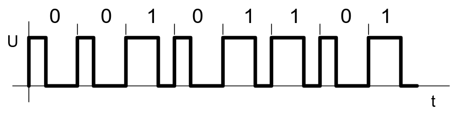
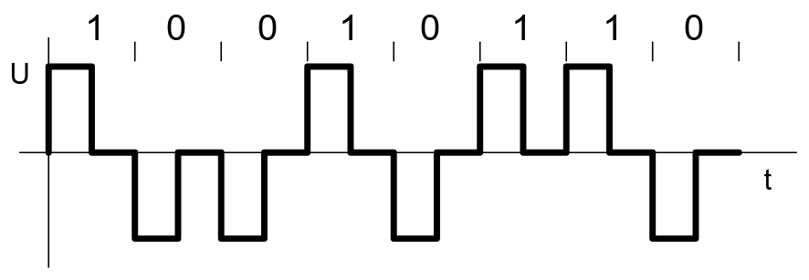
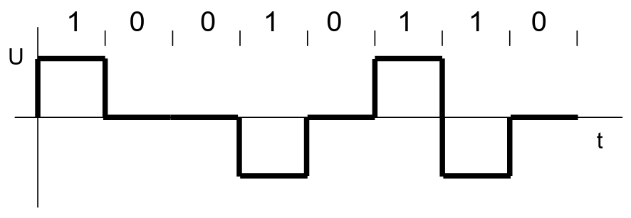
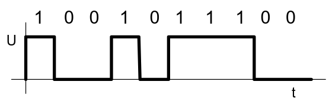
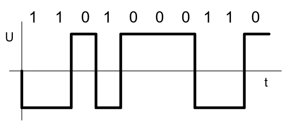
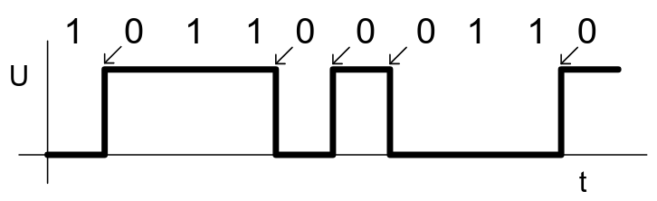
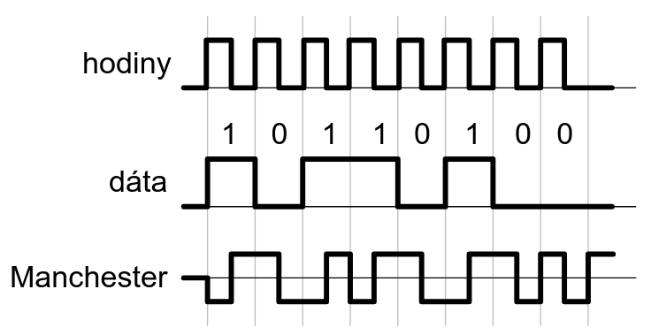
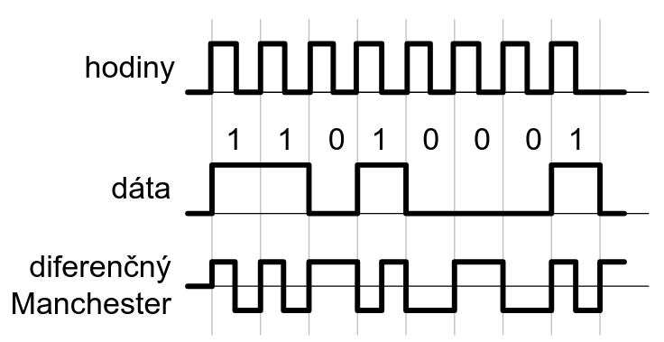
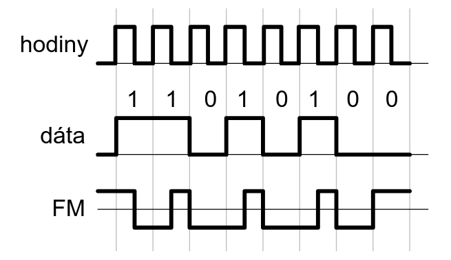
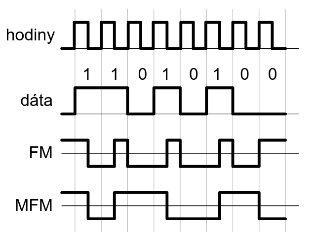

# PVS

Prepojene Vstavane Systemy

## Organizacia

celkovo 60 zo 100  
cvicenia (semestralka, aktivita - 25+5) 15 z 30  
test (moodle - teoria) - 50  
ustna skuska (nepovinna) - 20  
bonusove body na prednaske - 10

## Uvod

Zakladne casti PC

- CPU - riadiaca + aritmeticko - logicka jednotka
- Vstupno-vystupna jendotka
- Pamat

Pracovny cyklus PC

- Vyber instrukcie z pamate - fetchs
- Dekodovanie instrukcie - decode
- Vyber operandov - read
- Vykonanie operacie - execute
- Zapis vysledku - write

Su na sebe nezav_sle - prudove spracovanie - pipeline  
Priklad 1GHz CPU - normalne by mohol vykonavat len 200M instrukcii, vdaka pipeline moze actually 1G

2 najpouzivanejsie architektury

- Von-Neumann - spojena pamat pre program a udaje
- Harvard - pamat zvlast pre program, zvlast pre udaje
  - Vyuziva sa hlavne vo vstavanych systemoch
  - Vyhody
    - 2 rozne komunikacne cesty - zbernice (bus)
    - Moze byt uplne odlisny typ pamate - ROM (flash pamat, NVRAM) a RAM

Single Instruction Single Data (SISD)

- 1 CPU (jedno jadro), vo vstavanych systemoch

Multiple Instruction Multiple Data (MIMD)

- Viac CPU (viac jadier), zdielana pamat, pouziva sa v modernych systemoch

### Vstavany system

System s pocitacom - stroj, elektricky spotrebic, budova, oblecenie

Ulohy

- Hlavna cinnost - meranie, riadenie, zaznam dat
- Komunikacia - pouzivatel, iny system, cloud

Obsluha zariadeni

- Pravidelna kontrola - tlacidlo, obsah registra, ... - jednoduche, ale zbytocne zatazuje, vacsinu casu sa nic nedeje
- Prerusenia
  - Podprogram sa zavola sam automaticky ako odpoved na udalost (stlacenie tlacidla, timer) - nieco ako funkcia
  - Rychlejsie, efektivnejsie
  - By default vacsinou je zakazane "prerusenie prerusenia", ale dalo by sa zapnut ak vieme co robime
  - Podprogram by nemal byt moc velky, zlozity, nemal by mat loopy, ked sa zacykli tak koniec sveta
  - Priebeh prerusenia
    - Prijatie poziadavky na prerusenie
    - Dokoncenie rozrobenej instrukcie
    - Odlozenie okamziteho stavu procesora
    - Zistenie zdroja prerusenia
    - Vykonanie zodpovedajuceho obluszneho programu prerusenia
    - Obnovenie povodneho stavu procesora
    - Pokracovanie v prerusenom programe
  - Rozdelenie/typy
    - Vnutorne, softverove, **hardverove**
    - Niektore su maskovatelne (daju sa zakazat)
    - Synchronne/**asynchronne**
    - Rozna priorita

### Operacny system

Rozhranie medzi hardwarom a softwarom  
Spravuje zdroje pocitaca (CPU, pamat, IO, komunikacne rozhrania (BT, seriovy port, I2C SPI, ...), prevodniky, casovace, ...)

**Proces** - vykonavany (beziaci) program (aplikacia)  
**Vlakno** - podprocesy - samostatne/paralelne vykonavane cinnosti  
Proces = 1+ vlakien  
**Uloha** - task - spolocny nazov pre vlakno aj proces

## RTOS

## Vstavane Systemy

Vnorene, zabudovane, embedded systems  
Pocitac zabudovany do systemu (vyrobnku) s cielom zlepsit vlastnosti alebo pridat nove funkcie (smart TV, biela technika, auta, wearables, ...)

### Historia

### Jadro vstavanych systemov

Pocitac

- Jednoucelovy pocitac - na mieru - neefektivne, drahe, neflexibilne
- Jednodockovy pocitac - raspberry pi, banana pi, beagle board
- PLC - Programovatelne Logicke Kontrolery - kompaktne, robustne, odolne, modularne, spolahlive, drahsie
- Miktokontolery - arduino, esp32, raspberry pi nano - treba dorobit napajanie, periferie; zvycajne male, lacnejsie
- Digitalne signalne procesory - podpora spracovania obrazu, zvuku - hybridne systemy
- FPGA - programovatelne logicke polia - definicia hardwaru "na mieru" - hybridne systemy
- ASIC - application specific integrated circuit - vlastny navh cipu pre velke serie

Sucasny trend

- Modularne systemy - PLC, cRIO, ... - nahradne diely, dlhodoba zaruka
- Podobne pri mensich projektoch - Arduino

### Kapacita prenosoveho kanala

Vyuzitie = $\dfrac{T_M}{T_B}$, kde $T_M$ je trvanie najkratsieho impulzu a $T_B$ je trvanie bitu

### Kody

RZ - Return to Zero - s navratom k nule
NRZ - No Return to Zero

**Unipolarny RZ kod** - iba jeden pol - iba kladne  
Problem so synchronizaciou je rieseny automaticky (samosynchnonizujuci) - obsahuje hodiny - na zaciatku kazdeho bitu sa zmeni z `0` na `1`  
Platime za to nizsim vyuzitim kapacity $K = 33\%$

**Bipolarny RZ kod** - kladne aj zaporne  
Na zaciatku je tiez zmena - ak do kladneho tak je `1`, ak do zaporneho tak je `0`  
$K = 50\%$

**AMI kod** - Alternate Mark Inversion  
`0` je vzdy na nule (0V)  
`1` sa strieda - raz hore, raz dole  
$K = 100\%$  
Problem so synchronizaciou pri nulach - vyriesime tak ze tam dame `1` (na druhej strane ju musim potom odstranit) - napr. sa dohodneme ze "max. 5 nul"

**NRZ** - bez navratu k `0`

**Unipolarny NRZ**  
Napatie = `1`  
Bez napatia = `0`  
$K = 100\%$

**Bipolarny NRZ**  
Napatie = `1`  
-Napatie = `0`  
$K = 100\%$

Obidve ma problem so synchronizaciou aj pri `0`, aj pri `1`

**NRZ space**  
`0` = zmena na zaciatku bitu  
`1` = bez zmeny na zaciatku bitu  
Pouziva sa napr. v USB  
Sync. - dlhy sled `1`  
$K = 100\%$

**Kod Manchester**  
`1` = zmena 0 -> 1  
`0` = zmena 1 -> 0  
Manchester = hodiny XOR data  
Pouzite v RFID, NFC, IEEE 802.3 - 10BASE-T)  
$K = 50\%$  
Zmeny v strede bitu

**Diferencny Kod Manchester**  
`0` = bez zmeny  
`1` = zmena  
Odolne voci prepolovaniu  
Teraz zmeny na zaciatku bitu  
Pouzite v Token Ring LAN, ukladanie dat  
$K = 50\%$

**Fazova modulacia** - FM  
`0` = zmena na zaciatku bitu  
`1` = zmena v strede bitu  
$K = 50\%$

**Modifikovana Fazova Modulacia** - MFM  
Ak po `1` ide `0`, potlacime zmenu, inak rovnako ako FM  
Vyriesime problem s "malymi odsekmi", cim dosiahnemem kapacitu $K = 100\%$

## Generovanie Logickych Signalov

> Vystup z obvodov

**Push-pull**  
2 spinace (tranzistory)  
Bud je zopnuty jeden, a mame na jednom vystupe napajacie napatie; alebo je zopnuty druhy a mame na druhom vystupe 0V  
Vzdy je zopnuty iba jeden  
Spojenie vystupov sposobi skrat

**Pull-up**, alebo open collector, open drain  
_Wired AND_  
Viac systemov  
Kazdy moze nastavit iba na log. 0  
Log. 1 je iba vtedy ked nikto nenastavi 0  
Zbernica

**Pull-down**  
Opacny princip  
Ked nikto nic = log. 0  
Ked aspon 1 nieco robi = log. 1  
_Wired OR_

### Signalizacia

Sposob prenosu signalu medzi 2 ucastnikmi

**Single ended**  
Jeden vodic - referencny  
Druhy vodic - signalovy  
Vyhody - malo vodicov ($N+1$ pre $N$ vodicov)  
Nevyhody - crosstalk, citlivost na rusenie, moznost nerovnakeho potencialu zeme

**Diferencialna signalizacia**  
Kazdy signal = 2 vodice (krutena dvojlinka)

**Galvanicka izolacia**  
Izolacny transformator  
2 cievky  
Vyhody - jednoduche, pomerne male, aj pre vyssie napatie  
Nevyhody - len pre striedave napatie (premenlive signaly)

**Optoclen**  
Pomocou svetla (LEDka)  
Vyhody - aj pre jednosmerne signaly, velmi male rozmery, vysoka ucinnost  
Nevyhody - potreba zdroja napatia

### Rozdelenie komunikacie

Podla tvaru dat

- Paralelna
- Seriova

Podla

- Bod-bod
- Hviezda
- Zbernica
- Strom
- Mesh

Podla

- Synchronne (s hodinovym signalom)
- Asynchronne (bez)

## RS-232

TIA/EIA 232

Komunikacia medzi

- DTE (Data Terminal Equipment) - terminal, dalekopis
- DCE (Data Circuit-terminating Equipment) - modem

Pouzitie

- Systemova konzola
- Pripojenie modulov - GPS, FR, Bluetooth, ...
- Komunikacia medzi systemami
- Komunikacia s PC
- Debugovanie

Vlastnosti

- Point-to-point
- Single-ended - spolocny vodic (zem) + dalsie signaly - kratsia vzdialenost
- Zakladny NRZ kod
- Vzdialenost do 15 m (nizkokapacitny kabel do 300 m)
- Simplex alebo duplex
- Rychlosti \[b/s] - najpouzivanejsie 4800, 9600, 115200, ale aj ine
- Log. 0 = `+3V` az `+15V`
- Log. 1 = `-3V` az `-15V`
