# SI

Softverove Inzinierstvo

## Uvod

Inzinierstvo = pouzitie vedeckych principov pri navrhu a tvorbe strojov, stavieb, struktur, ...

Softverove Inzinierstvo

- Disciplina, ktora sa zaobera tvorbou rozsiahlych softverovych systemov
- Aplikacia inzinierskych metod na softver, zaobera sa vsetkymi aspektami tvorby softveru
- Aplikacia systematickeho, disciplinovaneho meratelneho pristupu na vyvoj a udrzby softveru

Ciel SI

- Inziniersky pristup k tvorbe systemov
- Rozne aspekty tvorby systemov
- UML
- Praca v time
- Objektovy pristup

Programovanie je len jedna z mnohych cinnosti pri vyvoji softveru

Kick-off meeting

- Predstavenie timu a klienta
- Plan stretnuti
- Ulohy jednotlivych clenov timu
- Urcenie spolocnych cielov
- Vizia projektu
- Komunikacny plan
- Vyber nastrojov
- Eskalacny plan

**Zakladne prvky vyvoja softveru**

- Cinnosti
  - Procesy, ktore napomahaju zaistit, ze vysledny produkt je spravny, kompletny a zrozumitelny
  - Konkretny navod na vykonanie cinnosti
- Metodika (pracovny postup)
  - Sekvencia cinnosti, ktore napomahaju pri vyvoji finalneho produktu
  - Vysledky = produkty cinnosti
  - Riadenie kvality
- Nastroje (podpora)

Domena = problemova oblast

## Biznis analyza

### Studia realizovatelnosti

Zistuje, ci informacny system ma pre organizaciu zmysel z ekonomickeho a pouzivatelskeho pohladu  
Odhad, ci poziadavky zakaznika mozu byt splnene pomocou existujuceho HW a SW v medziach rozpoctu  
Studia ma byt rychla a lacna

Vysledok - feasibility report

- Obsahuje odporucanie, ci pristupit k analyze a pokracovat vo vyvoji
- Navrhuje zmeny rozsahu, rozpoctu a casoveho planu systemu
- Navrhuje dalsie vysoko urovnove poziadavky na system

### Analyza domeny a identifikacia poziadaviek

Zistovanie poziadaviek na novy system pozorovanim existujucich systemov  
Diskusia s potencialnymi pouzivatelmi a zadavatelom

Problemy

- Nerealisticke poziadavky
- Nutnost pochopenia poziadavky
- Hladanie spolocnych, nekonfliktnych casti
- Individualne zaujmy manazerov
- Zmeny poziadaviek

### Specifikacia poziadaviek

Vysledok - dokument specifikacie poziadaviek (DŠP)

Dve formy vystupu

- Zakaznik - vysokourovnovy popis poziadaviek - **pouzivatelske poziadavky**
- Vyvojar - podrobna specifikacia systemu - **systemove poziadavky**

### Validacia poziadaviek

Kontrola poziadaviek - realistickost, konzistentnost, uplnost  
Korekcia moznych chyb v _DSP_  
Doplnenie novych poziadaviek do _DSP_, ktore vznikli pri predchadzajucich fazach

### Analyza poziadaviek

- **Porozumenie aplikacnej domene**
- Zber poziadaviek
- Klasifikacia poziadaviek
- Riesenie konfliktov
- Urcenie priorit
- Kontrola poziadaviek

Metody

- Tradicne metody
  - Interview
  - Dotazniky
  - Pozorovanie pracovnikov
  - Analyza dokumentov
- Moderne metody
  - Joint Application Design (JAD)
  - Prototypovanie

#### Interview

Zber faktov, nazorov a spekulacii  
Sledovat rec tela a emocie

Odporucania

- Planovanie
- Budte neutralni
- Pocuvajte
- Piste si poznamky
- Hladajte ine pohlady
- Po stretnuti spravte zapis zo stretnutia
- Nepokladajte otazky sposobom, ktory navodzuje spravnu alebo nespravnu odpoved
- Pozorne pozuvajte
- Nedefinujte poziadavky na novy system

Otazky - otvorene a uzatvorene  
Zapis zo stretnuia - datum, zoznam ucastnikov, ciele stretnutia, diskusia, ulohy, termin dalsieho stretnutia

#### Dotazniky

Vyber respondentov

- Vyhovujuci respondenti
- Nahodny vyber
- Na zaklade kriterii
- Rozvrstveny

Navrh

- Zvycajne uzatvorene otazky
- Aj vzdialene vykonanie

#### Pozorovanie pracovnikov

Vhodne doplnenie pre interview

Tazko ziskat objektivne data

- Ludia pracuju inak, ked su pozorovani
- Limitovany cas
- Limitovany pocet osob

### Analyza prodedur a dokumentov

Problemy existujuceho systemu  
Moznosti naplnenia novych potrieb  
Organizacna struktura  
Mena podstatnych ludi  
Specialne pripady spracovania informacii  
Dovody pre aktualny navrh systemu  
Data a pravidla ich spracovavania

Typy dokumentov

- Zapisane postupy prac - vratane dat a informacii pouzivanych a vytvaranych v danom procese
- Biznis formulare - explicitne definuju vstupne a vystupne data
- Reporty - spatna analyza k datam na zaklade, ktorych boli vytvorene
- Popis aktualneho informacneho systemu

### Joint Application Design (JAD)

Spaja klucovych pouzivatelov, manazerov a systemovych analytikov
Ciel - sucasne zozbierat poziadavky od vsetkych klucovych ucastnikov

Ucastnici

- Veduci stretnutia
- Pouzivatelia
- Manazeri
- Sponzori
- System analytici
- Tajomnik
- IS pracovnici

### Prototypovanie

Rychly prevod poziadaviek na pracujuci system  
Ked pouzivatel uvidi system, poziada o modifikacie, alebo o nove poziadavky

Najvhodnejsie ked

- Poziadavky nie su jasne
- System nie je urceny pre vela pouzivatelov
- Navrh je rozsiahly a vyzaduje konkretnu formu
- Historicky komunikacny problem medzi analytikmi a pouzivatelmi
- Existuju nastroje

### Charakteristiky sposobov

Dotieravost - pytajte sa na vsetko  
Nestrannost - najdenie najlepsieho riesenia pre organizaciu  
Uvolnenie obmedzeni  
Pozornost detailom  
Nove pohlady

### Ciel - pochopenie organizacie

- Obchodne ciele
- Informacne potreby
- Spracovavane data
- Postupnosti a zavislosti spracovavania dat
- Pravidla spracovavania dat
- Politiky a odporucania
- Klucove udalosti

## Biznis modelovanie

Vystupy metod

- Informacie zozbierane od pouzivatelov
- Existujuce subory a dokumenty
- Pocitacovo zalozene informacie

Spracovanie

- Pre dalsich clenov timu
- Pre zakaznika
- Definicia spolocnych pojmov
- Strukturovanie a filtrovanie
- Zrozumitelnost
- Nove otazky
- Identifikacia nekonzistentnosti
- Identifikacia problemov
- Zaklad na dalsiu pracu

Biznis modelovanie vyjadruje, ako popisat viziu organizacie, pre ktoru je system vyvijany a ako nasledne tuto viziu pouzit pri popise procesov, roli a zodpovednosti  
Pomaha zlepsit pochopenie a komunikaciu medzi zakaznikom a softverovym inzinierom

Stukturalne a procesne stranky  
Problemy  
Mozne vylepsenia  
Spolocne pojmy

Biznis analyza -> biznis model

Pochopenie reality, aktualneho stavu  
Ziskanie dostupnych informacii, ich analyza a pochopenie

Spracovanie - **model biznis procesov**, domenovy model

Diagram biznis pripadov pouzitia - Business Use Case Diagram (BUCD)
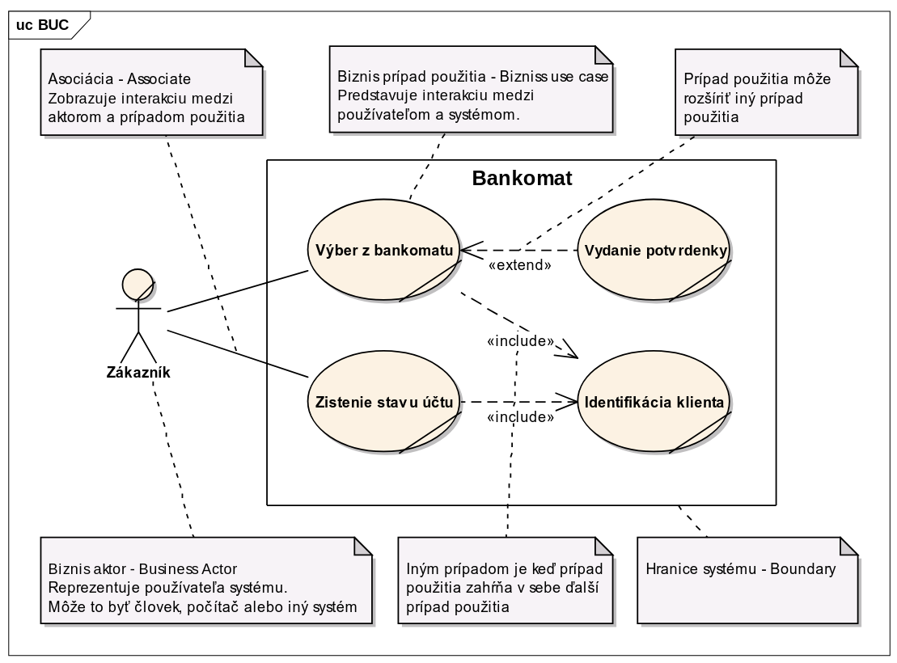

### Analyza biznis procesov

Vyber biznis pripadov pouzitia, ktore je potrebne rozpracovat

- Analyza textovych poznamok
- Spracovanie - diagramy aktivit

Pocas modelovania biznis procesov identifikacia dolezitych objektov - zaradenie do domenoveho modelu

Diagram aktivit
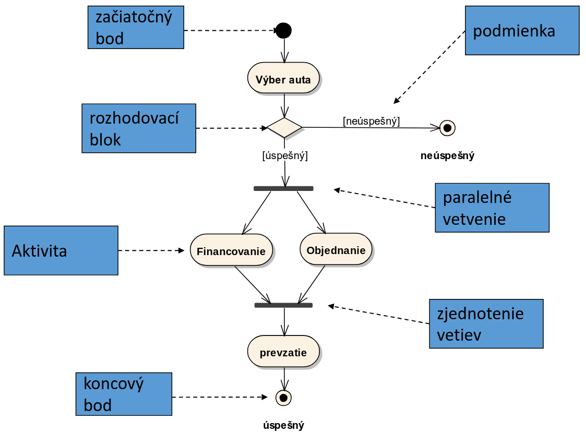
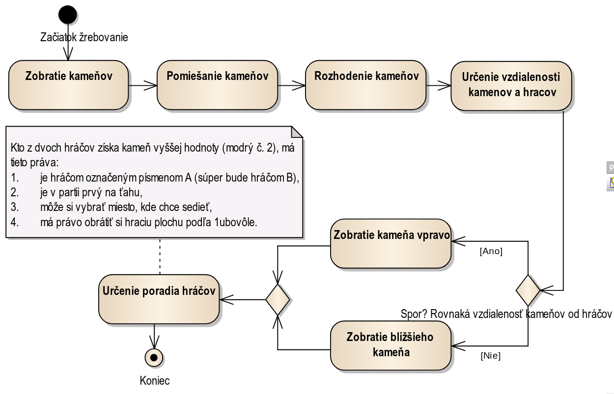
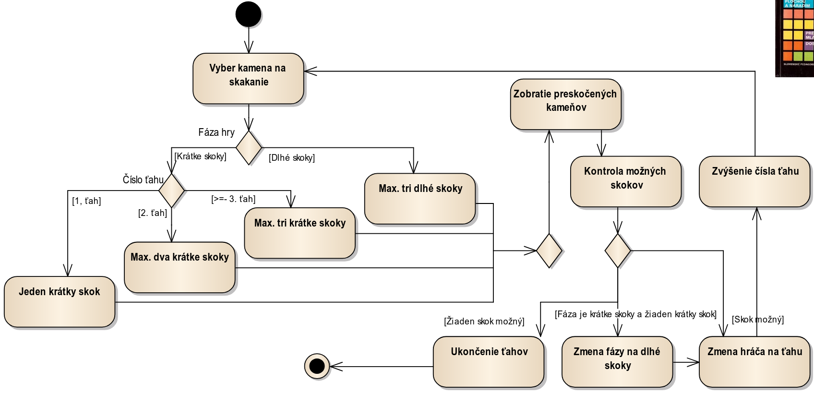

### Domenovy model

Analyza identifikovanych objektov

- Pridanie novych
- Zrusenie, spojenie existujucich
- Co je vlastnost a co je objekt?
- Urcenie workerov a entit

Urcenie vzajomnych vztahov

- Slovny popis
- Smer vztahu
- Pocetnost roli vo vztahu

Domenovy model

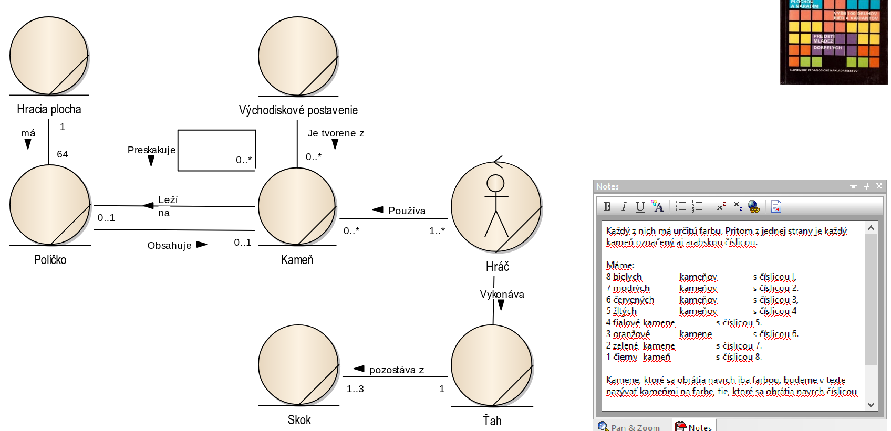

## Specifikacia poziadaviek

Ciel - urcit **co** ma navrhovany softverovy system robit (nie ako) - urcit funkcie systemu  
Iba terminologia z domeny klienta  
Vytvorit zadanie projektu

Rozdelenie poziadaviek

- Funkcne - definuju konkretne sluzby a reakcie systemu - co ma vykonavat
- Mimofunkcne
  - Obmedzenia kladene na system - spolahlivost, odozva, pouzity programovaci jazyk, ...
  - Casto kritickejsie ako funkcne poziadavky
  - Niekedy su dane vonkajsimi faktormi (legislativne poziadavky)
- Domenove
  - Vyplyvaju priamo z oblasti, v ktorej system pracuje (napr. konkretny matematicky vzorec na vypocet niecoho)
  - Mozu byt aj funkcne aj mimofunkcne

Rozdelenie podla urovne popisu

- Vysoko urovnove - biznis - preco potrebujem projekt, pohlad zadavatela, biznis pohlad
- Stredne - pouzivatelske - co potrebuje pouzivatel aby system robil, pohlad pouzivatela
- Detailne - systemove - co potrebuje robit sytem, systemovy pohlad

Napr.

- Biznis poziadavka
  - Sprehladnit pracu s externymi dokumentami
- Pouzivatelska specifikacia poziadaviek (popis funkcnych a mimofunkcnych poziadaviek pouzivatelov)
  - System musi poskytnut sposob prezentacie externych dokumentov a moznost ich prehliadania
  - System umozni vyhladavat dokumenty podla klucovych slov
- Systemova specifikacia poziadaviek (podrobnejsia specifikacia, musi byt presna)
  - Pouzivatelovi bude poskytnuta moznost definovat typy dokumentov
  - Kazdy typ externeho dokumentu bude na obrazovke reprezentovany urcitou ikonou
  - Pouzivatelovi bude poskytnuta moznost definovvat pre typ externeho dokumentu vlastnu ikonu
  - Pouzivatelovi bude poskytnuta moznost zdruzit typ externeho dokumentu s prehliadacom

Vysledok - Dokument Specifikacie Poziadaviek (DSP)  
Dve formy - zakaznik a vyvojar - vysokourovnovo a podrobne

Vlastnosti

- Externe spravanie sa systemu
- Jednoducho strukturovany
- Obmedzenia implementacie
- Charakterizovat prijatelne odpovede na neziaduce udalosti
- Zaznamenat predstavu o zivotnom cykle systemu

### Sposob specifikacie poziadaviek

- Prirodzeny jazyk
- Formulare
- Pripady pouzitia
- Pseudokody
- Diagramy UML
- Specifikacia rozhrani

#### Prirodzeny jazyk

Zrozumitelny pre vyvojara aj pouzivatela, pouzivany aj napriek nevyhodam

Nevyhody

- Nejednoznacnost popisu
- Zlozite koncepcie (algoritmy) su tazko popisatelne
- Velmi flexibilny - jedna vec popisana viacerymi sposobmi
- Neexistencia jednoduchej modularizacie (update zmien)
- Automatizacia procesov

Nutnost sa vyhybat

- Dlhym suvetiam s vedlajsimi vetami
- Terminom s niekolkymi prijatelnymi vyznamami
- Vyjadrenie niekolkych poziadaviek jednou poziadavkou
- Nekonzistencii terminov - pouzivanie synonym

#### Formulare

Popis specifikovanej funkcie alebo entity  
Popis vstupov a vystupov

Ake dalsie entity specifikvoana funkcia alebo entita pouziva  
Pripadne vstupne a vystupne podmienky  
Ak vznikaju postranne efekty, tak aj ich popis

Zlozenie?

- Kto
- Co
- Preco
- Poznamky
- Priorita
- Nejasnosti

Napr. github projects, jira, trello a podobne?

#### Pseudokody

Jazyk s abstraktnymi konstrukciami  
Lepsie vyjadrenei vnorenych podmienok a cyklov

#### Specifikacia rozhrani

Ak ma system komunikovat s inymi systemami musi byt specifikovane komunikacne a softverove rozhranie

Dva typy rozhrani, ktore je nutne definovat

- Proceduralne rozhranie
- Popis predavanych dat

Priklad specifikacie proceduralneho rozhrania

- Klasicke jazyky - prototyp procedury alebo funkcie, popis in/out parametrov, popis cinnosti a pod
- Objektove jazyky - vseobecny popis triedy, popis konstruktorov, popis metod a pod

Rozne formy ako aj uroven formalizacie

## Pripady pouzitia

Pripady pouzitia???

- Vykonnostne poziadavky
- Pouzivatelske rozhranie
- Firemne pravidla
- Datove formaty
- Vstypno/vystupne formaty
- Roly pouzivatelov

### Model pripadov pouzitia (Use Case Model)

Pouzivalju sa na popis kontextu systemu a popis funkcnych poziadaviek

Zakladne prvky - aktori a pripady pouzitia

- **Aktor** (actor) - prvok okolia modelovaneho systemu - clovek, hardver, iny softver
- **Pripad pouzitia** (use case)
  - Zakladna funkcia systemu z vonkajsieho pohladu - z pohladu klienta
  - Zoznam cinnosti zvycajne definujucich interakciu medzi aktorom a systemom za ucelom dosiahnutia ciela

Hladanie Aktorov a pripadov pouzitia

- Identifikacia aktorov
- Identifikacia pripadov pouzitia
- Vytvorenie popisu pre kazdy pripad pouzitia
- Popis toku udalosti pre kazdy pripad pouzitia
- _Strukturovanie pripadov pouzitia (len v niektorych pripadoch)_
- _Identifikacia analytickych tried (len v niektorych pripadoch)_

Specifikacia poziadaviek

- Identifikacia hlavnych podsystemov
- Vytvorenie balickov reprezentujucich jednotlive podsystemy
- Diagramy balickov a ich popis

Pre jednotlive podsystemy

- Identifikacia aktorov
- Analyza pozadovanych funkcionalit
- Vytvorenie pripadov pouzitia
- Popis pripadov pouzitia

#### Aktor

Zacina sa s konkretnymi ludmi - identifikacia ulohy, ktoru hraju pri interakcii so systemov - mena aktorov  
Kto alebo co bude system pouzivat

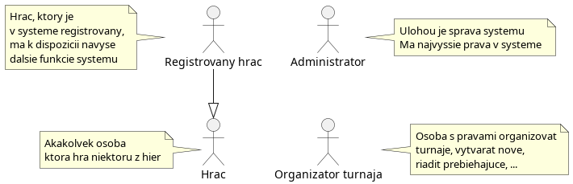

Nieco mimo vlastny system

- Pouziva system
- Zadava vstupy do systemu
- Prebera vystupy zo systemu
- Neriadi system

Kandidatom moze byt ten alebo to

- Priamo pouziva system - pouzivatel
- Udrzuje system - administrator
- Externy hardver - snimac cipovych kariet
- Ine (softverove) spolupracujuce systemy

#### Pripad pouzitia

Popisuje urcity sposob pouzitia systemu z pohladu aktora

- Vyjadruje spravanie systemu
- Popisuje postupnost sprav medzi aktorom a systemom
- Poskytuje aktorovi urcity vysledok (hodnotu)

Je prostriedok na

- Vyjadrenie poziadaviek na system
- Ulahcenie komunikacie s klientom
- Komunikaciu medzi vyvojarmi
- Testovanie systemu
- Urcovanie ceny
- Strukturovanie systemu

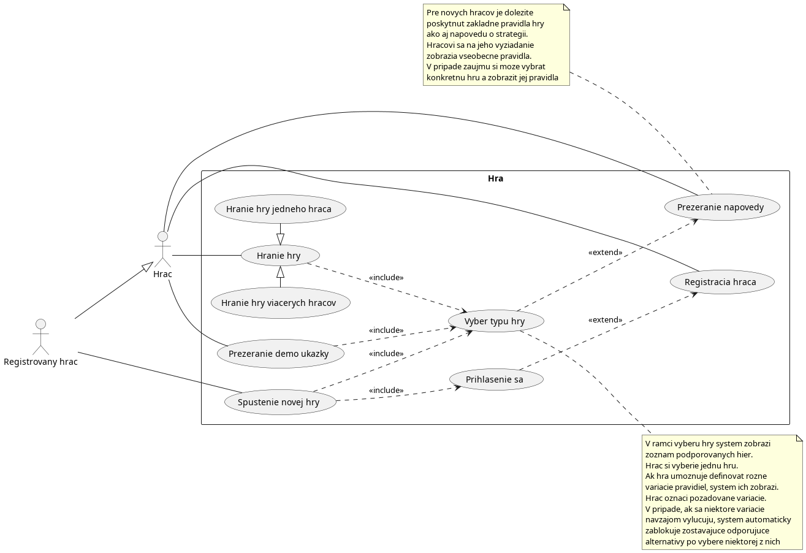

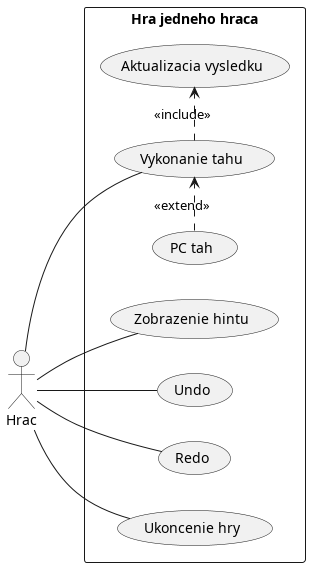

#### Vztahy

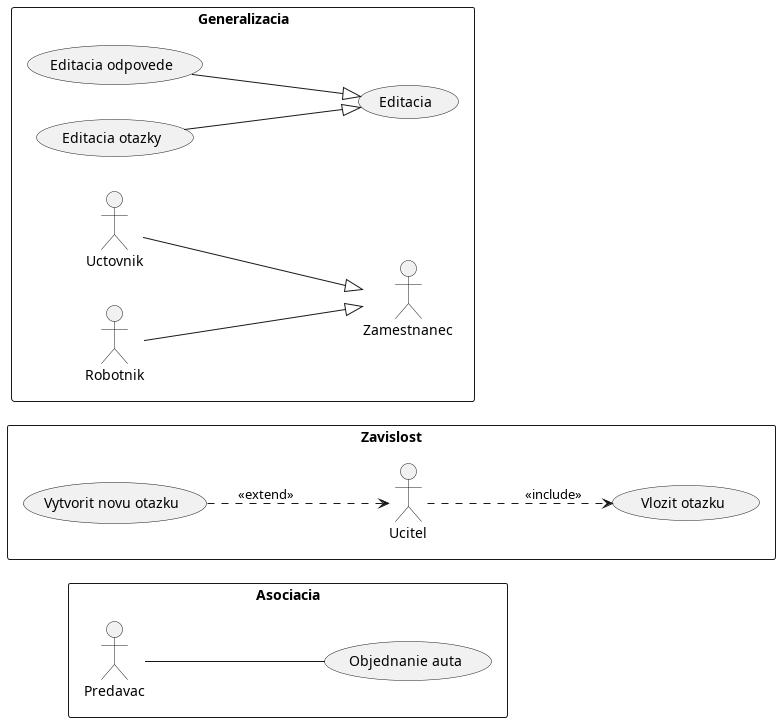

### Use Case vs. Poziadavky

Rozdielny sposob zobrazenia modelu noveho systewmu  
Pripady poziadaviek nezachytavaju mimofunkcne poziadavky  
Use case popisuje **ako** pouzivatel a system spolupracuju na dosiahnuti poziadavky  
Use case ide viac do detailov

### Popis pripadov pouzitia - Scenare

Postupnost cinnosti v kounikacii aktora so sytemom

Forma scenara

- Strukturovany text
- Diagram UML
  - Sekvencny diagramy
  - Diagram spoluprace
  - Diagram aktivit
  - Stavovy diagram

#### Textovy scenar

Nalezitosti (schema)

- ID a nazov scenara
- Strucny popis scenara
- Aktor, ktory inicializuje use case
- _A priori_ podmienky pre use case
- Kroky v scenari - cinnosti aktora a systemu
- _A posteriori_ podmienky use case
- Aktor, ktory dostane vysledok use case

Popis pre kazdy use case

- Kratka notacia nazvu pripadu pouzitia
- Strucny popis pripadu pouzitia (1-3 vety)
- Zobrazte aj akterov spojenych s pripadom pouzitia
- V tejto etape sa mozu objavit nove pripady pouzitia a stare mozu zaniknut
- Popis toku udalosti pre kazdy pripad pouzitia
- Tvorba doplnkovej specifikacie - nove poziadavky na system

**A priori podmienky**

- Vstupne podmienky, ktore musia byt splnene pred zaciatkom vykonavania use case
- Stav systemu pred zahajenim use case

**A posteriori podmienky**

- Vystupne podminky, ktore musia byt splnene po skonceni vykonavania use case
- Stav, ktory system dosiahne po skonceni use case
- Jednoduche vyrazy, ktore je mozne vyhodnotit
- Vysledok vyhodnotenia ma tvar pravda/nepravda

##### Priklad

Dobry priklad scenara

```txt
1. Use case zacina, ked zakaznik zvoli "vyplnit objednavku"
2. System zobrazi formular objednavky
3. Zakaznik vyplni meno a priezvisko
```

Zly priklad scenara (kto zadava? ake udaje? kam su zadavane?)

```txt
1. Su zadavane udaje o zakaznikovi
```

##### Vetvenie

Vetvenie krokov scenara - podla nejakych podmienok

```txt
1. Use case zacina, ked zakaznik oznaci tovar v nakupnom kosiku
2. Ak zakaznik zada "zmazat tovar"
  2.1 System odstrani tovar z kosika
3. Ak zakaznik urci nove mnozstvo tovaru
  3.1 System zmeni mnozstvo tovaru v kosiku
```

##### Hlavne a alternativne kroky

Niektore kroky nemozno presne umiestnit - mozu sa robit v roznych okamihoch  
Riesenie - jeden hlavny tok udalosti a k nemu alternativne kroky  
Alternativ moze byt viac  
Alternativy su za hlavnym tokom  
Spolocne _a priori_ podmienky  
Vlastne _a posteriory_ podmienky

**Priklad**

Hlavne kroky

```txt
1. Use case zacina, ked zakaznik zvoli "zobrazit obsah kosika"
2. Ak je kosi prazdny
  2.1 System oznami zakaznikovi, ze kosik neobsahuje ziadny tovar
  2.2 Use case konci
3. System zobrazi zoznam vsetkych tovarov v nakupnom kosiku - ID tovaru, nazov, mnozstvo a cenu
```

Alternativne kroky 1

```txt
1. Zakaznik moze kedykolvek opustit stranku nakupneho kosika
```

Alternativne kroky 2

```txt
1. Zakaznik moze kedykolvek opustit system
```

##### Opakovanie

```txt
1. Use case zacina ked zakaznik zvoli "najst produkt"
2. Ssytem poziada zakaznika, aby vybral kriteria vyhladavania
3. Zakaznik urobi volbu kriterii
4. System hlada vyrobky vyhovujuce kriteriam
5. Ak system najde vyhovujuce vyrobky
  5.1 Pre kazdy najdeny vyrobok system zobrazi
    5.1.1 Obrazok vyrobku
    5.1.2 Podrobnosti o vyrobku
    5.1.3 Cenu vyrobku
6. Kym zakaznik prezera zobrazene informacie
  6.1 System preharava hudbu
  6.2 System zobrazuje reklamu v pruhu reklamy
```

##### Priklad - Symetria

Hlavny scenar

```txt
Scenar popisuje proces vyberu hry
Aktor: Hrac

1. Scenar zacina, ked hrac poziada o vyber hry
2. System nasledne zobrazi zoznam podporovanych hier utriedeny podla nazvu hry
3. System pre kazdu hru na somostatny riadok zobrazi
  3.1 Ikonu hry
  3.1 Nazov hry
  3.1 Minimalny/maximalny pocet hracov
4. System zvyrazni prvu hru ako zvolenu
5. Kym hrac nepotvrdi zvolenu hru stlacenim tlacidla "Hraj"
  5.1 Hrac oznaci zvolenu hru
  5.2 System ju zvyrazni ako zvolenu hru
  5.3 Ak pre hru existuju rozne variacie hrania
    5.3.1 System rozbali rozsirene nastavenia zvolenej hry (v zavislosti od hry sa mozu lisit)
    5.3.1 System nastavi standardne hodnoty pre jednotlive nastavenia
    5.3.1 Hrac si zvoli pozadovane nastavenia hry
6. System ukonci vyber hry a spusti zvolenu hru v zavislosti od jej nastavenych parametrov
```

Alterhativny scenar

```txt
1. V ramci kroku 5 (vyber hry), hrac moze v lubovolnej chvili ukoncit vyber hry stlacenim tlacidla "Zrus"
2. System sa spyta, ci naozaj chce hrac ukoncit vyber hry
3. Ak hrac zvoli "Ano"
  3.1 System ukonci vyber hry a zobrazi hlavnu obrazovku hry
4. Ak hrac zvoli "Nie"
  4.1 Pokracuje hlavny scenar bodom 5
```

_A priori_ podmienky

- Identifikacia hraca - hrac je prihlaseny alebo zadal svoj "Nick"

_A posteriori_ podminky

- Vyber hry - zvolena hra
  - Hra bola zvolena hraco a bola spustena
- Nevybratie ziadnej hry - zachovanie nastaveni
  - Po zruseni "zrusenia vyberu hry" vsetkym hracom zvolene nastaveni ahry zostanu bezo zmeny
- Nevybratie ziadnej hry - zrusenie vyberu
  - System sa prepne do hlavnej obrazovky

##### Odporucania

Piste zrozumitelne

Od mensich podrobnosti k vacsim

- Nazov aktora a jeho ciel
- Hlavny scenar
- Alternativne scenare
- Kroky alternativnych scenarov

### Ciel use case

Urcit **co** ma navrhovany softverovy system robit (nie ako)  
Urcit funkcie systemu  
Iba terminologia z domeny klienta  
Vytvorit zadanie projektu

## Poziadavky

### Validacia poziadaviek

Vstup - Dokument Specifikacie Poziadaviek (DSP)  
Platnost zmenenych poziadaviek  
Konzistencia  
Uplnost poziadaviek  
Kontrola realizovatelnosti  
Overitelnost  
Sledovatelnost povodu poziadavky

#### Konflikt

Detekcia a riesenie konfliktov

Priklad

- Dvaja pouzivatelia vyzaduju nezlucitelne vlastnosti
- Rozpor medzi pozadovanymi schopnostami a danymi obmedzeniami

Konflikt by nemali riesit vyvojari  
Rozhodnutie o konflikte by malo byt sledovatelne az ku konkretnej osobe (zasupca zadavatela)

#### Metody validacie

Preskumanie (reviews)

- Manualna timova kontrola poziadaviek (od zakaznika po kontraktora)
- Forma preskumania
  - Formalne preskumanie DSP - vyvojovy tim vysvetluje zakaznikovi dosledky kazdej poziadavky
  - Neformalne - diskusia o poziadavkach so zastupcami zakaznika

Generovanie testovacich pripadov

- Tvorba testov poziadaviek - caste odhalovanie problemov
- Ak je tazke vytvori test - tazka implementacia poziadavky

Prototypovanie

- Predstavenie spustitelneho modelu zakaznikovi - zistenie, ci zodpoveda jeho poziadavkam
- Pomocou prototypu zakaznik najlepsie pochpi spravanie sa uzivatelskeho rozhrania

Automaticka analyza konzistencie

- Ak su poziadavky vo forme modelu (formalna alebo strukturovana notacia) - mozna automaticka kontrola konzistencie

### Sprava poziadaviek

Proces riadenia zmien systemovych pozidaviek

Poziadavky z hladiska vyvoja

- Trvale
- Nestale

Planovanie spravy poziadaviek stanovuje

- Sposob identifikacie poziadaviek
- Proces zmeny poziadaviek
- Sledovatelnost
- Nastroje na uchovavanie informacii o poziadavkach

Sledovatelnost poziadaviek (traceability)

- Definuje schopnost sledovat poziadavky
- Nastroj - matica zavislosti poziadaviek
  - Zavislost medzi poziadavkou v riadku od poziadavky v stlpci
  - **U** - uses - poziadavka v riadku pouziva moznosti dane pozidavkou v stlpci
  - **R** - relates - slabsi vztah, napr. obe poziadavky su sucastou rovnakeho podsystemu

| ID  | 1   | 2   | 3   | 4   | 5   |
| --- | --- | --- | --- | --- | --- |
| 1   | .   | U   | R   | .   | .   |
| 2   | .   | .   | U   | .   | .   |
| 3   | R   | .   | .   | .   | .   |

### Proces zmeny poziadaviek

Analyza problemu a specifikacia zmeny

- Identifikacia problemu alebo navrh na zmenu poziadavky
- Zistovanie platnosti problemu alebo zmeny
- Vysledok - podrobnejsi navrh zmeny

Analyza zmeny a urcenie jej ceny

- Urcenie, aku zmenu DPS alebo dizajnu je potrebne realizovat
- Odhad ceny zmeny alebo novehu terminu dokoncenia
- Roozhodnutie o pokracovani v procese zmeny

Implementacia zmeny

## Analyza a navrh architektury

Co dalej s projektom, ked uz viem co zakaznik naozaj chce

### Analyza

Proces rozdelenia komplexneho problemu na mensie casti, za ucelom ich lepsieho pochopenia

**Ciel** - vytvorit analyticky model - konceptualny model

Zachytenie podstatnych poziadaviek a charakteristickych rysov systemua

Rozdelenie na vrstvy

1. Prezentacna vrstva
2. Logicka vrstva
3. Datova vrstva

Vystup

- Diagram tried
- Komunikacny diagram
- Diagram nasadenia
- Diagram komponentov
- Sekvencny diagram
- Stavovy diagram
- Diagram balickov
- Diagram zlozenych struktur

### Navrh

Presna specifikaica sposobov ako to implementovat

Zlucenie technickych rieseni

- Perzistencia objektov
- Ich distribucia
- Architektura
- GUI

Zalozeny na analytickom modeli

### Cinnosti analyzy a navrhu

Cinnosti analyzy

- Architentonicka analyza
- Analyza tried
- Analyza balickov
- Analyza pripadov pouzitia

Cinnosti navrhu

- Navrh possytemov
- Navrh tried
- Navrh rozhrani
- Navrh navrhovych realizacii pripaov pouzitia
- Navrh nasadenia

### Vyznam analytickeho modelu

Nove osoby v projekte  
Porozumenie systemu po dlhej dobe  
Pochopenie systemu - uspokojovanie poziadaviek  
Sledovatelnost poziadaviek  
Planovanie udrzby a rozsirovania  
Pochopenie logickej architektury

### Pravidla tvorby diagramov

Tvoreny v domenovom jazyku  
"Rozpravajte pribeh"  
Perspektiva  
Rozlisuje problematiku domeny a riesenia  
Minimalizacia vztahov  
Len "prirodzena dedicnost"  
Tvorit model pre maximalny pocet pouzivatelov  
Co najjednoduchsi

### Architektonicka analyza

Priklad - herny engine

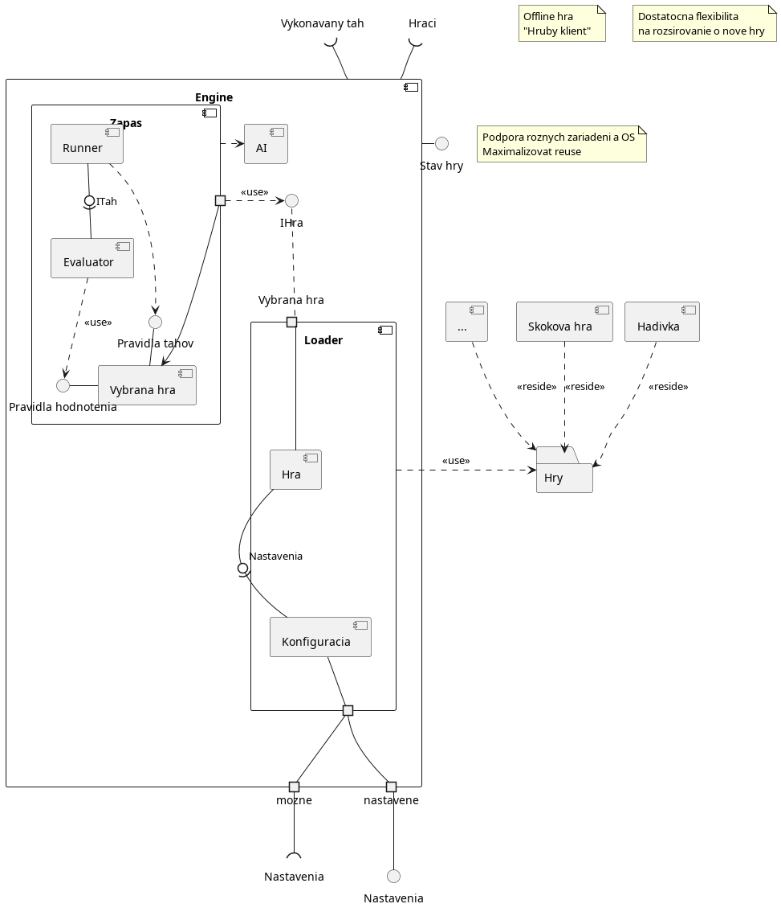

Vysokourovnovy dizajn softveru

- Ramec pre podrobnejsi navrh rozsiahleho systemu
- Popisuje organizaciu systemu do podsystemov a alokaciu podsystemov na hardware a software komponenty

Kroky

1. Rozdelenie systemu do podsystemov
2. Rozdelenie do vrstiev a oddielov
3. Navrh topologie systemu
4. Identifikacia paralelizmu
5. Alokacia na uzly a volba komunikacie
6. Volba sposobu riadenia a pod

#### Rozdelenie systemu do podsystemov

Podsystem obsahuje aspekty systemu s podobnymi vlastnostami (max 20)  
Napr. PC obsahuje podsystemy - sprava pamate, system suborov, planovanie procesov, ...

Podsystem identifikujeme podla sluzieb, ktore poskytuje  
Sluzba = mnozina funkcii, ktore maju rovnaky zakladny ucel

Hranice podsystemu sa zvolia tak, aby vacsina komunikacie prebiehala vo vnutri podsystemu

Vztah medzi dvoma podsystemami

- Klient - server
- Peer-to-peer

Dekompozicia systemu do podsystemu - zakladne rozdelenie do

- Horizontalnych vrstiev
- Vertikalnych vrstiev

#### Rozdelenie do vrstiev

Vrstvene systemy - usporiadana mnozina virtualnych svetov  
Kazdy svet je postaveny z prvkov nizsieho sveta a poskytuje stavebne prvky vyssiemu svetu  
Medzi vrstvami je vztah klient - server  
Znalost je jednosmerna

Vrstvene architektury

- Uzavrete
  - Vrstva je implementovana iba pomocou prostriedkov najblizsej nizsej vrstvy
  - Obmedzuje zavislost medzi vrstvami - modularita
  - Lahsie zmeny v rozhrani
  - Priklad - sietovy model ISO/OSI
- Otvorene
  - Moze pouzivat prostriedky ktorejkolvek nizsej vrstvy
  - Tazka udrzba - zmena podsystemu moze ovplyvnit lubovolnu vyssiu vrstvu
  - Tvorba efektivneho a kompaktnejsieho kodu

Specifikacia systemu obvykle definuje iba vrchnu vrstvu  
Spodna vrstva je nada dostupnymi zdrojmi (HW, OS, kniznice)

Pre male systemy cca 3 vrstvy  
Pre velke systemy cca 5-7 vrstiev  
Pre najzlozitejsie systemy max. 10 vrstiev

Podla odporucani

- O-10 tried - vrstvy nie su potrebne
- 10-50 tried - 2 vrstvy
- 25-150 tried - 3 vrstvy
- 100-1000 tried - 4 vrstvy

#### Rozdelenie do oddielov (particii)

Oddiely rozdeluju system vertikalne na nezavisle alebo slabo zviazane podsystemy  
Kazdy z nich poskytuje iny typ sluzieb  
Podsystemy mozu navzajom o sebe vediet, ale tato znalost nie je velka, preto nevznikaju podstatne zavislosti medzi oddielmi  
System moze byt postupne dekomponovany do podsystemov pomocou vrstiev a oddielov

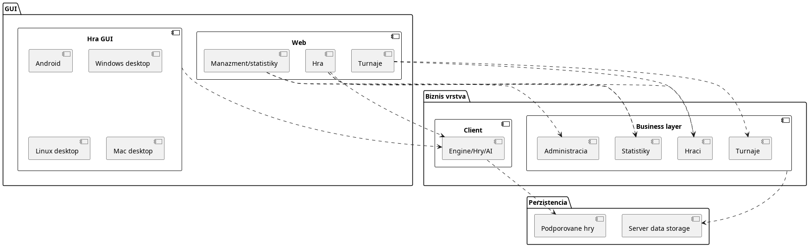

#### Topologia systemu

Po identifikacii zakladnych podsystemov - urcenie tokov dat medzi nimi  
Niekedy tecu data medzi vsetkymi podsystemami, v praxi len zriedka

Vo vacsine pripadov jednoducha topologia

- Jednoducha sekvencia - prekladac
- Hviezda - hlavny system, ktory riadi podriadene systemy

##### Alokacia podsystemov

Odhad poziadaviek na HW zdroje

- Hruby odhad vypoctovej sily na zaklade pozadovaneho poctu transakcii za sekundu a doby spracovania jednej transakcie a pod

Rozhodnutie o HW alebo SW implementacii

Alokacia uloh na fyzicke jednotky (PC alebo CPU)

- Uloha vyzaduje vysoky vykon - viac CPU
- Podsystemy, ktore casto komunikuju - umiestnene v jednej jednotke

Urcenie prepojenia fyzickych jednotiek

- Vyber topologie
- Urcenie poziadaviek na mechanizmy a kounikacne protokoly

##### Datove uloziska

Interne a externe uloziska dat maju dobre definovane rozhranie - sluzia ako hranice oddelujuce jednotlive podsystemy

Typy ulozisk

- Subory
  - Lacne, jednoduche a permanentne, s nizkou urovnou abstrakcie - nutny dalsi kod na pracu s nimi
  - Vhodne pre objemne a tazko strukturovatelne data a data s malou informacnou hustotou s kratkou dobou zivotnosti
- Databazy
  - Spolocne rozhrania pre mnozinu aplikacii pomocou jazyka SQL
  - Vhodne pre data ku ktorym pristupuju viaceri pouzivatelia
  - Nevyhody
    - Vyssia rezia
    - Nedostatocna podpora pre zlozitejsie datove struktury
    - Nemoznost cistej integracie s jazykom SQL

##### Topologia - priklad

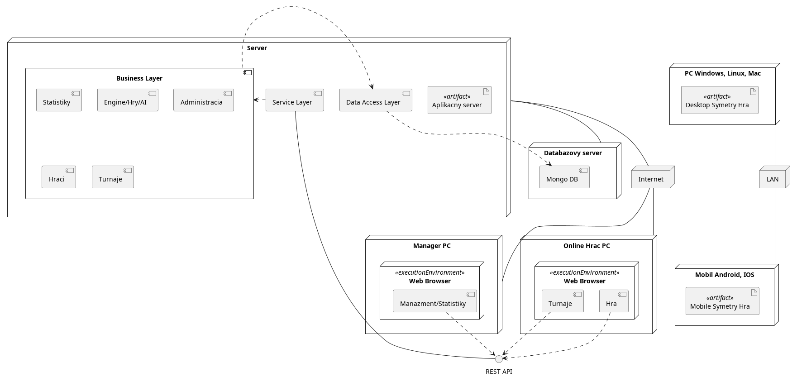

#### Identifikacia paralelizmu

Identifikacia podsystemov, ktore musia a ktore nesmu pracovat paralelne  
Paralelne podsystemy mozu byt implementovane roznymi HW jednotkami  
Podsystem bez moznosti paralelneho behu mozu byt sucastou rovnakeho procesu

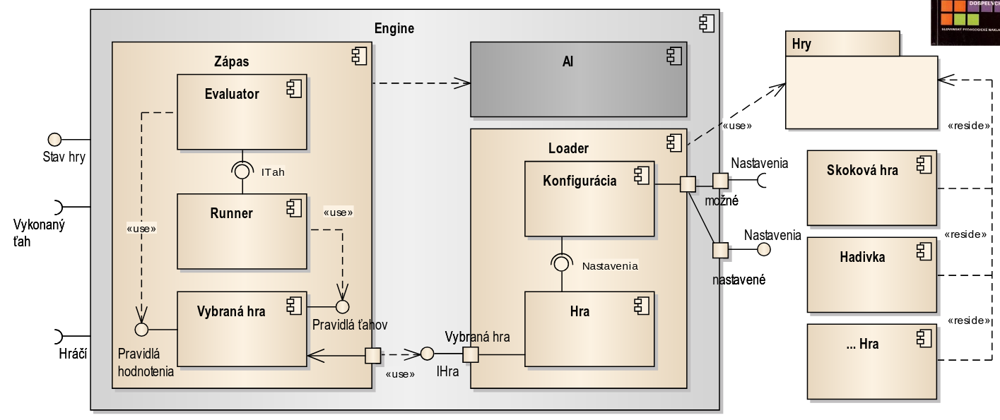
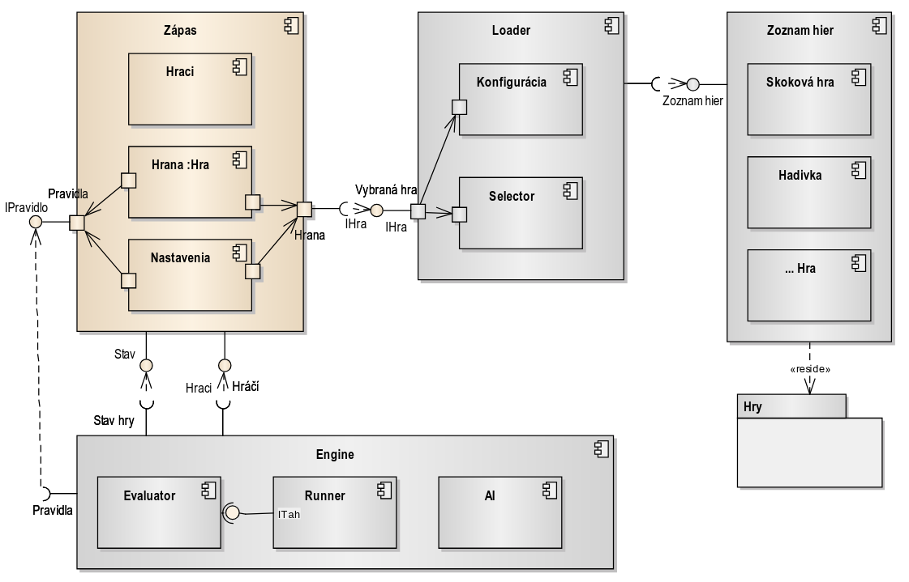

> No idea co chcel autor povedat obrazkami

#### Mechanizmy riadenia

Systemy riadene proceduralne

- Beh systemu je riadeny programovym kodom
- Vyhoda - jednoducha implementacia
- Nevyhoda - tazke spracovanie asynchronnych udalosti

Systemy riadene udalostami

- Beh system riadi dispatcher, predstavovany podsystemom, programovacim jazykom alebo OS
- S jednotlivymi udalostami su zviazane procedury aplikacie
- Procedura po skonceni cinnosti vracia riadenie dispatcherovi
- Vyhoda - jednoducha obsluha novych typov udalosti
- Nevyhoda - zlozita implementacia

Paralelne systemy

- Riadenie niekolkych nezavisle beziacich objektov
- Udalosti prichadzaju k objektom ako spravy
- Objekt moze cakat na vstup, zatial co ostatne prokracuju v cinnosti

#### Diagramy

Diagram zlozenych struktur

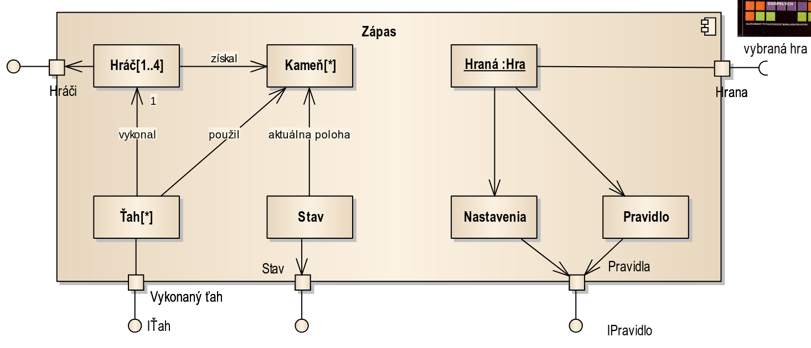

Sekvencny a komunikacny diagram

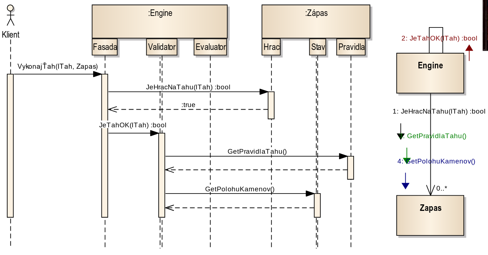

Diagram prehladu interakcii

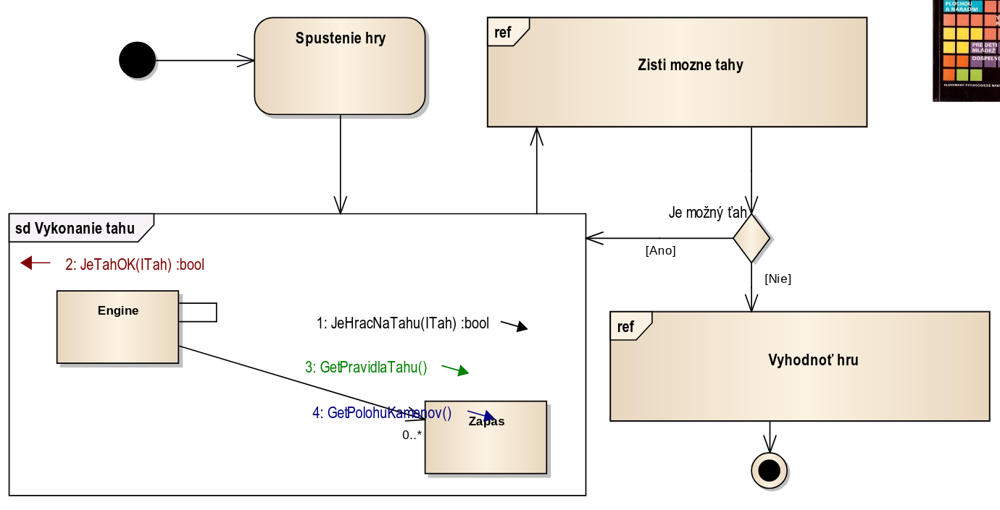

## Analyza a navrh tried

Vystup

- Analyticky model
- Diagram tried
- Komunikacny diagram
- Diagram nasadenia
- Sekvencny diagram
- Stavovy diagram
- Diagram balickov

### Analyticky model tried - konceptualny model

**Diagram tried**

- Zachytava staticky pohlad na logicku strukturu systemu modelovanu triedami, ich atributmi, operaciami a vzajomnymi vztahmi
- Modeluje obchodnu domenu systemu - typy objektov a vztahy medzi nimi
- Snaha o zachovanie prehladnosti a jednoduchosti bez znasania implementacnych detailov

**Analyticka trieda**

- Trieda, ktora reprezentuje zakladne data a spravanie
- Nezachytava SW a HW podrobnosti
- Nazov odraza jej ucel
- Hruba abstrakcia, specificky prvok domeny
- Mapuje jasne identifikovanu vlastnost
- Mala mnozina zodpovednosti
- Sudrzna
- Minimum vazieb

Prakticke rady

- 3-5 zodpovednosti
- Ziadna trieda nie je sama o sebe
- Nie vela malych tried
- Nie niekolko velkych tried
- Nie "funkcoidy"
- Nie vsemocne triedy
- Nie hlboke hierarchie dedicnosti

### Identifikacia tried

- Analyza podstatnych mien a slovies
- Metoda CRC
- Metoda stereotypov RUP

#### Analyza postatnych mien a slovies

Zobrat specifikaciu poziadaviek alebo keru onu, a zvyraznit podstatne mena a slovesa

Podstatne mena a frazy = triedy, atributy  
Slovesa a slovesne frazy - zodpovednosti, operacie

Pozor na

- Neziaduce triedy
- Nepresen pochopenie domeny
- Skryte triedy

#### Metoda CRC

Class, Responsibilities, Collaborators

Spolu s metodou analyzy podstatnych mien a slovies

Oddelenie zhromazdovania informacii a ich analyzy

- Prijimanie vsetkych napadov a ich zaznacenie
- Pomenovanie "predmetov" domeny - kandidati na triedu alebo atribut
- Uvedenie zodpovednosti predmetov
- Praca v time - oznacenie tried, ktore by spolupracovali

Analyza informacii

#### Metoda Stereotypov RUP

Hranicne triedy - `<<boundary>>`

- Vsetko s cim priamo komunikuju akteri
- Napr. formulare, komunikacne protokoly, rozhrania

Entitne triedy - `<<entity>>`

- Obsahuju informacie, ktore system udrzuje dlhsiu dobu
- Zodpovedaju objektom z realneho sveta
- Napr. student, fakulta, predmet

Riadiace triedy - `<<control>>`

- Koordinuju spravanie sa systemu
- Napr. triedy obsahujuce riadiacu logiku, nastavujuce obsah entitnych tried

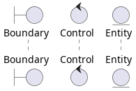

### Sekvencny diagram

Zobrazuje casovo utriedenu interakciu medzi objektami za ucelom vykonania podstatnych casti pripadu pouzitia  
Vychadza zo scenara

Postup

1. Identifikujte aktorov
2. Specifikujte hranicne objekty a jeden riadiaci objekt
3. Odvodte entitne objekty
4. Zadefinujte spravy medzi nimi

Pravidla

- Aktori by mali komunikovat iba s hranicnymi objektami
- Hranicne objekty len s riadiacimi objektami a aktormi
- Riadiace objekty so vsetkymi okrem aktorov

#### Priklad

Vychadza zo scenara

```txt
Scenar popisuje proces vyberu hry
Aktor: Hrac

1. Scenar zacina, ked hrac poziada o vyber hry
2. System nasledne zobrazi zoznam podporovanych hier utriedeny podla nazvu hry
3. System pre kazdu hru na somostatny riadok zobrazi
  3.1 Ikonu hry
  3.1 Nazov hry
  3.1 Minimalny/maximalny pocet hracov
4. System zvyrazni prvu hru ako zvolenu
5. Kym hrac nepotvrdi zvolenu hru stlacenim tlacidla "Hraj"
  5.1 Hrac oznaci zvolenu hru
  5.2 System ju zvyrazni ako zvolenu hru
  5.3 Ak pre hru existuju rozne variacie hrania
    5.3.1 System rozbali rozsirene nastavenia zvolenej hry (v zavislosti od hry sa mozu lisit)
    5.3.1 System nastavi standardne hodnoty pre jednotlive nastavenia
    5.3.1 Hrac si zvoli pozadovane nastavenia hry
6. System ukonci vyber hry a spusti zvolenu hru v zavislosti od jej nastavenych parametrov
```

Diagram

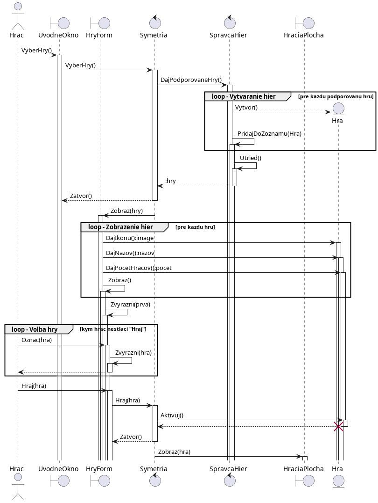

### Diagram tried

#### Domenovy model

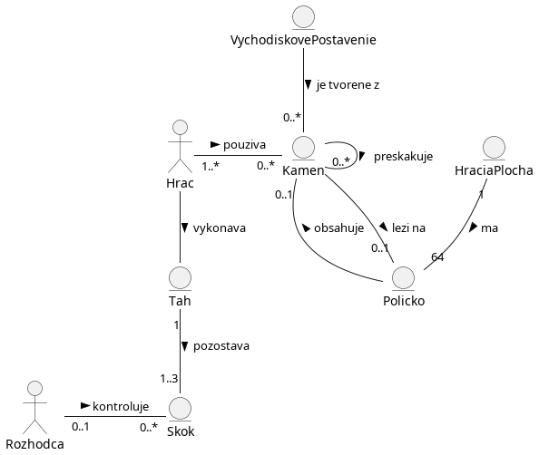

#### Eliminacia tried

Z domenoveho modelu vyhodime chybne a nepotrebne triedy

- Nerelevantne triedy zrusime
- Ak trieda popisuje jediny nesamostatny objekt - atribut
- Trieda popisuje cinnost objektu - operacia

Tym padom...

- Vyhodime rozhodcu
- Skok je atribut
- Tah je cinnost

Analyticky model - eliminacia tried

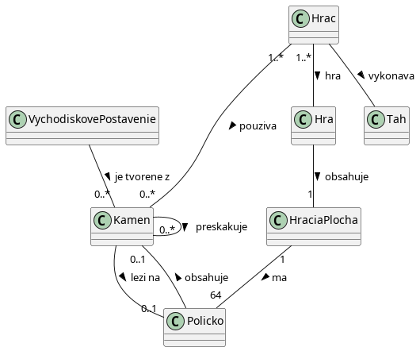

Nasledne optimalizujeme asociacie

- Zrusime nepodstatne asociacie
- Zrusime asociacie, ktore predstavuju popis implementacie
- Su to tieto
  - `Kamen` lezi na `Policko`
  - `Hrac` pouziva `Kamen`
  - `Hrac` vykonava `Tah`

Zrusime predbezne asociacie - jednorazove akcie

- `Kamen` preskakuje `Kamen`

Dostaneme nieco taketo

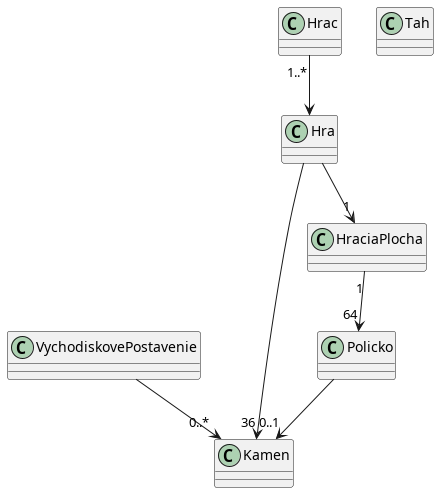

#### Quick odbocka - Typy vztahov medzi triedami

**Asociacia**

- Dlsi vztah medzi instanciami, spojenie trva dlhsiu dobu
- Oznacenie - ciara

**Agregacia**

- Vztah celok/cast
- Volnejsi vztah
- Cast moze existovat aj bez celku
- Hrac v sportovom klube - ak klub zanikne, hrac stale existuje
- Oznacenie - prazdny kosostvorec

**Kompozicia**

- Vztah celok/cast
- Instancia casti moze patrit len jednemu celku
- Tesna previazanost zivotneho cyklu
- Ak je celok zmazany, zmazu sa aj casti
- Oznacenie - plny kosostvorec

**Generalizacia**

- Hierarchia dedicnosti
- Smer zdola nahor - hladaju sa triedy so spolocnymi vlastnostami, ktore su vybrate do nadtriedy (rodica)

**Specializacia**

- Hierarchia dedicnosti
- Smer zhora nadol - existujucu triedu rozsirujeme o specificke podtriedy (`Hra` -> `SkokovaHra`)

> Generalizacia a Specializacia sa oznacuju rovnako


#### Koniec odbocky

Spat ku class diagramu...  
Teraz mozeme spresnit typy vztahov  
Rovno zaroven aj urcime role vo vztahu

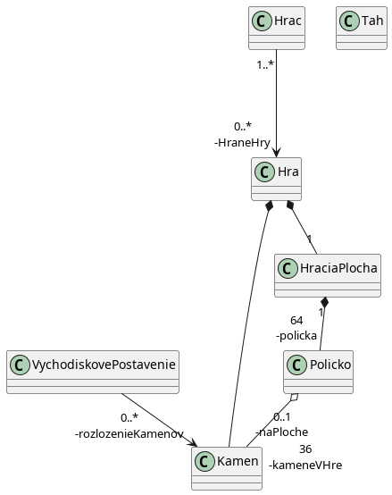

Dalej identifikujeme primarne atributy a operacie

- Najdolezitejsie logicke atributy, ktore su dolezite pre aplikaciu
- Navonok viditelne vlastnosti jednotlivych objektov - meno, farba, rychlost, ...

Zaroven hladame primarne operacie objektov

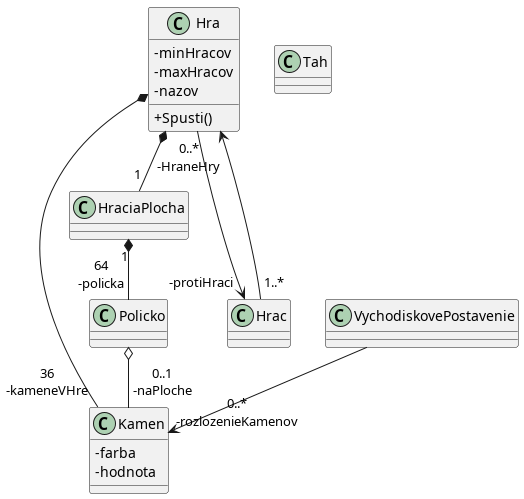

Skokova hra

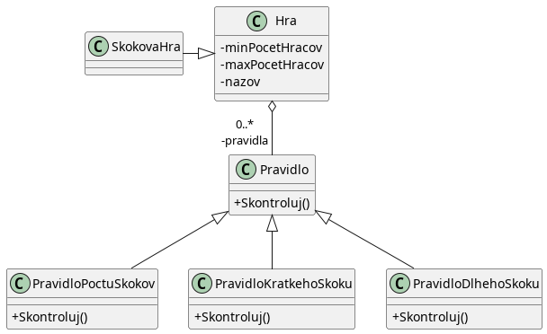

### Analyza tried - zhrnutie

Definicia analytickych tried

- Domenovy model
- Metoda stereotypov, ...
- Analyza problemov domeny riesenia
- Dalsie zdroje

Analyza mensich casti systemu  
Spolu musia vytvarat konzistentny celok - porovnat triedy a ich role, atributy, ...  
Analyza je kreativny a malokedy priamociary proces

### Analyza balickov

Zoskupovanie tried  
Abstrakcia zdruzovania - je to konrajner a vlastnik modelovanych prvkov  
Univerzalny mechanizmus zoskupovania prvkov a diagramov

Umoznuju

- Subeznu pracu
- Zoskupovanie semanticky suviacich prvkov
- Definovanie hranic vo vnutri modelu
- Zapuzdreny menny priestor
- Vnaranie balickov

Vystup

- Analyticky model
- Diagram tried
- Komunikacny diagram
- Diagram nasadenia
- Sekvencny diagram
- Stavovy diagram
- Diagram balickov

#### Package diagram

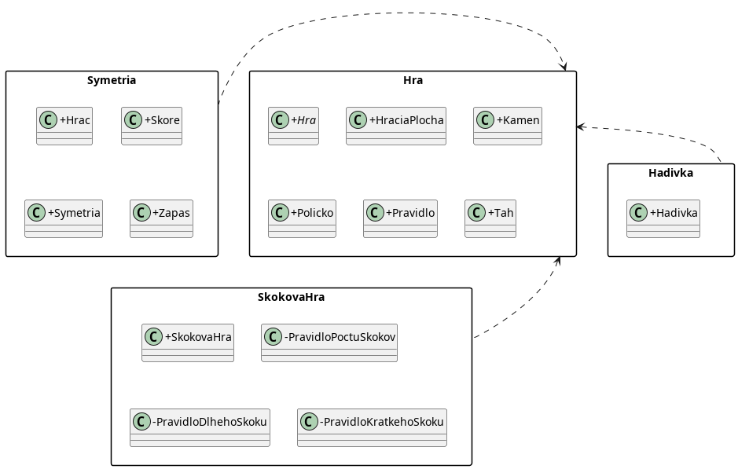

Co ak v ramci analyzy zistim, ze hry maju velke mnozstvo pravidiel zhodnych...  
Pridame novy balicek

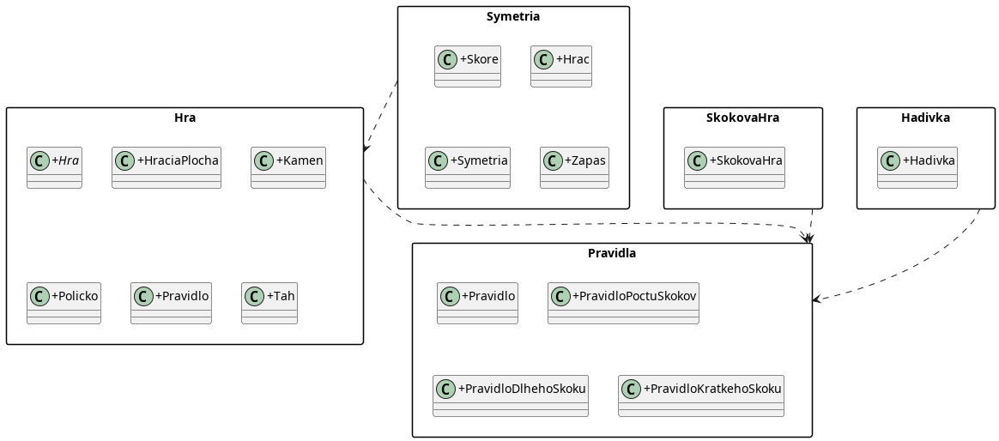

### Realizacia pripadov pouzitia

Modelovane interakcie medzi objektami  
Popis spoluprace instancii analytickych tried za ucelom dosiahnutia pozadovaneho spravania sa sytemu

Ciele

- Zistenie interakcii analytickych tried
- Zistovanie zasielanych sprav
  - Primarne operacie
  - Primarne atributy
  - Primarne vztahy
- Aktualizacia modelov

Vystup

- Analyticky model
- Diagram tried
- Komunikacny diagram
- Diagram nasadenia
- Sekvencny diagram
- Stavovy diagram
- Diagram balickov

Analyza

- Logicky model tvoreneho systemu
- Analyza poziadaviek z pohladu problemovej domeny

Navrh

- Presna specifikacia sposobov ako to implementovat
- Zlucenie technickych rieseni
  - Perzistencia objektov
  - Ich distribucia
  - Architektura
  - GUI
- Zalozeny na analytickom modeli

Navrhova trieda

- Uplna a dostacujuca
- Jednoducha
- Vysoko sudrzna
- Bez tesnych vazieb

Objektovo orientovany navrh

- Vstup - analyticke triedy
- Analyticka trieda sa moze stat
  - Jedinou triedou
  - Castou triedy
  - Agregovanou triedou
  - Skupinou spriaznenych tried
  - Asociaciou
  - ...
- Vytvorenie navrhovych tried
- Definicia operacii, atributov
- Definicia asociacii, agregacii a kompozicii

#### Operacie

Jednoducho - zoznam slovies

Z popisu interakcii medzi objektami

- Nakreslenie diagramov spoluprace alebo sekvencnych diagramov
- Zistenie stimulov, ktore dokaze objekt prijat - operacie

Dalsie moznosti operacii

- Inicializacia novo vytvorenej instancie spolu s prepojenim s asociovanymi objektami
- Vytvorenie kopie instancie
- Test ekvivalencie instancii
- ...

Operacie popiseme - nazov, parametre, navratova hodnota, kratkyp opis, viditelnost

#### Stavovy diagram - trieda `SkokovaHra`

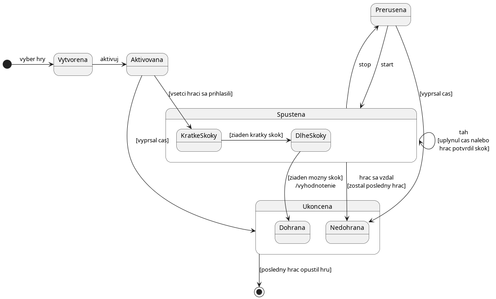

#### Definicia atributov

Vychadzame z logckych atributov objektu - co je potrebne pre zachovanie stavu objektu  
Ake atributy su potrebne pre implementaciu operacii

Atributy v navrhu musia byt jednoduche (int, bool, ...) alebo musia vyjadrovat hodnotu (string) - inak to budu asociacie

Atributy sa popisu

- Meno, typ, pociatocna hodnota, viditelnost
- Snaha o skryvanie informacii - sukromne atributy

Overenie potreby najdenych atributov

Definicia atributov v triede `SkokovaHra`

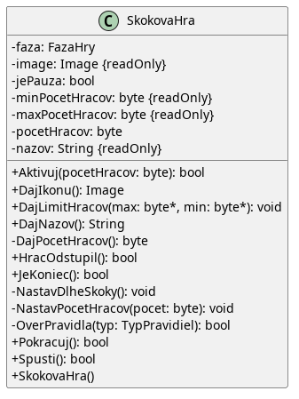

Ak trieda obsahuje viac ako 10 atributov, 10 asociacii, 20 operacii

- Je zle navrhnuta?
- Je nutne ju rozdelit?

Doplnenie abstrakcie

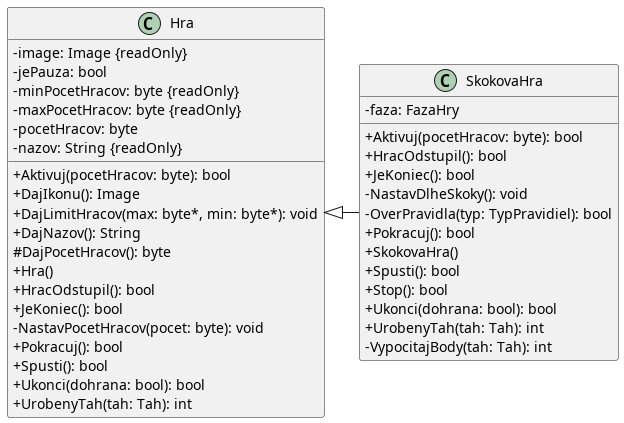

Nove triedy navrhovych tried

- Hranicne triedy
  - Ak su k dispozicii nastroje pre navrh GUI, potom jedna hranicna trieda = jedno okno alebo formular
  - Jedna trieda = API alebo protokol
- Entitne (datove) triedy
  - Casto pasivne a perzistentne - implementacia v subore alebo v relacnych databazach
  - Ak nie su perzistentne - implementacia v pamati
- Reiadiace triedy
  - Obsahuju aplikacnu logiku

Datovy model

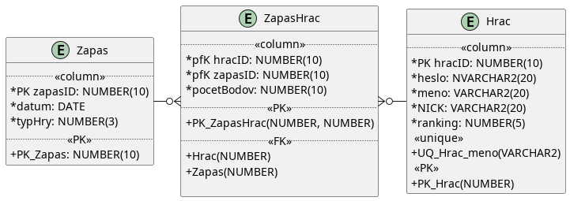

Realizacia pripadov pouzitia - navrh

- Namiesto analytickych tried - navrhove, rozhrania, komponenty
- Odhalovanie novych nefunkcnych poziadaviek a tried
- Identifikacia navrhovych vzorov

Modely tried projektu

- Domenovy model tried - vysledok biznis modelovania
- Konceptualny model tried - vysledok analyzy
- Implementacny model tried - vysledok navrhu (UML) a implementacie (kod)

> No idea o com sa tu vyprava

## Testovanie

Co je softverova chyba

- Softver nerobit to, co by podla specifikacie mal robit
- Softver robi nieco, co by podla specifikacie nemal robit
- Softver robi nieco, o com specifikacia nic nehovori
- Softver nerobi nieco, o com specifikacia nic nehovori, ale mala by
- Softver je tazko zrozumitelny, tazko sa s nim pracuje, je pomaly - koncovy pouzivatel ho nebude povazovat za spravny

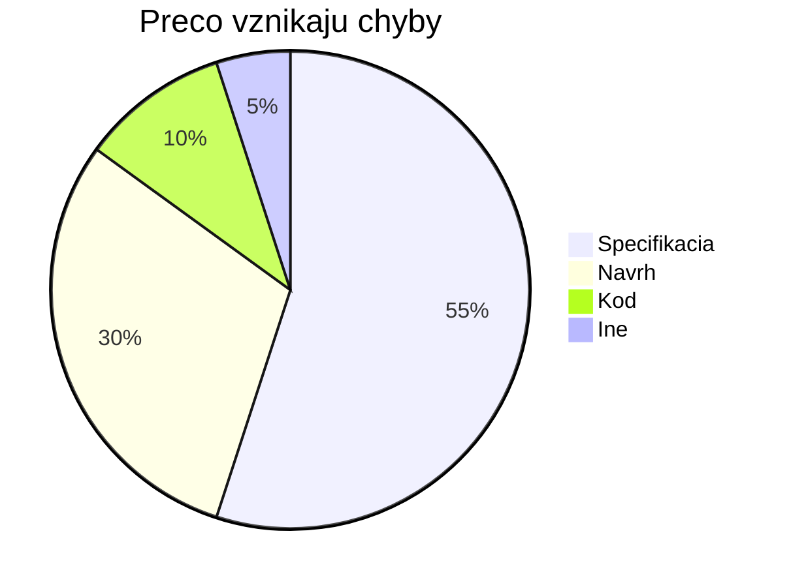
```mermaid
pie title Preco vznikaju chyby
  "Specifikacia" : 55
  "Navrh" : 30
  "Kod" : 10
  "Ine" : 5
```

Cim skor vznikne chyba, tym je narocnejsie a tazsie ju opravit

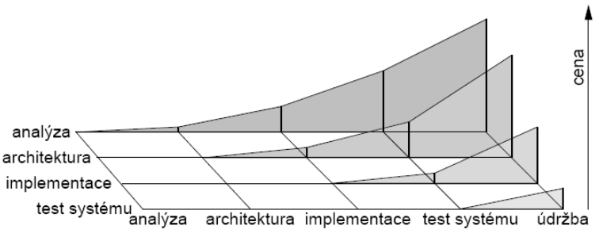

Cielom dobreho softveroveho testera je vyhladavat chyby, vyhladavat ich co najskor a zaistit ich opravu  
Dobry tester by mal byt

- Zvedavy
- Neunavny
- Tvorivy
- Perfekcionista
- Dobry usudok
- Taktnost
- Presvedcivoat
- Programatorske znalosti
- Domenove znalosti

Program nie je mozne testovat kompletne

- Pocet moznych vstupov a vystupov je prilis velky
- Pocet moznych ciest je prilis velky
- Specifikacia softveru je subjektivna

Axiomy

- Nikdy nepreukazete, ze chyby neexistuju
- Cim viac chyb najdete, tym viac chyb tam je
- Nie vsetky najdene chyby sa opravia
- Je tazke povedat, kedy je chyba chybou
- Specifikacia produktu nikdy nie je konecna
- Testeri nie su najoblubenejsimi clenmi tymu
- Testovanie je presna technicka disciplina

Paradox pesticidov - ak sa na softver opakovane aplikuju tie iste testovacie pripady, po urcitom case tieto testy prestanu nachadzat nove chyby

### Pojmy

Presnost a spravnost

- Presnost - precision = konzistencia
- Spravnost - accuracy - ako blizko su namerane hodnoty alebo vysledky k realnemu cielu, v SW = robi presne to co specifikacia predpisuje
- Priklad s tercom a sipkami
  - Ak vsetky sipky trafim na stred, tak som presny a spravny
  - Ak vsetky sipky trafim napr. na cislo 1 - som presny ale nie spravny

Verifikacia a validacia

- Verifikacia - _"Vyberam produkt spravne?"_ - kontrola, ci SW splna specifikacie, ci nevznikli chyby (technicka disciplina)
- Validacia - _"Vyberam spravny produkt?"_ - zistujem, ci SW actually riesi potreby zakaznika, ci ma zmysel, ci to zakaznik takto predstavoval

Kvalita a spolahlivost

- Kvalita - SW je uplny, konzistentny, testovatelny, pre pouzivatela zrozumitelny, robi to co ma
- Spolahlivost - schopnost pracovat bez poruchy za stanovenych podmienok po urcity cas
- Priklady
  - Ak je riadiaci system lietadla nespolahlivy, je nepouzitelny aj keby mal vsetky funkcie v poriadku
  - Kazdy spolahlivy SW je kvalitnejsi, ale kvalitny softver nemusi byt nutne spolahlivy

### Sposoby testovania

Cerna a biela skrinka

- Cierna skrinka - nepozname vnutorny kod
  - Pozerame sa len na vstup a vystup
  - Napr. zadam heslo - ocakavam prihlasenie, nezaujima ma ako je to naprogramovane
- Bila skrinka - pozname vnutorny kod
  - Kontroluju sa vetvy, podmienky, cykly
  - Cielom je prejst vsetky cesty v kode

Staticke a dynamicke testovanie

- Staticke - bez spustenia programu
  - Kontrola kodu
  - Code review
  - Analyza dokumentacie
  - Staticka analyza (linter)
- Dynamicke - so spustenim programu
  - Zadavam vstupy
  - Sledujem spravanie programu

### Testovanie specifikacie

Vyssia uroven

- Ste zakaznikom
- Aktualne standardy a zasady
  - Firemna terminologia a konvencie
  - Odborne poziadavky
  - Vladne standardy
  - GUI, HW, SW standardy
- Podobny softver
  - Velkost
  - Zlozitost
  - Testovatelnost
  - Kvalita a spolahlivost

Nizsia uroven

- Atributy specifikacie
  - Uplna
  - Spravna
  - Presna
  - Konzistentna
  - Relevantna
  - Realizovatelna
  - Bez kodu
  - Testovatelna
- Problemove terminy
  - Vzdy, nikdy, kazdy, ziadny
  - Urcite, teda, zrejme, jasne
  - Nieco, niekedy, casto, vacsina
  - A podobne, napriklad
  - Dobry, rychly, lacny, maly
  - Spracovane, osetrene, preskocene
  - Ak ... tak

### Testovanie s klapkami na ociach

Dynamicke testovanie ciernej skrinky  
Definicia testovych pripadov  
Mnozina ekvivalentnych pripadov - mnozina pripadov, ktore testuju rovnaku vec alebo odhaluju rovnaku chybu

#### Testovanie dat

Hranicne podmienky  
Subhranicne podmienky  
Poziatocna, prazdna, nevyplnena, nedefinovana, nulova, ziadna hodnota  
Neplatne, chybne, nespravne, nezmyselne udaje

#### Testovanie stavov

Testovanie logiky toku riadenia

- Vytvorenie mapy stavov a prechodov
- Ich redukcia
- Definicia testovych pripadov

Testovanie stavov nesplnenim

- Nespravne casovanie
- Opakovanie, stres, zataz

Ako hlupy pouzivatel  
Hladame tam, kde uz nejake boli  
Skusenosti, intuicia, predtucha

### Skumanie programoveho kodu

Staticke testovanie bielej skrinky

Formalna revizia

- Identifikacia problemov
- Dodrzovanie pravidiel
- Priprava
- Pisomna sprava
- Dalsie dosledky
  - Komunikcia
  - Kvalita
  - Timova spolupraca
  - Riesenie

Standardy a zasady programovanie

Vseobecne body na reviziu

- Chyby v odkazoch na data
- Chyby v deklaraciach dat
- Chyby vo vypoctoch
- Chyby v porovnavaniach
- Chyby toku riadenia
- Parametre podprogramov
- Vstypno - vystupne chyby

### S rontgenovymi okuliarmi

Dynamicke testovanie bielej skrinky

Okrem pozorovania aj testovat a riadit

- Nizkourovnove
- Na najvyssej urovni
- Overovanie
- Meranie

#### Testovanie casti

Testovanie jednotiek a integracia

- Zhora nadol
- Zdola nahor

#### Uplna analyza dat

Toky dat  
Subhranicne pripady  
Vzorce a rovnice  
Umyselne vyvolanie chyb

#### Uplna analyza programoveho kodu

Analyzator kodu  
Uplna analyza prikazov a riadkov programu  
Uplna anlyza vetvenia programu  
Uplna analyza podmienok

### Aplikovanie postupov testovania

Konfiguracne testovanie  
Testovanie kompatibility  
Testovanie cudzich jazykov  
Testovanie pouzitelnosti  
Testovanie dokmentacie  
Testovanie bezpecnosti  
Testovanie webovych stranok

### Planovanie testov

Najvyssia uroven ocakavania  
Ludia, miesta, veci  
Definice  
Povinnost medzi skupinami  
Co ano a co nie  
Fazy  
Strategie  
Poziadavky na prostriedky  
Poverenia testerov  
Cacovy plan  
Testove pripady  
Spravy o chybach  
Metriky a statistiky  
Rizika a problemy

### Navrh testov

Identifikator  
Testovane funkcie  
Postup  
Kriteria splnenia a nesplnenia  
Identifikacia testovych pripadov

### Testove pripady

Identifikator  
Testovane funkcie  
Vstupy a vystupy  
Prostredie  
Zvlastne poziadavky  
Vzajomne zavislosti

### Testove procedury

Identifikator  
Ucel  
Zvlastne poziadavky

Kroky

- Zaznam
- Priparava
- Zahajenie
- Procedura
- Meranie
- Obnovenie, ukoncenie, upratanie

### Sledovanie testovych pripadov

Vlastna hlava  
Papier  
Tabulkovy procesor  
Databaza

## Agilne metodiky

Hlavny problem sucasnosti - rychlost vyvoja  
Niektore metody uz nie su tak efektivne  
Nielen dobre ale hlavne rychlo  
Systematicky vyvoj uz aj pre male projekty

Zmeny

- Vacsia konkurencia
- Mensie programatorske timy
- Co najrychlejsie nasadenie systemu

Potrebujeme metodiky na rychly a kvalitny vyvoj "malych" aplikacii

Jedinou cestou ako overi spravnost navrhnuteho systemu, je co najskor ho vyvinut, predlozit zakaznikovi a na zaklade jeho reakcie upravit

Tradicny pristup

- Mame fixnu funkcionalitu, variabilny cas na vyvoj a zdroje

Agilny pristup - presne naopak

- Mame fixny cas a zdroje, variabilna funkcionalita

### Zakladne principy

Iterativny a inkrementalny vyvoj  
Priama osobna komunikacia v time  
Stale spojenie so zakaznikom  
Rigorozne, opakovane, priebezne automatizovane testovanie  
Vyzaduju menej formalnych a byrokratickych artefaktov  
Najsilnejsi doraz na zdrojovy kod

Preferencne tezy agilneho programovania

- Prijat a umoznit zmenu je omnoho efektivnejsie
- Je treba byt pripraveny reagovat na nepredvidane udalosti

Preferencne tezy

| Prednost                    | Pred                            |
| --------------------------- | ------------------------------- |
| Individuality a komunikacia | Procesy a nastroje              |
| Prevadzky schopny softver   | Obsiahla a objemna dokumentacia |
| Spolupraca so zakanikom     | Uzatvaranie roznych zmluv       |
| Reakcia na zmenu            | Striktne plnenie planu          |

### Zakladne tezy

Hodnota pre zakaznika  
Zmeny su vyhodou  
Caste dodavky  
Zakaznici pracuju s timom  
Motivacia je klucova  
Vzajomna konverzacia  
Uspech posudzovany podla fungovania  
Udrzatelny vyvoj  
Perfektny navrh a riesenie  
Jednoduchost  
Kreativita  
Ako zvysit efektivitu?

### Extremne programovanie (XP)

Jedinym exaktnym, jednoznacnym, zmeratelnym, overitelnym a nezpochybnitelnym zdrojom informacii je zdrojovy kod  
Ucinny, evektivny, lahky, flexibilny a zabavny spodob vyvoja  
Velmi rozumny

Hodnoty

- Komunikacia
- Jednoduchost - pise sa to co je potrebne, nie "do buducna"
- Spatna vazba - kratke iteracie, caste vydania
- Odvaha - refaktorovanie, mazanie zleho kodu, zmeny navrhu
- Respekt

Cinnosti

- Testovanie
- Pisanie zdrojoveho kodu
- Pocuvanie
- Navrh

Vyhody

- Praca v sulade s instinktmi
- Iterativna
- Inkrementalna
- Priamy postup k cielu
- Bez formalit
- Podpora v IDE, CASE

Nevyhody

- Detaily jednoduche, zlozite vykonat
- Tazke zavedenie
- Vsetci clenovia timu
- Nie vhodne pre kazdeho cloveka

### SCRUM

Cielom timu je "dotlacenie lopty" na pozadovanu poziciu  
Dopredu nevieme uplne presne, co bude pri vyvoji nutne robit  
Zavadza teda kazdodenne stretnutia, ktore prinesu slabe, zato caste zablesky svetla

Klucove pojmy

- Flexibilne predmety dodania
- Flexibilny harmonogram
- Male timy
- Caste revizie
- Spolupraca
- Backlog
- Sprint
- Riziko
- Scrum meeing

Fazy

1. Planovanie - pred prvym sprintom si pripravime veci
2. Sprinty - vela krat sa opakuju kroky: develop, review, adjust, wrap
3. Koniec - closure - vsetko je hotove

Vyhody

- Reakcie na zmeny
- Sloboda volby riesenia
- OOP
- Prepracovany sposob odhadu pracnosti

Nevyhody

- Skor suhrn vzorov
- Tazke zavedenie
- Vsetci clenovia timu
- Nie vhodne pre kazdeho cloveka

### Test Driven Development

Testovaci kod musi byt dokonceny este pred zaciatkom pisania testovaneho kodu

Kroky

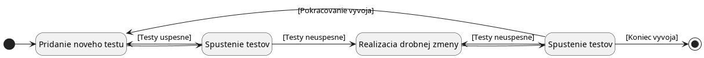
