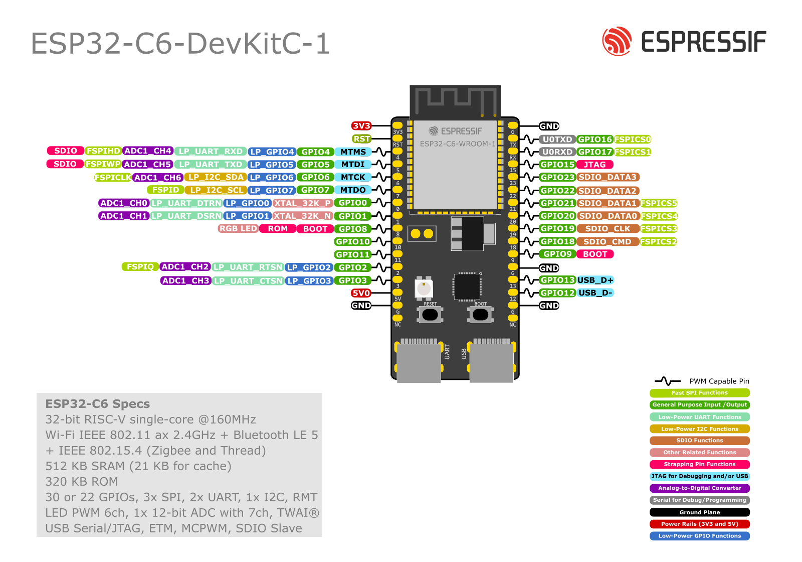

# VVS

## Hardware Terminologia

Procesor - jadro, ktore vykonava instrukcie, spracovava data  
Mikropocitac/mikrokontroler - procesor + pamate + periferie  
Cip - integrovany obvod  
System on Chip (SoC) - vacsina casti pocitaca je na cipe  
Modul - viac cipov na jednej doske  
System on Module - pocitac na module  
Kit, DevKit - modul + doplnky (napajanie, tlacidla, LED, ...)

## ESP32 serie

- Seria S2
  - 2019
  - Single core 32 bit CPU
  - 320 kB RAM, 4MB flash (1GB externa)
  - Len WiFi
- Seria S3
  - 2020
  - Dvojjadrovy 32 bit CPU
  - 512 kB RAM, 8MB flash (1GB externa)
  - Bluetooth 5 (BLE)
- Seria C3
  - 2020
  - 400kB SRAM, 4MB flash (1GB externa)
  - More suitable for IoT
- Seria C6
  - 2021
  - WiFi 6 (2.4GHz), Bluetooth 5.3, IEEE 802.15.4 (ZigBee)
- Seria C5
  - 2022
  - Aj 5GHz WiFi
- Seria H2
  - 2021
  - Thread, ZigBee, Bez WiFi
  - Ultra nizka spotreba

## GPIO

General Purpose Input-Output  
Vstupno-vystupny pin pre vseobecne pouzitie  
Digitalne vs. Analogove

ESP32-C6 pinout



24-26, 28-30 vyhradene pre externu Flash, nepouzivat  
6, 7, 12, 13, 16, 17 - pouzivat opartne (USB, JTAG, UART)  
4, 5, 8, 9, 15 - Strapping GPIO - config pri bootovani

> `Vdd` - vstupne napatie = `3.3V`

Vystup

- Logicka 0: `0` az `0.1 x Vdd`
- Logicka 1: `0.8 x Vdd` az `Vdd`

Vstup

- Logicka 0: `-0.3` az `0.25 x Vdd`
- Logicka 1: `0.75 x Vdd` az `Vdd + 0.3`

### Vystupy

> Logicka 1 `> 2.64V`  
> Logicka 0 `< 0.33V`

Max. zatazitelnost

- $I_{OH}$ = `40mA` - zdroj (source), default `20mA`
- $I_{OL}$ = `28mA` - spotrebic (sink)
- Celkovo vystup max `1000mA`
- Celkovo vstup max `> 500mA`

```python
# micropython
from machine import Pin

p1 = Pin(1, Pin.OUT)
p2 = Pin(1, Pin.OUT, value=1)
p3 = Pin(1, Pin.OUT, drive=Pin.DRIVE_3)  # max vykon = 40mA

# nastavenie hodnoty
p1.on()
p1.off()
p2.value(1)

# citanie hodnoty
x = p3.value()
```

```python
from machine import Pin
import time

r = Pin(25, Pin.OUT)
g = Pin(26, Pin.OUT)
b = Pin(27, Pin.OUT)

i = 0
while True:
    r.value(i&1)
    g.value(i&2)
    b.value(i&4)
    i = i+1
    time.sleep(1)
```

## PWM

Pulse Width Modulation

### Fejkovy PWM

LEDka velmo rychlo blika, co posobi ako keby menej svietila

```python
while True:
    r.on()
    time.sleep(1)

    for i in range(500):
        r.off()
        time.sleep_ms(1)
        r.on()
        time.sleep_ms(1)
```

```python
# vacsi rozdiel - viac vidno
while True:
    r.on()
    time.sleep(1)

    for i in range(100):
        r.off()
        time.sleep_ms(9)
        r.on()
        time.sleep_ms(1)
```

### Normalny PWM

$U_O = U_{max} \cdot \dfrac{T_{on}}{T}$

> $T$ = perioda  
> $T_{on}$ = kedy je zapnuta

Duty Cycle

Neda sa pouzit pri "pomalom" zariadeni (motor)

Caste spinanie = vacsie energeticke (?) straty (to nechceme)  
Idealne mimo pocutelnej oblasti (20kHz)

ESP32-C6 - 6 PWM kanalov, 4 casovace

```python
from machine import Pin, PWM

pwm = PWM(Pin(0), freq=5000, duty_u16=32768)
pwm.freq(1000)

pwm.duty(256)  # 0 - 1023
pwm.duty_u16(256)  # 0 - 65_535
pwm.duty_ns(25000)  # 0 - 1_000_000_000
pwm.deinit()
```

```python
pwm = PWM(Pin(10), freq=500, duty=100)

while True:
    time.sleep(1)
    pwm.duty(1023)
    time.sleep(1)
    pwm.duty(100)

# pwm.deinit()
```

## Vstupy

### Prerusenie od tlacidla

### Dotykovy snimac

Kondenzator - uchovavanie naboja (energie) - kapacita $C = \epsilon \cdot \dfrac{S}{d}$  
Pri dotyku (dotykovy displej?) sa meni kapacita kondenzatora

Pri dotyku sa znizuje hodnota  
Idealne kalibrovat  
Snimac by mal byt odizolovany od tela (staticka el.)

```pyton
t = TouchPad(Pin(14))

while True:
    print(t.read())
    time.sleep(1)
```

## Casovac

Vola sa callback funkcia pravidelne v danom intervale

```python
t = Timer(id, mode=Timer.PERIODIC, freq=-1, period=-1, callback=None)
# mode moze byt aj Timer.ONE_SHOT
```

```python
def MyCallback():
    pass

tim = Timer(0)
tim.init(mode=Timer.PERIODIC, freq=1000, callback=MyCallback)
tim.deinit()
```

Lambda funkcia

- mala anonymna funkcia
- vyhodnocuje jeden vyraz

```python
tim = Timer(2, freq=2, callback=lambda x: print(".", end=""))
```

Trieda

```python
class Blik:
    def __init__(self, timer, period, led):
        self.led = Pin(led, Pin.OUT)
        self.tim = Timer(timer, period=period, mode=Timer.PERIODIC, callback=self.callback)

    def callback(self, tim):
        self.led.value(not self.led.value())

red = Blik(0, 2000, 21)  # actually to bude kazdu sekundu, nie 2, nevieme preco
green = Blik(2, 4000, 11)
```

### Watchdog casovac

Strazi zariadenie predtym, aby nezamrzlo  
Ak ho nenakrmime do `timeout` milisekund, ✨zacne vyvadzat✨ a resetuje zariadenie  
Hardwarova zalezitost

Co moze resetovat

- Vyvolat prerusenie
- CPU reset (by default)
- Core reset - CPU, WDT, periferie
- System reset - vsetko = +napajanie

```python
wdt = WDT(timeout=3000)
wdt.feed()
```

## Prevodniky

- Analogovo cislocovy prevodnik - AC (ADC)
- Cislicovo analogovy prevodnik - CA (DAC)

### CA prevodnik (DAC)

Generovanie spojiteho, analogoveho vystupu  
Diskretne -> Spojite

$U_{vyst} = \dfrac{\text{vstupny kod}}{2^N - 1} \cdot U_{ref}$

Chyby - offsetu, zosielnenia, diferencialna nelinearita, integralna nelinearita, monotonnost

```python
dac = DAC(Pin(25))
dac.write(128)  # 0-255
```

> ESP32-C6 ho nema

Nejde od 0V po 3.3V, ale kusok menej

### AC prevodnik (ADC)

Analogove -> Diskretne (digitalne)  
Diskretny aj v case aj v hodnote  
Sampling - vzorkovanie - poseka sa v case (CD - ~44kHz)  
Quantization - priradenie hodnoty nejakej urovni (CD - 16bit)

ESP32-C6

- Jeden 12bit prevodnik (4096 hodnot)
- Krok - $\dfrac{3.3V}{4096} \approx 0.8mV$
- GPIO Kanaly 0 az 6

```python
adc = ADC(Pin(3))
val = adc.read()  # 12 bit
val = adc.read_u16()  # softwarovo 16 bit
val = adc.read_uv()  # mikrovolty
# ak chceme co najpresnejsie hodnoty, pouzit read_uv()

adc.width(ADC.WIDTH_9BIT)  # 9 - 12 bit

acd.atten(ADC.ATTN_11DB) # utlm - (ake napatie mozeme pripojit?)
```

## Fotorezistor

Meni svoj odpor v zavislosti od osvetlenia

- neosvetleny ~50k ohm
- osvetleny ~20 ohm

ESP32-C6 - GPIO 3

```python
foto = ADC(Pin(3, Pin.IN))
foto.atten(ADC.ATTN_11DB)

while True:
    val = foto.read_u16()
    print(val)
    time.sleep(0.5)
```

Thonny - view - plotter

## NeoPixel

Seriove LED na doske

Napajanie by malo byt >0.7 \* vstupne napatie  
Problem - napajanie 5V, $5 \cdot 0.7 = 3.5$, my mame len 3.3V napajanie  
Seriova komunikacia 800kHz  
8 bitov na farbu, spolu 24bit

```python
np = neopixelNeoPixel(Pin(8), 3)
np[0] = (32, 64, 128)
np.fill(255, 0, 0)
np.write()
r, g, b = np[0]
```

## Seriovy port - UART

Unversal Asynchronous Receiver Transmitter  
Start bit, data, (parita), stop bit  
Rychlost 1200, 9600, 115200 bit/s (87us per znak)

```python
uart = UART.init(baudrate=9600, bits=8, parity=None, stop=1, ...)

uart.any()  # vrati pocet znakov k dispozicii na citanie
uart.read([nbytes])
uart.readinto(buf, [nbytes])
uart.realine()
uart.write(buf)
uart.deinit()
```

### stdin

```python
import sys
bytes_read = sys.stdin.buffer.readinto(buf, nbytes)

# prenos ctrl-c
import micropython
micropython.kbd_intr(-1)  # zakazanie
micropython.kbd_intr(3)  # povolenie (znak 3 = ctrl-c)
```

## Ultrazvukovy snimac

Meranie vzdialenosti ultrazvukom  
40 kHz

> HCSR04

Napajanie 5V

Ako to funguje

1. Trigger - na prikaz sa nieco spusti (krok 2)
2. Vysle sa 8 ultrazvukovych period - Cycle Sonic Burst
3. Meria sa \_
4. Z nemaraneho casu sa pomocou rychlosti zvuku (~340m/s) - d = (v\*t)/2

```python
start = time.ticks_us()
# ...
end = time.ticks_us()
time_length_time.ticks_diff(start, end)  # vrati cas v mikrosekundach
```

Alebo

```python
machine.time_pulse_us(pin, level, timeout_us)
```

Alebo

```python
from hcsr04 import HCSR04

hcsr = HCSR04(trigger_pin=15, echo_pin=23)

while true:
    dist = hcsr.distance_cm()
    print(dist)
    time.sleep(0.5)
```

## Optosnimac CNY70

Led + fototranzistor

Zasvieti sa led na zaklade odrazeneho svetla (farby?), ktoru zaznamena fototranzistor  
Filter denneho svetla

> GPIO4, GPIO0, GPIO1, vyuziva ADC

## Akcelerometer a Gyroskop

MEMS = Micro-Electro-Mechanical System (mikro zavazia na pruzinkach + elektronika)

3D akcelerometer

- do +- 16G, (default 2G)
- 16bit
- pozor na offset

3D gyroskop

- do +- 2000 stupnov/s (default 250)
- 16 bit

Moznost kombinacie - komplementarny filter

### I2C - paralelny prenos dat - MPU6050

```python
i2c = I2C(scl=Pin(7), sda=Pin(6), freq=100000)

i2c.start()
i2c.writeto(0x68, bytearray([107, 0]))
i2c.stop()

i2c.start()
i2c.readfrom_mem(0x68, 0x3B, 14)  # adresa zariadenia, adresa dat, pocet dat
i2c.stop()
```

## Vykonove prisposobenie

ESP max vystup 40mA  
Pre vacsie prudy potrebujeme prisposobenie - spinac pre digitalne, zosilnovac pre analogove vystupy

Tranzistor ako spinac  
Pouzite aj pri bzuciaku  
V 2 stavoch - uplne otvoreny (preteka prud, v saturacii (vsuvka z chemie)) alebo uplne zavrety  
Maly ubytok napatia - zanedbame

### Jednosmerny motor

Maly motor ma permanentne magnety (vacsie maju elektromagnety)  
Dost vysoke otazky, hlavne nezatazene  
Maly vykon - pripaja sa prevodovka - znizi otacky, zvysi silu/moment/vykon?

Len do jednej strany - rele (bez PWM, z hladiska bezpecnosti galvanicky oddelene), tranzistor  
Ak by sme chceli do oboch stran - H-mostik

#### H-mostik

Basically len viac tranzistorov, ktore sa striedavo spinaju  
Q1 a Q4, Q2 a Q3  
Pozor na skrat - nemozem naraz zopnut tranzistory vedla seba  
Hore su PNP, dole su NPN

1.5A stabilne, kratkodobo 2A

Na nasej doske:  
+6V (z baterie)  
DRV8833 - 2x H-mostik  
GPIO 18,19\*,20,22\*

> \*ovladane PWM, druha strana je natvrdo  
> pre zmenenie polarity zmenit to co je PWM s tym co PWM nie je

```python
m21=Pin(22, Pin.OUT, value=0)
m22=Pin(20, Pin.OUT, value=0)

m11=Pin(19, Pin.OUT)
m12=PWM(Pin(18), frequ=440, duty-512)

m11.value(0)
time.sleep(1)
# m12.value(0)  # ?
```

#### Rele

Elektromechanicka suciastka  
Len zapnut/vypnut, urcite nie PWM  
Nizky odpor  
Pomalsie  
Odolnejsie na pretazenie  
Pozor na jednosmerne prudy - kvoli iskreniu pri rozopinani

SSR - solid state relay - cisto elektronicke, aj pre PWM, menej odolne  
Bistabilne rele - 2 stabilne polohy, staci len kratky impulz aby sa prehodil, nepotrebuju stale napajanie, pouzivane napr. pri termostatoch

#### Servo

Jednosmerny motor + prevodovka + riadiaci obvod

2 typy

- polohove - 0 az 180 stupnov
- rychlostne - 0 az 360 stupnov, niektore sa mozu tocit

```python
servo = PWM(Pin(13, freq=50, duty=75))
```

### BLDC

Brushless DC motor  
Vyssia ucinnost a zivotnost  
Vysoke otacky  
Vyborny pomer vykon/hmotnost  
Elektronicke prepinanie cievok (Hallove snimace alebo meranie prudu)  
Vymeneny rotor a stator  
Komplikovanejsie riadenie - existuju hotove moduly  
ekolobezky, ebicykle, ...

---

tranzistor, hmostik, solid state relay - PWM  
iba rele nie pwm

## Komunikacny podsystem - bezdrotova komunikacia

WiFi 802.11, Esp-now, Bluetooth, Bluetooth Low Energy, IEEE 802.15.4 (ZigBee) - vsetko v 2.4GHz

### WiFi

WiFi kanaly - 1, 6, 11 - sirka 22 MHZ

```python
import network

# klient - pripojenie na existujucu siet
sta = network.WLAN(network.STA_IF)  # station
sta.active(True)
sta.scan()
sta.connect(ssid, pass)
sta.ifconfig()

# ap
ap = network.WLAN(network.AP_IF)
ap.config(ssid="ahoj", key="heslisko")  # security=0..4
ap.active(True)
ap.ifconfig()

# sockety
s = socket.socket(socket.AF_INET, socket.SOCK_STREAM)
s.bind(('', 80))
s.listen(5)

while True:
    conn, addr = s.accept()
    req = str(conn.recv(1024))
    ...
    conn.send('HTTP/1.1 200 OK\n')
    conn.send('Content-Type: text/html\n')
    conn.send('Connection: close\n\n')
    conn.sendall(response)
    conn.close()
```

### Esp-now

Connection-less (UDP, ale mame moznost prijat potvrdenie o prijati)  
Priama komunikacia (max. 20 zariaadeni)  
Moznost sifrovania (max. 6 zariadeni)  
Spravy do 250B  
Vhodne pre male IoT siete  
Nizka latencia  
Dlhy dosah (stovky metrov)

```python
import network, espnow

sta = network.WLAN(network.STA_IF)
sta.acive(True)

e = expnow.ESPNow()
e.active(True)
e.config(timeout_ms=100_000)

peer = b'\xAA\xAA\xAA\xAA\xAA\xAA'  # mac addr
e.add_peer(peer)
e.send(peer, "Sprava")
# sync=True  # caka na prijatie odpovede na spravu
e.any()  # kontrola prijatia spravy
host, msg = e.recv()  # prijem spravy
host, msg = e.irecv()  # vracia bytearray, setri pamat
e.irq(callback)
```

```python
# citanie zo stdin - putty?
list = select.select([sys.stdin], [], [], 0)
if list[0]:
    ss = sys.stdin.read(1)
    e.send(peer, ss)
```

### Bluetooth classic

MicroPython ho nepodporuj

Arduino

```c
#include "BluetoothSerial.h"
BluetoothSerial SerialBT;
SerialBT.begin("Nazov");  // aktivacia bt
SerialBT.available();  // kontrola prijatia znakov
SerialBT.read();  // precitanie znaku
SerialBT.write(znak);  // vyslanie znaku
```

### Bluetooth LE

Velmi nizka spotreba (gombikova bateria >1 rok)  
Male pakety (244B pri BLE5)  
Velky dosah (1000m pri BLE5)  
Kratke vysielacie a prijimacie okna - zapinanie radia co najmenej, vypinanie co najskor  
Rychle pripojenie (~6 ms)  
Data vo formate key-value

Hlavne pojmy

- Inzerovanie (advertising) - pravidelne vysielanie informacii
- Skenovanie - hladanie inzerujucich zariadeni

Typy zariadeni

- Periferia - inzeruje a umoznuje pripojeie (zvycajne zdroj dat)
- Centrum - skenuje a moze sa pripojit (zvycajne spotrebic dat)
- Observer - skenuje, pocuva, ale nepripaja sa
- Broadcaster - inzeruje, ale numoznuje pripojenie (majak)
  - Kazdy moze pocuvat
  - Nespolahlivy prenos

Struktura dat

- Profile
  - Service - UUID
    - Characteristic - UUID
      - Properties
      - Value
      - Descriptor - UUID
    - Characteristic - UUID
      - Properties
      - Value
      - Descriptor - UUID
    - Characteristic - UUID
      - Properties
      - Value
      - Descriptor - UUID

### IEEE 802.15.4 (ZigBee)

Priamo MicroPython nepodporuje, ale da sa to nejako spravit

## Napajci podsystem

Vstavany system

- Riadiaci a vypoctovy podsystem
- Snimanie a predspracovanie dat
- Akcne cleny (motory, spinace, zosilnovace)
- Komunikacny podsystem (displeje, tlacidla, internet)
- Napajaci podsystem

Jednotlive podsystemy sa navzdajom ovplyvnuju

### Napajci podsystem

Zdroj energie - primarne, sekundarne, obnovitelne  
Uprava napatia - linearne reuglatory, DC/CD menice  
Riadenie spotreby - vypinanie podsystemov, uprava vykonu, ULP koprocesor

### Zdroj energie

Cudzie

- Pripojenie na siet
- Centralny zdroj systemu (bateria, motor s alternatorom, ...)

Vlastne

- Baterie
- Akumulatory
- OBnovitelne zdroje/ziskavanie energie z okolia (Energy Harvesting)

Kombinovane

#### Baterie

Primarne clanky  
Vyuzivaju chemicke reakcie, ktore nie su reverzibilne  
Po vycerpani energie su nepouzitelne  
Rozne typy - galvanicke clanky, elektrolyticke, palivove, prietokove  
Najbeznejsie zlozenie: anoda, katoda, elektrolyt (suchy, mokry)

Parametre

- Kapacita - Ah, mAh, Wh - zvycajne nedokazeme vyuzit vsetko
- Merna energia - Wh/kg, kJ/kg, Wh/l
- Merny vykon - W/kg, W/l
- Menovite napatie
- Vybijacia krivka
- Samovybijanie - %/mesiac
- Format - AA, AAA, D, LR44, CR2032

Typy primarnych baterii

- Zinkove
- Alkalicke
- Litiove
- Metal-Air
  - Zinok-vzduch
  - Hlinik-vzduch
  - Zelezo-vzduch
- Rezervne
- Biologicke, vodou aktivovane, ...

#### Akumulatory

Sekundarne clanky  
Reverzibilne chemicke reakcie

Parametre

- Pocet cyklov nabitie/vybitie
- Efektivnost cyklu
- C - suvisi s kapacitou - (teoreticky) prud, ktorym by sme bateriu vybili za 1 hodinu
- xC maximalny vybijaci prud

Zivotnost akumulatorov

- Zavisi od DOD (Depth of Discharge)
- Cim menej kapacity budeme vyuzivat, tym viac cyklov vydrzi
- Napr. budeme vyuzivat 50% - 1600 cyklov, ale ked iba 30% tak 2150 cyklov
- Matematicky - ak budeme vyuzivat na maximalnu kapacitu (takmer 100%) tak je to efektivnejsie

Typy akumulatorov

- Pb - autobaterie
- NiCd
- NiMH
- Li-Ion
- Li-Po
- LiFePo

#### Ziskavanie energie z okolia

Energy Harvesting - zvycajne obnovitelne zdroje  
Zdroj energie je casto nespolahlivy (slnko, vietor, ...) - kombinacia s akumulatormi alebo superkapacitormi  
Zlozitejsie nez baterie  
Dlhsia zivotnost  
Nizsia zataz prostredia (polemizovatelne)

Zdroje energie

- Slnecne kolektory - fotovolticky jav, najma v exterieri
- Termoclanok - rozdiel teplot
- Piezo-clanok - vibracie
- Magneticka indukcia - oscilacie
- Elektromagneticke vlnenie - "kradnutie" signalu
- Vietor, voda - vrtula, turbina + dynamo (aj v mikro prevedeni)
- Exoticke zdroje - pohyb konarov, prud krvi, bioenergia (stromy), oxidacia krvneho cukru, vlhkost vzduchu, ...
